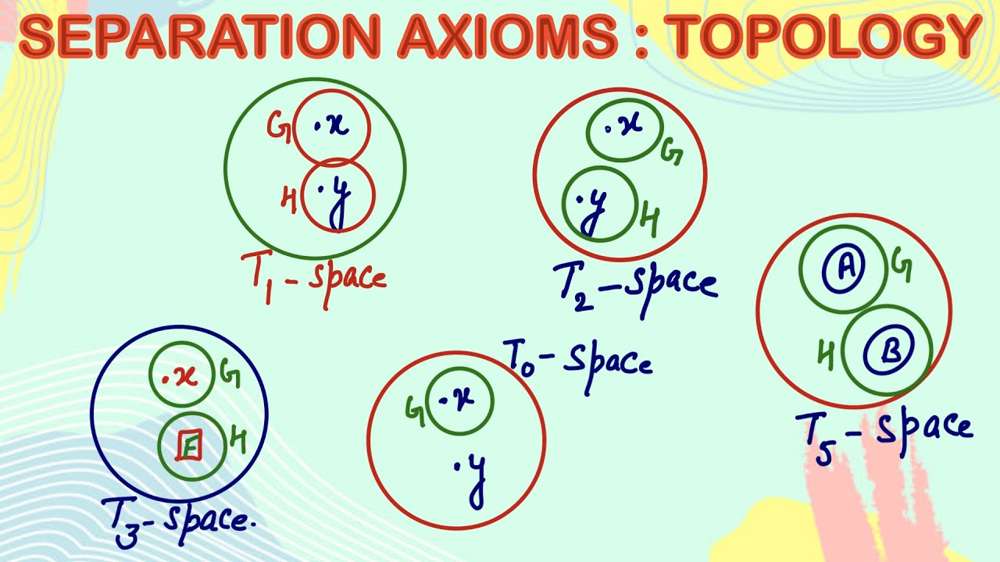
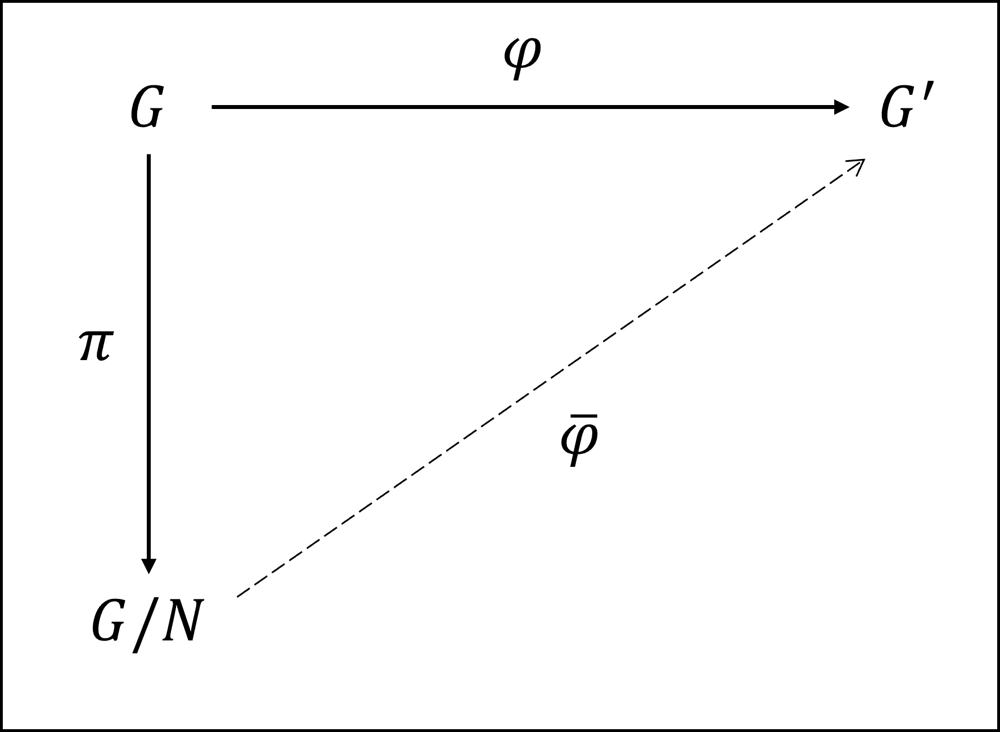

Book Title: 群上の調和解析

 # 第1章 位相群
 ## Section 1. 群
 **定義**  
 集合 $G$ 上に演算 $G\times G\rightarrow G$ が定まっており、 $\left(x,y\right)\in G\times G$ の値を $x\cdot y$ と書く。この演算が次の３条件を満たすとき $G$ はこの演算についての群であるという。 
 (G1) 任意の $x,y,z\in G$について、 $(x\cdot y)\cdot z = x\cdot (y\cdot z)$ （結合法則） 
 (G2) 任意の $x\in G$ に対して、 $e\cdot x = x\cdot e = x$ を満たす $e\in G$ が存在する。($e$は$x$に依存しない。) $e$ を $G$ の単位元という。 
 (G3) 任意の $x\in G$ に対して、 $y_x\cdot x = x\cdot y_x = e$ を満たす。 $y_x\in G$が存在する。( $y_x$ は $x$ に依存して決まる。)この $y_x$ を $x$ の逆元という。

任意の $x,y\in G$ について、 $x\cdot y = y\cdot x$ が成り立つとき、 $G$ は演算 $\cdot$ に関して可換群であるという。 

演算の記号として、+を用いる場合もあり、このとき $G$ は加群であるという。加群の単位元は零元とよび、 $0$ と記し、 $x$ の逆元は、 $-x$ と表す。

**定義**  
群 $G$ の部分集合 $H$ が $G$ と同じ演算の下にそれ自体がほとつの群をなすとき、 $H$ は $G$ の部分群であるという。

$H$ を $G$ の部分群であるとし、 $G$ 上の２項関係 ~ を
$$x\sim y \iff xH = yH$$
と定義すれば、 $\sim$ は同値関係である。ここで、 $xH = \lbrace xa| a\in H\rbrace$ である。この同値関係による $x\in G$ の同値類は $\xi_x$ は、
$$\xi_x =\lbrace y\in G\|xH=yH\rbrace$$
である。 $G$ の $\sim$ による商集合 $\lbrace\xi_x | x\in G\rbrace$ を $G/H$ で表す。同値類 $\xi_x$ を右-剰余類という。

$x, y\in G$ が同じ剰余類に属するためには、 $x^{-1}y\in H$ であることが必要充分である。このとき $x$ と $y$ とは $H$ を法として合同であると言い、
$$x\equiv y (\rm{mod} \ \ \  H)$$
と表記する。

同値関係 $\sim$ を
$$x\sim y \iff Hx=Hy$$
と定義した場合は、この $\sim$ による同値類は左-剰余類といい、その集合を $H\backslash G$ で表す。

**定義** 
$G$ の部分群 $N$ が 任意の $a\in G$ に対して、 $aNa^{-1} = N\,\,(\iff aN=Na)$ を満たすとき、 $N$ は $G$ の正規部分群であるという。

群 $G$ の正規部分群 $N$ について、 $G/N = G\backslash N$ は群をなす。 $x\in G$ の剰余類を $\xi_x$ と書くことにすれば、 $\xi_x = xN$ である。 $\xi_x, \xi_y\in G$ に対して、
$$(\xi_x)\cdot (\xi_y) = \xi_{x\cdot y}, \ \ \  (\xi_x)^{-1}=\xi_{x^{-1}}$$
すなわち、
$$(xN)\cdot (yN) = (x\cdot y)N, \,\,\, (xN)^{-1}=x^{-1}N$$
なる演算を定めれば、 $G/N$ はこの演算の下に群となり、これらの演算は、well-definedである。 $G/N$ を $G$ の $N$ に関する商群とよぶ。 $G/N$ の単位元は $N$、 $xN$ の逆元は、 $x^{-1}N$ である。  

$G$, $G^{\prime}$ を群(乗法演算をともに $\cdot$ で記す)とし、写像 $\varphi : G\rightarrow G^{\prime}$ が
$$\varphi (x\cdot y) = \varphi (x)\cdot \varphi (y),  x,y \in G$$
を満たすとき、 $\phi$ は準同型写像であるという。特に、$\varphi$ が全単射でもある場合は、これを同型写像という。

$G$ と $G^{\prime}$ の間になにか同型写像が存在するとき、 $G$ と $G^{\prime}$ はこの写像を媒介として、同型であるといい、これを $G\simeq G^{\prime}$ という記号で表記する。

$G$ と $G^{\prime}$ の単位元をそれぞれ $e$ と $e^{\prime}$ と書けば、準同型写像 $\varphi : G\rightarrow G^{\prime}$ に対して $\varphi (e) = e^{\prime}$ であり、 $\varphi (x^{-1})= \varphi(x)^{-1} (x\in G)$ である。また $\varphi$ の像 $\varphi (G)$ は $G^{\prime}$ の部分群である。

順同型写像 $\varphi: G\rightarrow G^{\prime}$ に対して、集合
$$Ker\varphi = \lbrace x\in G | \varphi (x)=e^{\prime} \rbrace$$
は正規部分群であり、これを $\phi$ の核と呼ぶ。
(任意の $x\in G$ に対して、 $y\in x Ker\varphi x^{-1}$ とすると、ある $a\in Ker\varphi$ が存在して、 $y=xax^{-1}$ 。このとき $\varphi (xax^{-1})=\varphi (x)\varphi (a)\varphi (x^{-1})=\varphi (x)e^{\prime}\varphi (x)^{-1}=e^{\prime}$ より、 $y\in Ker\varphi$ 。逆に $y\in Ker\varphi$ とすると、$y=xx^{-1}yxx^{-1}$ かつ $\varphi (xyx^{\prime}) = e^{\prime}$ なので、 $y\in xKer\varphi x^{-1}$ )

$1^{\circ}$　$G$, $G^{\prime}$ は群、 $\varphi : G\rightarrow G^{\prime}$ は準同型写像でかつ全射であるとする。 $N$ が $G$ の正規部分群ならば、 $\varphi (N)$ は $G^{\prime}$ の正規部分群である。 
証明) 任意の $y\in G^{\prime}$ に対して、 $y=\varphi (x)$ を満たす $x\in G$ が存在する。 $x^{-1}Nx\subset N$ であるから
$$y\varphi (N) y^{-1}=\varphi(x)\varphi(N)\varphi(x)^{-1}=\varphi(xNx^{-1})\subset \varphi (N)$$
ゆえに $\varphi(N)$ は $G$ の正規部分群である。  
$2^{\circ}$ $G$ は群、 $N$ をその正規部分群とし、写像 $\pi : G\rightarrow G/N$ を $\pi : x\mapsto xN \ (x\in G)$ と定義する。これを自然な写像または標準的写像という。 $\pi$ は準同型写像で、 $\pi (N)$ は $G/N$ の正規部分群である。
証明) $\pi$ は全射で、 $N$ が $G$ の正規部分群なので $1^{\circ}$ から導かれる。

**定理 1.1**  
$G$, $G^{\prime}$ は群、 $\varphi : G\rightarrow G^{\prime}$ は準同型写像とする。このとき $G/Ker\varphi$ と $\varphi(G)$ とは群として同型である。同型写像は
$$\Phi : x\cdot Ker\varphi \mapsto \varphi(x), \ \ x\in G$$
によって与えられる。 
証明) 全射性: 任意の $y=\varphi (x)$ に対し、 $x\cdot Ker\varphi$ をとれば、 $\Phi(x\cdot Ker\varphi)=\varphi (x)$ より全射。 
単射性: $\Phi (x\cdot Ker\varphi)=\Phi (x^{\prime}\cdot Ker\varphi)$ とすると $\varphi(x)=\varphi(x^{\prime})$ で、 $e^{\prime}=\varphi(x)\varphi(x^{\prime})=\varphi(x {x^{\prime}}^{-1})$ なので、 $x {x^{\prime}}^{-1} \in Ker\varphi$ よって、 $xKer\varphi=x^{\prime}Ker\varphi$ である。
さらに、 $\Phi$ は準同型写像である。実際、 $x, x^{\prime}$ に対して、
$$\Phi(xKer\varphi\cdot x^{\prime}Ker\varphi)=\Phi(xx^{\prime}Ker\varphi)=\varphi(x\cdot x^{\prime})=\varphi(x)\varphi(x^{\prime})=\Phi(xKer\varphi)\cdot \Phi(x^{\prime}Ker\varphi)$$
であるから、 $\Phi$ は準同型写像である。したがって、
$$G/Ker\varphi \simeq \varphi(G)$$
 
**定理 1.2**  
$G$, $G^{\prime}$ は群、 $\varphi: G\rightarrow G^{\prime}$ は準同型全射とする。 $H^{\prime}$ を $G^{\prime}$ の正規部分群とすれば、 $H=\varphi^{-1}(H^{\prime})$ は $G$ の正規部分群で
$$G/H\simeq G^{\prime}/H^{\prime}$$
証明) 写像 $\Phi: G\rightarrow G^{\prime}/H^{\prime}$ を
$$\Phi: x\mapsto \varphi(x)H^{\prime}$$
と定義すると、 $\Phi$ は全射の準同型である。( $yH^{\prime}\in G^{\prime}/H^{\prime}$ とすると、 $\varphi$ の全射性から $y=\varphi(x)$ となる $x\in G$ がある。この $x$ をとればよい。)  
$\Phi$ の核は、
$$Ker\Phi = \lbrace x\in G | \Phi(x)=H^{\prime} \rbrace = \lbrace x\in G | \varphi(x)H^{\prime} = H^{\prime} \rbrace \\ = \lbrace x\in G | \varphi(x)\in H^{\prime} \rbrace = \varphi^{-1}(H^{\prime}) = H$$
である。したがって、定理 1.1 により、
$$G/H\simeq G^{\prime}/H^{\prime}$$

**系 1.1** $G$ は群、 $H$ と $N$ は $G$ の正規部分群で、しかも $N\subset H$ とする。このとき
$$(G/N)/(H/N)\simeq G/H$$
証明) $G^{\prime} = G/N$ 、 $H^{\prime}=H/N$ とする。 $H^{\prime}$ は $G^{\prime}$ の正規部分群である。 $\pi: G\rightarrow G/N$ を自然な写像 $x\mapsto xN$ として、これを定理1.2の $\varphi$ に見立てれば、
$$\pi^{-1}(H^{\prime})=\lbrace g\in G | \pi(g)=H^{\prime} \rbrace = \lbrace g\in G | gN=H/N \rbrace$$
で、 $N\subset H$ より、
$$\pi^{-1}(H^{\prime})=\lbrace g\in G | g\in H \rbrace = H$$
よって、定理 1.2 より、
$$G/H\simeq G^{\prime}/H^{\prime} = (G/N)/(H/N)$$

## Section 2. 位相群の概念
**定義** 集合 $G$ が次の３条件を満たすとき、それは位相群であるという。 
(TG-1) $G$ は群である。 
(TG-2) $G$ は位相空間である。 
(TG-3) $G$ 上で定義されている群の演算が、与えられた位相に関して連続である。 

$G$ 上の群の演算を仮に  
乗法演算 : $(x,y)\mapsto x\cdot y \ \ [G\times G\rightarrow G]$  
逆元の演算 : $x\mapsto x^{-1} \ \ [G\rightarrow G]$  
とすれば、(TG-3) の意味するところは、この二つが連続であることである。これは演算
$$(x,y)\mapsto x\cdot y^{-1} \ \ [G\times G\rightarrow G]$$
が連続であることと同値である。 

例: 
$G=\mathbb{R}$ とし、その上に定まる位相はユークリッド位相であるとする。このとき $\mathbb{R}$ は加法についての位相群となる。 
$G=\mathbb{R}^l$ とし、その上にEuclid位相を定めれば、 $\mathbb{R}^l$ はベクトルの加法演算についての位相群( $l$ 次元ベクトル群 )となる。 
$G=\{z\in \mathbb{C} : |z|=1 \}$ は複素数の乗法と、 $\mathbb{C}$ から導入される相対位相について位相群となる。 
$(n\times n)$-型の実行列の全体は行列の和に関して可換群、またそのうち正則行列の全体 $GL$ は行列の積について非可換群を成し、いずれも ${\mathbb{R}}^{n^2}$ のEuclid位相の下に位相群となる。 $GL$ の元のうち行列式の値が $1$ に等しいものの全体 $SL$ は、行列の積についての群をなし、やはり位相群である。

## Section 3. 位相群の位相
位相群の特徴: 代数的な演算と、位相的な性質の間に密接な関係があり、その結果として、群の構造をもつ $G$ に位相群としての位相を導入するには、全空間にわたる基底を指定する必要はなく、単位元 $e$ の完全近傍系(すべての近傍の族)を指定すれば十分である。 
$A, B\subset G$ に対し、
$$
A\cdot B = \{x\cdot y\ | x\in A, y\in B\}, \ \ A^{-1} = \{x^{-1} | x \in A \}
$$
などと書く。 
**定義**  
集合 $X$ の部分集合の族 $\mathscr{F}$ が次の３条件を満たすとき、 $\mathscr{F}$ は $X$ 上の**フィルター**という。 
(1) $A, B\in \mathscr{F} \Rightarrow A\cap B \in \mathscr{F}$  
(2) $A\in \mathscr{F}, A\subset B \Rightarrow B\in \mathscr{F}$  
(3) $\empty \notin \mathscr{F}$  

いま、位相群の単位元 $e$ の完全近傍系の作るフィルターを $\mathscr{N}$ とする。 $a$ を $G$ の任意の元とするとするとき、写像
$$
x\mapsto a\cdot x; \ \ x\mapsto x\cdot a
$$ 
は $G$ から $G$ への位相同型写像である。したがって、
$$
a\mathscr{N}=\{aV|V\in \mathscr{N}\}, \mathscr{N}a = \{Va| V\in\mathscr{N}\}
$$
は点 $a$ の完全近傍系になる。このようにして、単位元 $e$ の完全近傍系を知ることにより、ほかの任意の点における完全近傍系を知ることができる。

$e$ の完全近傍系 $\mathscr{N}$ は次の三条件を満たす。 
(1) 任意の $U\in \mathscr{N}$ に対して、 $VV\subset U$ を満たす $V\in\mathscr{N}$ が存在する。 
証明) 群の乗法演算を $m: G\times G\rightarrow G$ とする。 $int(U)$ は $e$ の開近傍であり、 $m$ の連続性から、 $m^{-1}(int(U))$ は $(e, e)$ の開近傍なので、 $V\times V\subset m^{-1}(int(U))\subset m^{-1} (U)$ となる $V\in \mathscr{N}$ が存在する。 $ab\in VV$ とすると、 $(a, b) \in V\times V \subset m^{-1}(U)$ より、 $ab=m((a,b))\in U$ したがって、 $VV\subset U$  
(2) 任意の $U\in \mathscr{N}$ に対して、 $U^{-1}\in\mathscr{N}$。 
証明) 写像 $x\mapsto x^{-1}$ が $G$ を $G$ 自身に移す位相同型写像であるから、開写像。したがって、 $e = x^{-1}(e)\in x^{-1}(U^{\circ})=(U^{\circ})^{-1}\subset {U^{-1}}^{\circ} \subset U^{-1}$ (後ろから2番目の縫合関係は、内部は最大の開集合であることから)。または単に $e\in (U^{-1})^{\circ}=U^{-1}$ なので。  
(3) 任意の $a\in G$ 、 任意の $U\in\mathscr{N}$ に対して、 $aUa^{-1}\in \mathscr{N}$ 。  
証明) $a\in G$ を一つ固定したとき、 $x\mapsto ax$ 、 $x\mapsto xa^{-1}$ がいずれも $G$ から $G$ への位相同型写像、したがって開写像であることから、 $e=aea^{-1}\in aUa^{-1}$ なので、 $U\in \mathscr{N}$。

ここで、フィルター $\mathscr{N}$ について "(1)および(2)" が成り立つことは次の(\*)と同値である。 
(\*) 任意の $U\in \mathscr{N}$ に対して、 $VV^{-1}\subset U$ かつ $V^{-1}\in \mathscr{N}$ を満たす $V\in \mathscr{N}$ が存在する。 
証明) フィルター $\mathscr{N}$ について、 (1)と(2)が成り立つと仮定する。任意の $U\in \mathscr{N}$ に対して、(1) から $WW\subset U$ を満たす $W\subset \mathscr{N}$ が存在する。また (2) によって、 $W^{-1}\in \mathscr{N}$ であるから、 $V=W\cap W^{-1}$ とおけば、 $V\in \mathscr{N}$ (フィルターの定義(2))。(2)より $V^{-1}\in\mathscr{N}$ かつ $V^{-1}\subset W$ となり、したがって $VV^{-1}\subset WW \subset U$。 
逆にフィルター $\mathscr{N}$ が (\*)を満たすとする。このとき任意の $U\in\mathscr{N}$ について、 $e\in U$ となる。実際、 $V\in\mathscr{N}$ が $VV^{-1}\subset U$ とすれば、 ( $V$は非空であるから)すべての $x\in V$ について、 $xx^{-1}=e\in U$ となるからである。 (\*)より $V\subset VV^{-1}\subset U$。したがって、 $V\subset U^{-1}$ であるからフィルターの定義 (2) より $U^{-1}\in\mathscr{N}$ である。 $V\in \mathscr{N}$ が $VV^{-1}\subset U$ を満たすものとし、 $W=V\cap V^{-1}$ とおけば、 $W\in\mathscr{N}$ で (フィルターの定義(1)より)かつ $WW\subset VV^{-1}\subset U$ である。

上に定義した $W=V\cap V^{-1}$ は、 $e$ の近傍で、しかも $W=W^{-1}$ が成り立つ。この性質を対称性という。

**定理** 1.3  
$G$ を群、 $\mathscr{N}$ を上記の (1)、(2)、(3) を満足する $G$ 上の フィルターとする。このとき $G$ を位相群とし、かつ $\mathscr{N}$ を単位元 $e$ の完全近傍系とする $G$ の位相が一意に定まる。 
証明) 仮に所望の性質を持つ位相が存在するとすれば、各点 $a\in G$ の完全近傍系は、 $a\mathscr{N}$ および $\mathscr{N}a$ からなる集合族と一致する。このようにして、各点の完全近傍系が定まるので、所望の性質を有する $G$ 上の位相はただ一つである。 
次の2点を示す必要がある。 
(A) フィルター $a\mathscr{N}$ が点 $a\in G$ 上の完全近傍系となる $G$ 上の位相がある。 
(位相があること)  
(B) この位相について、 $G$ 上の群の演算が連続となる。 
( $G$ がこの位相の下で位相群となること)  
(A) の証明  
これを示すためには各 $a\in G$ について、 $a\mathscr{N}$ が次の４つの条件を満たすことを確認すればよい。 
(1) $U\in \mathscr{N}$ に対して、 $aU\subset P$ ならば $P\in a\mathscr{N}$  
(2) $a\mathscr{N}$ に属する任意有限個の集合の共通部分は $a\mathscr{N}$ の元である。 
(3) 任意の $U\in \mathscr{N}$ について、 $a\in U$  
(4) 任意の $U\in \mathscr{N}$ について、
$$
xV\subset aU {\rm{ \ \ for \ \ all \ \ }} x\in aV (したがって、aU\in x\mathscr{N})
$$
を満たす $V\in\mathscr{N}$ が存在する。 
近傍系参照 : https://ja.wikipedia.org/wiki/%E8%BF%91%E5%82%8D%E7%B3%BB#:~:text=%E8%BF%91%E5%82%8D%E7%B3%BB%20%E6%95%B0%E5%AD%A6%20%E3%81%AE%20%E4%BD%8D%E7%9B%B8%E7%A9%BA%E9%96%93%E8%AB%96%20%E5%91%A8%E8%BE%BA%E5%88%86%E9%87%8E%E3%81%AB%E3%81%8A%E3%81%84%E3%81%A6%E3%80%81%E7%82%B9%E3%81%AE%20%E8%BF%91%E5%82%8D%E7%B3%BB%20%EF%BC%88%E3%81%8D%E3%82%93%E3%81%BC%E3%81%86%E3%81%91%E3%81%84%E3%80%81%20%E8%8B%B1%3A,basis%29%20%E3%81%82%E3%82%8B%E3%81%84%E3%81%AF%20%E5%B1%80%E6%89%80%E5%9F%BA%20%28local%20basis%29%20%E3%81%A8%E3%81%AF%E3%80%81%E8%BF%91%E5%82%8D%E3%83%95%E3%82%A3%E3%83%AB%E3%82%BF%E3%83%BC%E3%81%AE%20%E3%83%95%E3%82%A3%E3%83%AB%E3%82%BF%E3%83%BC%E5%9F%BA%20%E3%82%92%E3%81%84%E3%81%86%E3%80%82  

(1) と (2) は $a\mathscr{N}$ がフィルターであることを意味している。(それぞれフィルターの定義(2)と(1)から導かれる。) $\mathscr{N}$ の定め方から、(3)も成り立つ( $e\in U$ )。(4) だけ示せば十分である。任意の $U\in\mathscr{N}$ を考えると、完全近傍系の性質(1)より、 $VV\subset U$ を満たす $V\in\mathscr{N}$ が存在する。すると任意の $x\in aV$ に対して、
$$
xV \subset aVV \subset aU
$$
ゆえに、 $aU\in x\mathscr{N}$。 
(B) の証明: 演算 $(a, b)\mapsto ab^{-1}$ が連続となることを示す。 
$U$ を $e$ の任意の近傍とすれば、 (3)により
$$
V\equiv b^{-1}Ub\in \mathscr{N} \tag{1}
$$
この $V$ に対して、(1)、(2) $\iff$ (\*) より、 $WW^{-1}\subset V$ なる $W\in\mathscr{N}$ が存在する。 いま $u, v\in W$ とすれば、 $uv^{-1}\in V$ であり、 したがって、 (1) により、 $buv^{-1}b^{-1}\in U$ 。よって、
$$
u\in W, v\in W \Rightarrow (au)(bv)^{-1}=(ab^{-1})(buv^{-1}b^{-1})\in ab^{-1}U
$$

定理1.3 において、群 $G$ 各点の完全近傍系を指定することにより、 $G$ の位相群としての位相が決定されることを示した。 
$G$ の位相は基本近傍系を指定するだけでも決定される。

**定義**  
$(S, \mathscr{O})$ を一つの位相空間とし、 $V(x)$ を点 $x$ の(全)近傍系とする。 $V(x)$ の部分集合 $V^{*}(x)$ で次の性質をもつものを、 $x$ の基本近傍系という。 
(\*) 任意の $V\in V(x)$ に対して、 $U\subset V$ となるような $U\in V^{*}(x)$ が存在する。

単位元 $e$ の開集合からなる基本近傍系を $\mathscr{B}(e)$ とすると、 
(※) 任意の $U, V\in \mathscr{B}(e)$ に対し、 $W\subset U\cap V$ を満たす $W\in \mathscr{B}(e)$ が存在する。 
証明) $U\cap V$ は $e$ の近傍であるから(開集合かつ $e\in U^{\circ}\cap V^{\circ}=(U\cap V)^{\circ}$)、基本近傍系の定義より、 $W\subset U\cap V$ となるような $W\in \mathscr{B}(e)$ が存在する。 
$(1^{\prime})$ 任意の $U\in\mathscr{B}(e)$ に対して、 $VV\subset U$ を満たす $V\in \mathscr{B}(e)$ が存在する。 
証明) 任意の $U\in \mathscr{B}(e)$ に対して、 $U$ は $e$ の近傍なので、 近傍系の性質(1)より、 ある近傍 $W$ が存在して、 $WW\subset U$ となる。近傍 $W$ に対して、$V\in \mathscr{V}(e)$ が存在して、 $V\subset W$ となる。 したがって、 $VV\subset WW\subset U$。 
$(2^{\prime})$ 任意の $U\in\mathscr{B}(e)$ に対して、 $U^{-1}\in\mathscr{B}(e)$ 
証明) $U\in \mathscr{B}(e)$ で、近傍なので、近傍系の性質(2)から $U^{-1}$ も近傍である。 したがって、基本近傍系の定義から、 ある $W\in \mathscr{B}(e)$ s.t $W\subset U^{-1}$ である。よって、$W$ はまた近傍であるから、 $U^{-1}\in\mathscr{B}(e)$。 
$(3^{\prime})$ 任意の $U\in \mathscr{B}(e)$ 、 $a\in G$ に対して、 $V\subset aUa^{-1}(\iff a^{-1}Va\subset U)$ を満たす $V\in\mathscr{B}(e)$ が存在する。 
証明) 近傍の性質(3)より、 $aUa^{-^1}$ は近傍である。したがって、基本近傍系の定義から、 $V\subset aUa^{-1}$ を満たす $V\in\mathscr{B}(e)$ が存在する。 
$(4^{\prime})$ 任意の $U\in\mathscr{B}(e)$ と $x\in U$ に対して、 $xV\subset U$ を満たす $V\in\mathscr{B}(e)$ が存在する。 
証明) $U$ は $x$ の近傍なので、 $U\in x\mathscr{N}$ よって、 ある $U^{\prime}\in \mathscr{N}$ に対して、 $U = xU^{\prime}$ 。 $U^{\prime}\in \mathscr{N}$ より、 ある $V\in \mathscr{B}(e)$ があって、 $V\subset U^{\prime}$ 。したがって、 $xV\subset xU^{\prime}=U$ 。

$\mathscr{B}(e)$ に属する集合に $x\in G$ を乗じ、
$$
\mathscr{B}(e)=\{V\subset G | xU\subset V \rm{\ for \ \ some\ }U\in\mathscr{B}(e)\}
$$
が点 $x$ の完全近傍系をつくるフィルターとなる。 
証明) (1) $U, V\in \mathscr{N}(x)$ とすると、ある $U^{\prime}, V^{\prime}\in\mathscr{B}(e)$ があって、 $xU^{\prime}\subset U$ 、 $xV^{\prime} \subset V$ を満たす。このとき
$$
x(U^{\prime}\cap V^{\prime})=xU^{\prime}\cap xV^{\prime}\subset U\cap V
$$
$U^{\prime}\cap V^{\prime}\in \mathscr{N}(e)$ より $U\cap V\in\mathscr{N}(e)$ である。  
(2) $U\in\mathscr{N}(e)$ 、 $U\subset V$ とする。 このときある $U^{\prime}\in \mathscr{B}(e)$ があって、 $xU^{\prime}\subset U\subset V$ 。したがって、 $V\in \mathscr{N}(x)$ である。 
(3) 任意の $U\in \mathscr{N}(x)$ に関して、 $x\in U$ なので、 $U\neq\empty$ である。したがって、 $\empty \notin \mathscr{N}(x)$ 。

そして逆にまだ位相の定まっていない群 $G$ 上に $(1^{\prime})$ ~ $(4^{\prime})$ を満たす集合族 $\mathscr{B}(e)$ が与えられれば、これを $e$ の開集合からなる基本近傍系とする $G$ の位相が定まり、 $G$ は位相群となる。 
証明) $\mathscr{N(x)}$ が完全近傍系の公準 $(1)$ ~ $(3)$ を満たすフィルターであることを示す。フィルターであることは上で証明したため、 $\mathscr{N(x)}$ が完全近傍系の公準 $(1)$ ~ $(3)$ を満たすことを証明する。 
(おそらく (※)、$(1^{\prime})～(4^{\prime})$ から導けると思うが、わからない)

定理 1.3' 
群 $G$ の単位元 $e$ を含む集合族 $\mathscr{B}(e)$ が条件(※) および $(1^{\prime})～(4^{\prime})$ を満足するならば、 $G$ を位相群とし、かつ $\mathscr{B}(e)$ を単位元 $e$ の開集合からなる基本近傍系とする位相が位置に定まる。

次の定理は位相群 $G$ の分離公理に関するものであり、位相群 $G$ においては $T_0, T_1, T_2, T_3$ が同値となる。

参考: https://www.youtube.com/watch?v=Ebr1piFxEwI  
$(T_0)$ (Kolmogorovの公理) 相異なる２点の少なくとも一方が他方を含まない近傍を有する。 
$(T_1)$ (Fechetの公理) 相異なる２点はそれぞれ他方を含まない近傍を有する。 
$(T_2)$ (Hausdorffの公理) 相異なる２点はそれぞれ互いに交わらない近傍を有する。 
$(T_3)$ (Vietorisの公理) 任意の閉集合 $F$ とこれに含まれない点はそれぞれ交わらない近傍を有し(正則性)、かつ $T_1$。 
$(T_4)$ (Tietzeの公理) 交わらない二つの閉集合は互いに交わらない近傍を有し(正規性)かつ$T_1$。 
すぐにわかる関係として、
$$
T_4\Rightarrow T_3\Rightarrow T_2 \Rightarrow T_1\Rightarrow T_0
$$

**定理 1.4**(位相群の分離公理)
位相群 $G$ について、 $T_0, T_1, T_2, T_3$ はすべて同値である。 
証明) $T_0\Rightarrow T_2,T_3$ を証明すれば十分である。 
$T_o\Rightarrow T_2$: $a,b\in G$, $a\neq b$ とすれば、$G$ が $T_0$ であるから、例えば $a\in U$、$b\notin U$ となる開集合が存在する。このとき互いに交わらない $a,b$ の近傍が存在することを示す。このとき一般性を失うことなく、 $a=e, b\neq e$ および $e\in U, b\notin U$ として証明すれば十分である(一般的には、$a, b$を考えて、$e, a^{-1}b$において証明されていることを利用すればよい。) そこで、 $VV^{-1}\subset U$ を満たす $e$ の近傍 $V$ をとる(定理1.3より)。 $e\in V$ 、 $b\in bV$ であるから、仮に $b\cap bV\neq\empty$ であるとし、 $x\in V\cap bV$ とすれば、
$$
x\in V \ and \ x=by \ for \ some \ y\in V 
$$
したがって、
$$
b=xy^{-1} \in VV^{-1}\subset U
$$
これは $b\notin U$ に矛盾する。 
$T_0\Rightarrow T\_3$ : $F\subset G$ を 閉集合で、 $e\notin F$ とする。このとき $G\backslash F$ は $e$ の近傍であるから、 $e$ の適当な近傍 $V$ をとれば、
$$
VV\subset G\backslash F
$$
とすることができる。これから、 前と同様にして、 $V\cap FV=\empty$ となる。 また、 $FV=\cup_{x\in F}xV$ であるから、 $FV$ は開集合。 そして、 $e\in V$ 、 $F\subset FV$ であるから、正則である。 また、 $G$ は $T_2$ でもあるから、 $T_1$ である。したがって、 $G$ は $T_3$ である。

## Section 4. 距離付け定理
距離 $d$ から定められる位相空間を、 $\mathscr{O}_d$ と書くことにする。

**定義**
与えられた位相空間 $(S, \mathscr{O})$ に対して、 $\mathscr{O}=\mathscr{O}_d$ となるような $S$ 上の距離関数 $d$ が存在するならば、 $d$ はこの位相空間 $(S, \mathscr{O})$ を距離付けるといい、また、 $(S, \mathscr{O})$ は距離付け可能であるという。

位相群の距離付けに関しては、次の定理が知られている。 
**定理 1.5**(距離付け)  
$G$ を Hausdorff 位相群とする。このとき、 $G$ が距離付け可能であるための必要充分条件は、単位元 $e$ の加算近傍系が存在することである。さらに、 $G$ が距離付け可能であれば、 $G$ は左不変な、すなわち
$$
\rho(ax, ay) = \rho(x, y) \ for \ all a, x, y \in G
$$
を満たす $\rho$ によって、距離付け可能である。 
証明) 距離付け可能な空間は、加算近傍系が存在する。位相空間 $X$ の距離を $d$ として、 
$$
N_{1/n}(a) = \{x\in X : d(x, a)< \epsilon \}
$$
とすると $N_{1/n}(a)$ は点 $a$ の可算基本近傍系となる。 実際、任意の $\epsilon$ 対して、アルキメデスの性質(連続性の公理から証明される)から ある $n_0$ が存在して、
$$
1< \epsilon n_0
$$
となる。そこで、 $n\ge n_0$ とすれば、$1/n\le 1/n_0\ < \epsilon$ より、
$$
N_{1/n}(a)\subset N_{\epsilon}(a)
$$
となるので、 $\{N_{1/n}(a) \}_{n\in \mathbb{N}}$ は 点 $a$ における $X$ の基本近傍系である。さらに、 その数は自然数濃度に等しいため、可算である。逆を証明する。 $N_1,N_2\dots $ を $e$ の可算基本近傍系とする。まず $U$ を $e$ の近傍とすれば、 $V=U\cap U^{-1}$ も $e$ の近傍で、 $V=V^{-1}$ である。また、乗法演算の連続性から、 基本近傍系の元 $U$ に対して、 $$VVV\subset U$$ となる近傍系の元がある。 Vに含まれる基本近傍系の元を $W$ とすれば、 $(W)^3\subset U$ となる。したがって、$N_k^{\prime} = N_k\cap N_k^{-1}$ とし、 $(N_{k+1}^{\prime})^3\subset N_k^{\prime}$ となるように選択すれば、新しい $e$ の基本近傍系を、
$$
\begin{matrix}
\{N_k^{\prime}\}は対称的 \\
 (N_k^{\prime})^3\subset N_k^{\prime} \\
 N_k^{\prime}\subset N_k
\end{matrix}
$$
とすることができる。そこで、はじめから、 $\{N_k\}$ が対称的で、しかも $N_{k+1}^3\subset N_k$ を満たすものと仮定してよい。ただし、便宜上、 $N_0=G$ とおく。

関数 $\sigma: G\times G\rightarrow \mathbb{R}$ を次のように定義する。
$$
\sigma: (x,y)\mapsto \frac{1}{2^k} \ \ if \ \ x^{-1}y\in N_k\backslash N_{k+1}, k=0, 1, 2,\dots
$$
とすると、この $\sigma$ は  
(1) $\sigma(x,y)\ge 0 $  
(2) $\sigma(x,y)=\sigma(y,x)$ ( $N_k$ が対称的なため)  
(3) $\sigma(ax,ay)=\sigma(x,y)$  
を満足する。そこで、 $\rho: G\times G\rightarrow \mathbb{R}$ を
$$
\rho(x,y)=inf_{x_0,\dots,x_n}\left\{\displaystyle\sum_{i=1}^{n}\sigma(x_{i-1}, x_i): x_0=x,x_1,\dots,x_n=y \right\}
$$
と定義する。ただし、inf は $x_0=x, x_1,\dots, x_n=y$ となるような、任意有限個の点 $(x_0,x_1,\dots,x_n)$についてとる。こうして定義された $\rho$ は距離関数である。 $\rho(x,y)\ge 0$ , $\rho(x,y)=\rho(y,x)$ は良い。 $\rho(x,y)\iff x=y$ を証明する。$\Rightarrow$ $\rho(x, y)=0$ なので、任意の $i$ に関して $\sigma(x_{i-1}, x_i)=0$ である。したがって、任意の $i$ に関して $x_{i-1}^{-1}x_i\in N_i\backslash N_{i+1}$ 。 よって、 $x_{i-1}^{-1}x_i=e$ であり、 $x=y$ $\Leftarrow$ $x=y$ で、 $x^{-1}y$より任意の $k$ に対して $x^{-1}y=e\in N_k\backslash N_{k+1}$ 。よって、 $\rho(x,y)=0$ 。三角不等式を証明する。 $x,y,z\in G$ と $\epsilon >0$ を勝手に与えると、 $x_0,\dots, x_n, \dots, x_m \ (x_0=x, x_n=y, x_m=z)$ を適当に選んで、
$$
\rho(x,y) > \rho(x_0,x_1)+\dots+\rho(x_{n-1}, x_n)-\frac{\epsilon}{2}
$$
$$
\rho(y,z) > \rho(x_n,x_{n+1})+\dots+\rho(x_{m-1}, x_m)-\frac{\epsilon}{2}
$$
とすることができる。ゆえに
$$
\rho(x,y)+\rho(y,z)>\displaystyle\sum_{i=1}^{m}\sigma(x_{i-1}, x_i) - \epsilon \ge \rho(x,y) - \epsilon
$$
$\epsilon$ は任意であるから、
$$
\rho(x,z)\le \rho(x,y) + \rho(y,z)
$$
また、 $\rho(ax,ay)=\rho(x,y)$ となることは、 $\sigma(ax, ay)=\sigma(x,y)$ からわかる。 
最後に、 $\rho$ による位相が $G$ の当初の位相と一致することを他方の位相の近傍系がもう一方の位相の近傍系に一致することを示すことで示す。それには
$$
(1) x^{-1}y\in N_k \Rightarrow \rho(x,y)\le \frac{1}{2^k}
$$
$$
(2) x^{-1}y \notin N_k \Rightarrow \rho(x,y)\ge \frac{1}{2^k}
$$
を示せば十分である。 
(1) の証明: $x^{-1}y\in N_k$ とすれば、 $\rho$ の定義から、 $\rho(x,y)\le \sigma(x,y)\le\frac{1}{2^k}$  
(2) の証明: $x^{-1}y\notin N_k$ とする。 $\rho(x,y)>\frac{1}{2^k}$ を示すためには、 $x=x_0,x_1,\dots, x_{n-1}, x_n=y$ をみたす任意の有限個の点について 
$$
\displaystyle\sum_{i=1}^n \sigma(x_{i-1}, x_i)\ge \frac{1}{2^k}
$$
を証明すればよい。帰納法により証明する。 $n=1$ のとき、 $x^{-1}y\notin N_k$ ならば $x^{-1}y\in N_{i} \ (i\le k-1)$ なので、 $\sigma(x,y)\ge\frac{1}{2^k}$ 。 次に $p\le n-1$ であるすべての $p$ に対して、 $x_0^{-1}x_p\notin N_k$ ならば、 
$$
\displaystyle\sum_{i=1}^p \sigma(x_{i-1}, x_i)\ge\frac{1}{2^k}
$$
が成り立つと仮定する。 $x=x_0, x_1, \dots, x_n=y$ とし、 $q$ を $x_0^{-1}x_q\notin N_{k+1}$ となるような最小の添え字 $(1\le q\le n)$ とする。そこで
$$
x=x_0, \ x_{q-1}, \ x_q, \ x_n=y
$$
なる有限個の点を考えれば、帰納法の仮定により
$$
\sigma(x_0, x_{q-1}) + \sigma(x_{q-1}, x_q) + \sigma(x_q, x_n) \ge \frac{1}{2^k}
$$
($q=n$ のときは、 $n=1$ の場合を使い、 $q<n$ のときは帰納法の仮定を用いる)  
また、 $q$ の定義から、 $x_0^{-1}x_{q-1}\in N_{k+1}$ であるから、
$$
\sigma(x_0, x_{q-1})\le \frac{1}{2^{k+1}}
$$
(どこで使っている?)  
したがって、
$$
x_{q-1}^{-1}x_q\notin N_{k+1}, \ x_q^{-1}x_n\notin N_{k+1}
$$
のどちらかが成り立つ。実施、仮に $x_{q-1}^{-1}x_q\in N_{k+1}$ かつ $x_q^{-1}x_n\in N_{k+1}$ であれば、
$$
x^{-1}y=x_0^{-1}x_n=(x_0^{-1}x_{q-1})\cdot(x_{q-1}^{-1}x_q)\cdot(x_q^{-1}x_n)\in N_{k+1}^3\subset N_k
$$
となって矛盾。 
そこでまず $x_{q-1}^{-1}x_q\notin N_{k+1}$ とすれば
$$
\sigma(x_{q-1}, x_q)\ge \frac{1}{2^k}
$$
したがって、
$$
\displaystyle\sum_{i=1}^n \sigma(x_{i-1}x_i)\ge \frac{1}{2^k}
$$
また、 $x_q^{-1}x_n\notin N_{k+1}$ とすれば、 $\{x_0,x_1,\dots,x_n\}$を
$$
x=x_0, \dots, x_q, \dots, x_n=y
$$
の形に分解して、帰納法の仮定から
$$
\sigma(x_0,x_1) + \dots + \sigma(x_{q-1}, x_q)\ge \frac{1}{2^{k+1}}
$$
$$
\sigma(x_q,x_{q+1})+\dots+\sigma(x_{n-1},x_n)\ge \frac{1}{2^{k+1}}
$$
2番目の不等式は、 $j=q+1,\dots, n-1$ で、
$$
x_qx_j = x_qx_n^{-1}x_nx_0^{-1}x_0x_j\notin (N_{k+1})\subset N_k
$$
からの結果。 
次の結果が得られる。 
$$
\displaystyle\sum_{i=1}^n\sigma(x_{i-1}, x_i)\ge 2\times \frac{1}{2^{k+1}}=\frac{1}{2^k}
$$

## Section 5. 位相群の準同型写像
位相群間の準同型写像について考える次の定理は準同型の連続性に関する重要な定理である。

**定理(位相群の準同型の連続性)**
$G, G^{\prime}$ を二つの位相群、 $\varphi: G\rightarrow G^{\prime}$ とする。このとき
(1) $\varphi$ は連続 $\iff$ $\varphi$ は単位元 $e$ において連続。しかもこのとき $\varphi$ は一様連続である。 
$G^{\prime}$ における単位元の任意の近傍 $V$ に対して、 $G$ における単位元の近傍 $U_V$ を適当に選び $x^{-1}y\in U\Rightarrow \varphi(x)^{-1}\varphi(y)\in V$ とすることができる。ここで一様が意味するところは、 $V$ に対して選択する近傍 $U_V$ は $V$ に依存し、一般的には場所 $x, y$ にも依存するが、ここでは $x, y$ に依存せずに選択できるということである。 
(2) $\varphi$ は開写像 $\iff$ $\varphi$ は $e$ において開写像( $e$ の任意の開近傍 $U$ の像 $\varphi(U)$ は $G^{\prime}$) の開集合である。 
証明) $\varphi$ が $e$ において連続であるとする。つまり $G^{\prime}$ の単位元 $e^{\prime}$ の任意の近傍 $V$ に対して $e$ の適当な近傍 $U$ をとれば $\varphi(U)\subset V$ となるとする。 $x$ を $G$ の任意の元とし、 $y=\varphi(x)$ とする。 $y$ の任意の近傍を $W$ とすれば、 $e^{\prime}$ の近傍 $V$ を適当に選び、 $yV\subset W$ とすることができる。この $V$ に対して、 上記の $U$ をとると、 $xU$ は $G$ における $x$ の近傍であり、
$$
\varphi(xU)=\varphi(x)\varphi(U)=y\cdot \varphi(U)\subset yU
$$
これによって、 $\varphi$ が $G$ のすべての点で連続であることがわかる。逆は、すべての点で連続なので、単位元 $e$ においても連続。 
また、上の記号で、 $x^{-1}y\in U$ ならば $\varphi(x)^{-1}\varphi(y)=\varphi(x^{-1}y)\in V$ であるから、 $\varphi$ が連続であれば、それは一様連続である。 
(単位元の近傍 $U$ に対し、任意の点 $y$ の近傍が $yU$ と記述できることがポイント?) 
(2) $\varphi$ が単位元 $e$ において開写像であるとき、 $\varphi$ が開写像であることだけ示せば十分である。定理 1.1 により $e$ の完全近傍系 $\mathscr{N}$ と点 $x\in G$ の完全近傍系 $\mathscr{N}_x$ とは $N\mapsto xN (N\in \mathscr{N})$ の対応関係の下に過不足なく１対１に対応している。 
$U$ を $G$ の開集合 $x$ を $U$ の１点とすると、 $U$ は $x$ の近傍で、上記のことから $xV=U$ となる $e$ の開近傍 $V$ が存在する。 $\varphi$ は準同型写像なので $\varphi(U)=\varphi(x)\varphi(V)$ 仮定により、 $\varphi$ は $e$ において開写像であるから、 $\varphi(V)$ は開集合である。したがって、 $\varphi(U)=\varphi(x)\varphi(V)$ は $\varphi(x)$ を含む開集合である。

## Section 6. 位相群の部分群
**定理 1.7**(部分群の性質) 
$H$ を Hausdorff位相群 $G$ の部分群とすると、次の命題が成り立つ。 
(1) $H$ の閉方 $\bar{H}$ も $G$ の部分群である。 
(2) $H$ が $G$ の正規部分群であれば、 $\bar{H}$ も可換である。 
(3) $H$ が可換であれば、 $\bar{H}$ も可換である。 
(4) $H$ は開集合 $\iff$ $int(U)\neq \empty$ 
(5) $H$ が開集合であれば、 それは閉集合である。  
証明) (1) $a,b\in \bar{H}$ とする。 このとき有向点族 $\{x_\lambda\}_\lambda$ 、 $\{y_\lambda\}_\lambda$ が存在して、 $x=\lim_\lambda x_\lambda$ 、 $y=\lim_\lambda y_\lambda$ 。このとき、 $xy^{-1} = \lim_\lambda x_\lambda y_\lambda^{-1}$ より、 $xy^{-1}\in \bar{H}$ である。 
(2) $H$ が $G$ の正規部分群であるとする。 $a\in \bar{H}$ 、 $c\in G$ とする。 このとき有向点族 $\{a_{\lambda}\}_{\lambda}$ があって、 $a = \lim_\lambda a_\lambda$ 。したがって、 $cac^{-1}=\lim_\lambda ca_\lambda c^{-1}$ より $cac^{-1}\in\bar{H}$ 。よって、 $\bar{H}$ も正規部分群である。 
(3) $G$ がHausdorffなので、$x, y\in \bar{H}$ に対して $x_\lambda \rightarrow x, y_\lambda\rightarrow y$ なる $H$ の有効点族 $\{x_\lambda\}, \{y_\lambda\}$ が存在する。 $H$ の可換性により、
$$
xy=\lim_\lambda x_\lambda y_\lambda = \lim_\lambda y_\lambda x_\lambda =yx
$$
であるから所望の結果を得る。
(4) $H$ が開集合ならば、 $int(H)\neq\empty$ 。逆に $x\in int(H)$ とすれば、 $xU\subset H$を満たす、単位元 $e$ の近傍 $U$ が存在する。 任意の $y\in H$ に対して
$$
yU = yx^{-1}xU\subset yx^{-1}H=H
$$ 
であるから、 $H$ は開集合である。 
(最後の等号) $yx^{-1}H\subset H$ は $H$ が部分群であることから成り立つ。逆に $z\in H$ とすれば $z=yx^{-1}xy^{-1}z\in yx^{-1}H$であるから成り立つ。 
(5) $H$ が開部分群であるとすれば、
$$
H^c =\cup_{x\notin H} xH
$$
各 $xH$ は開集合であるから、 $H^c$ は開集合。

**系 1.2** 
$G$ はHausdorff位相群、 $U$ は 単位元 $e$ の対称的近傍とすれば、 $H=\displaystyle\bigcup_{n=1}^{\infty}$ は開かつ閉な部分群である。 
証明) $H$ は部分群である。また、 $int(H)\neq \empty$ 。 したがって、定理 1.7 (4)、(5)より、 $H$ は開かつ閉である。

**系 1.3** 
$G$ は Hausdorff位相群、 $H$ はその局所コンパクトな部分群とすれば、 $H$ は閉である。
証明) $H$ が位相群 $\bar{H}$ において稠密かつ局所コンパクトなので、 開部分群である。したがって、定理 1.7 (5) より、それは　$\bar{H}$ において開部分群であるから、本来の位相についても開である。

## Section 7. 位相群の商群
位相群 $G$ の閉じた正規部分群 $N$ について、商群 $G/N$ を考え、これに位相群を定める。 
$G/N$ の位相は、商位相、すなわち $\pi: x\mapsto xN$ で定義される自然な写像 $\pi: G\rightarrow G/N$ を考え、集合族
$$
\{U\in G/N : \pi^{-1}(U) は G の開集合\}
$$
を $G/N$ の位相とする。商位相は $\pi$ を連続とする $G/N$ の中で最も強い位相である。

**定理 1.8 (商群)**  
$G$ を位相群、 $N$ をその閉じた正規部分群とすれば、次の命題が成り立つ。 
(1) $\pi : G\rightarrow G/N$ は連続 
(2) $\pi$ は開写像 
(3) $G/N$ は位相群で、 $G$ が Hausdorffならば $G/N$ も Hausdorffである。 
(4) $G^{\prime}$ をもうひとつの位相群とし、 $\varphi:G\rightarrow G^{\prime}$ を連続な準同型写像とする。いま、 $N\subset \rm{Ker}\varphi$ ならば、 $G/N$ から $G^{\prime} $　への連続な週同型写像 $\varphi:G/N\rightarrow G^{\prime}$ で、
$$
\varphi = \bar{\varphi}\circ\pi
$$
を満たすものが存在し、このような $\bar{\varphi}$ は一意に定まる。

証明) (1) 商位相の定義から成り立つ。  
(2) $U\subset G$ を開集合とする。このとき 
$$
\pi^{-1}(\pi(U))=UN=\displaystyle\bigcup_{x\in N}Ux
$$
であり、　各 $Ux$ は開集合なので、 $\pi^{-1}(\pi(U))$ は開集合。したがって商位相の定義から、 $\pi(U)$ は開集合である。
(3) $G/N$ が群であることはすでに述べたので、それが実際に位相群であることを示す。 $a,b\in G$ とすれば
$$
\pi(a)\pi(b)=\pi(ab)
$$
である。実際、 $N$ が正規部分群であるから
$$
\pi(a)\pi(b)=aN\cdot bN=abNN=abN=\pi(ab)
$$
$G/N$ における $\pi(ab)$ の近傍を $V$ とする。 $\pi$ の連続性から、 $\pi^{-1}(V)=U$ は $G$ における $ab$ の近傍。したがって、 $a,b$ それぞれの近傍 $U_a, U_b$ を適当に選んで $U_aU_b\subset U$ とすることができる。 よって
$$
\pi(U_a)\pi(U_b)\subset \pi(U)=V
$$
$\pi$ は開写像なので、 $\pi(U_a), \pi(U_b)$ は $\pi(a), \pi(b)$ の近傍である。これから、 $G/N$ における積の演算の連続性が得られる。逆元演算の連続性も同様。 $G$ がHausdorffであれば、 $G/N$ もHausdorffであることをしめすためには、それが $T_1$ であること、すなわち $G/N$ の1点、たとえば $\{\xi_e=N\}$ が $G/N$ において閉であることを示せば十分である( $T_1$ 空間はこの条件と同値であることと、位相群において、 $T_1$ と $T_2$ 空間は同値であることから)。 $\pi^{-1}(\xi_e)=N$ で、これは仮定により $G$ の閉集合である。 $(G/N)\backslash \{\xi_e\}=\pi(G\backslash N)$ であるが、 $G\backslash N$ は $G$ の開集合、 $\pi$ は開写像なので、 $(G/N)\backslash \{\xi_e\}$ は $G/N$ の開集合である。したがって $\{\xi_e\}$ は $G/N$ の閉集合である。これから、すべての剰余類 $\{\xi_x=xN\} \ (x\in G)$ は閉である。 任意の点 $x\in G$ を乗算する写像は、位相同型写像のため、すべての剰余類 $\{\xi_x=xN\} \ (x\in G)$ は閉である。 
(4) $N\subset \rm{Ker}\varphi$ に注意すると、 各 $x\in G$ について $\bar{\varphi}(xN)=\varphi(x)$ とすれば、この $\bar{\varphi}$ が求める準同型写像である(一意性とwll-definedは計算すればわかる)。 $V\subset G^{\prime}$ を開集合とすれば、 
$$
\pi^{-1}(\bar{\varphi}^{-1}(V))=(\bar{\varphi}\circ \pi)^{-1}(V)=\varphi^{-1}(V)
$$
$\varphi$ が連続のため、これは開集合である。したがって、商位相の定義により、 $\bar{\varphi}^{-1}(V)$ も開集合である。

# 第２章 Banach代数
複素Banach空間 $\mathfrak{X}$ からそれ自身の中への有界線形作用素の空間 $\mathfrak{L}(\mathfrak{X})$ あるいは コンパクト・Hausdorff空間の（複素）連続関数の空間 $\mathfrak{C}(X,\mathbb{C})$ などを抽象化して、Banach代数の概念が得られる。
## Section 0 ノルム空間、Banach空間
忘れたので復習。

**定義**(ベクトル空間)
$S$ を空でない集合とする。 $S$ における加法 $S\times S\rightarrow S:(x,y)\mapsto x+y $ と スカラー倍法 $\mathbb{R}\times S\rightarrow S:(\lambda, x)\mapsto \lambda x$ とが与えられ、次の1. と2. が満たされるとき、 $S$ はこれらの演算に関してベクトル空間であるという。 
1. 加法について  
(1) 任意の $x,y\in S$ に対して、 $x+y=y+x$  
(2) 任意の $x,y,x\in S$ に対して、 $(x+y)+z=x+(y+z)$  
(3) $S$ に一つの元 $0$ ( $S$ の零元と呼ばれる) があって、 $S$ のすべての元 $x$ に対して、 $x+0=x$ が成り立つ。 
(4) $S$ の任意の元 $x$ に対し、 $x+(-x)=0$ となる $S$ の元 $-x$ が存在する。
2. スカラー倍法(と加法)について  
(1) 任意の $x,y\in S$ 、 任意の $\lambda\in\mathbb{R}$ に対して、 $\lambda(x+y)=\lambda x + \lambda y$ 。 
(2) 任意の $x\in S$ 、 任意の $\lambda, \mu \in \mathbb{R}$ に対して、 $(\lambda +\mu)x=\lambda x + \mu x$ 。 
(3) 任意の $x\in S$ 、 任意の $\lambda, \mu \in \mathbb{R}$ に対して、 $(\lambda\mu)x=\lambda(\mu x)$ 。 
(4) 任意の $x\in S$ に対して、 $1x=x$ (1は実数1である。) 

$\mathbb{R}$ の代わりに $\mathbb{C}$ にしたものを、複素ベクトル空間という。

いま、 $S$ を一つのベクトル空間とし、 $\varphi$ を $S$ から、 $\mathbb{R}$ への一つの写像とする。ただし、 $x\in S$ の $\varphi$ による像 $\varphi(x)$ をここでは $\|x\|$ と書くことにする。これについて、次の $(N1)$～$(N4)$ が成り立つとき、 $\varphi=\| \ \|$ を $S$ 上のノルムという。 
(N1) 任意の $x\in S$ に対して $\|x\|\ge 0$ 。 
(N2) $\|x\|=0$ となるのは $x=0$ のとき、またそのときに限る。 
(N3) 任意の $x\in S$ 、任意の $\lambda\in\mathbb{R}$ に対して、 $\|\lambda x\|=|\lambda|\|x\|$ 。  
(N4) 任意の $x,y\in S$ に対して、 $\|x+y\|\le \|x\|+\|y\|$ 。 
ベクトル空間 $S$ の上に一つのノルム $\| \ \|$ が与えられたとき、 $S$ と $\| \ \|$ の組 $(S, \|\|)$ をノルム空間という。  
ノルム空間 $S$ の２点 $x,y$ に対し、
$$
d(x,y)=\|x-y\|
$$
とおく。この $d$ をノルム $\| \ \|$ から定められる距離関数といい、 $d(\| \ \|)$ で表す。

ノルム空間の例  
例1. 集合 $\mathbb{R}^n$ において、その２点 $x=(x_1,\dots, x_n)$ , $y=(y_1\dots, y_n)$ に対し
$$
x+y = (x_1 + y_1,\dots, x_n + y_n)
$$
また、 $\mathbb{R}^n$ の点 $x=(x_1, \dots, x_n)$ と $\lambda\in \mathbb{R}$ に対し、
$$
\lambda x = (\lambda x_1,\dots, \lambda x_n)
$$
と定義すれば、 $\mathbb{R}^n$ はこれらの算法に関して( $\mathbb{R}$ 上の)ベクトル空間になる。さらにこのベクトル空間において、 $x=(x_1,\dots, x_n)$  に対し、
$$
\|x\|^{(n)}=\sqrt{\displaystyle\sum_{i=1}^{n} x_i^2}
$$
と定めれば、 $\| \ \|^{(n)}$ は $\mathbb{R}^n$ 上の一つのノルムとなる。

例2. ベクトル空間 $\mathbb{R}^n$ において、 $x=(x_1,\dots, x_n)$ に対し、
$$
\|x\|_1^{(n)}=\displaystyle\sum_{i=1}^n |x_i|
$$
$$
\|x\|_{\infty}^{(n)}={\rm{max}}\{|x_1|,\dots, |x_n|\}
$$
とおけば、これらも $\mathbb{R}^n$ 上のノルムとなる。

例3. $\mathbb{R}^{\mathbb{N}}$ の元、すなわち実数の無限列 $(x_n)_{n\in\mathbb{N}}=(x_1,x_2,\dots,x_n,\dots)$ で、級数 $\displaystyle\sum_{n=1}^{\infty} x_n^2$ が収束する( $\displaystyle\sum_{n=1}^{\infty} x_n^2<+\infty$ )ものを考え、そのような無限列全体の集合を $l^{(2)}$ とする。 $l^{(2)}$ の元 $x=(x_n)_{n\in\mathbb{N}}$ 、 $y=(y_n)_{n\in\mathbb{N}}$ および $実数 \lambda$ 
$$
x+y = (x_n + y_n)_{n\in\mathbb{N}}, \ \ \lambda x = (\lambda x_n)_{n\in\mathbb{N}}
$$
と定義すれば、 $\displaystyle\sum_{n=1}^{\infty}(x_n+y_n)^2\le 2\left(\displaystyle\sum_{n=1}^{\infty}x_n + \displaystyle\sum_{n=1}^{\infty}y_n\right) <+\infty$ 、 $\displaystyle\sum_{n=1}^{\infty}(\lambda x_n)^2=\lambda^2 \displaystyle\sum_{n=1}^{\infty}x_n^2 < +\infty$ であるから、 $x+y$ と $\lambda x$ も $l^{(2)}$ の元となる。 これらの算法に関して、 $l^{(2)}$ はベクトル空間となる。 
また、 $l^{(2)}$ の元 $x=(x_n)_{n\in\mathbb{N}}$ に対し、
$$
\|x\| = \sqrt{\displaystyle\sum_{n=1}^{\infty} x_n^2}
$$
と定める。これはノルムの性質(N1)～(N3)を満たす。また、 $\mathbb{R}^k$ におけるノルムの性質 $\| \ \|^{(k)}$ の性質
$$
\sqrt{\displaystyle\sum_{n=1}^k (x_n + y_n)^2}\le \sqrt{\displaystyle\sum_{n=1}^k x_n^2} + \sqrt{\displaystyle\sum_{n=1}^k y_n^2}
$$
において、 $k\rightarrow \infty$ とすれば
$$
\|x+y\| \le \|x\|+\|y\|
$$
が得られる。 よって、 $(l^{(2)}, \| \ \|)$ はノルム空間となる。このノルム空間を Hilbert空間または $l^{(2)}$ 空間という。

例4. $X$ を空でない任意の集合とし、 $X$ 上の有界実数値関数全体の集合を $S^*=\mathscr{F}^b(X, \mathbb{R})$ とする。 $f, g\in S^*$ 、 $\lambda\in\mathbb{R}$ に対し、 $X$ から $\mathbb{R}$ への写像 $f+g$ 、 $\lambda f$ を
$$
(f+g)(x)=f(x)+g(x), \ \ (\lambda f)(x) = \lambda f(x) \ \ (x\in X)
$$
と定義すれば、これらも $X$ 上の有界実数値関数、すなわち $S^*=\mathscr{F}^b(X, \mathbb{R})$ の元である。 この加法とスカラー倍について、 $S^*$ はベクトル空間をなす。 
$f\in S^*$ に対し、
$$
\|f\|={\rm{sup}}\{|f(x)| : x\in X\}
$$
と定める。 
$X$ が位相空間であるとき、 $X$ 上の実数値関数で有界かつ連続であるもの全体の集合を $B(X, \mathbb{R})$ で表す。これを $S$ とすれば、 $S\subset S^*=\mathscr{F}^b(X, \mathbb{R})$であるが、 $f, g\in S$ ならば、 $f+g, \lambda f\in S$ である(連続関数の和もスカラー倍も連続関数)から、 $S$ もまたベクトル空間 (部分空間) である。 $S^*$ のノルムを $S$ 上で制限すれば、 $S$ 上のノルムが得られるから、 $S$ もノルム空間である。

完備性
定義
$(S, d)$ を距離空間とする。 $S$ の点列 $(a_n)_{n\in \mathbb{N}}$ は、次の性質を満足するとき、コーシー列であるといわれる。 
任意に正数 $\epsilon$ を与えたとき、 適当に自然数 $n_0$ をとれば、 $m>n_0$ 、 $n>n_0$ であるすべての自然数 $m,n$ に対して、 $d(a_m, a_n)<\epsilon$ が成り立つ。 

収束点列はコーシー列であるが、逆が成り立つとは限らない。 
例.1 
$\mathbb{R}$ の開区間 $(0,1)$ を $S$ とする。 $S$ において、点列
$$
\frac{1}{2}, \frac{1}{3},\dots, \frac{1}{n}
$$
は Causy点れ鵜であるが、収束点列ではない。実際、十分大きい $m$ に対して、 $\frac{1}{m}<\epsilon/2$ 、 $\frac{1}{n}<\epsilon/2$ とできるので、
$$
d(\frac{1}{m}, \frac{1}{n}) \le d(\frac{1}{m}, 0) + d(0, \frac{1}{n}) < \epsilon
$$
しかし、 $0\notin S$ より、収束点列ではない。 

定義  
距離空間 $(S, d)$ において、その任意のコーシー列が収束するとき $(S, d)$ は完備であるという。

Banach空間  
ノルム空間 $(S, \| \ \|)$ は、 $\| \ \|$ から定められる距離関数 $d=d(\| \ \|)$ に関して $(S, d)$ が完備(コーシー列が必ず収束する)であるとき、Banach空間であるという。

**定理** 
Hilbert空間 $l^{(2)}$ はBanach空間である。 
証明) $l^{(2)}$ のノルム $\| \ \|$ から定められる距離関数を $d$ とし、$(x^{(k)})_{k\in\mathbb{N}}$ を距離空間 $(l^{(2)}, d)$ における任意のコーシー列とする。これが収束することを示せばよい。 
$x^{(k)}=(x^{(k)}_n)_{n\in\mathbb{N}}=(x^{(k)}_1,x^{(k)}_2,\dots,x^{(k)}_n,\dots)$ とする。一つの自然数 $n$ を任意に固定するとき、ノルム $\| \ \|$ の定義から、任意の $k,l\in\mathbb{N}$ に対し、
$$
|x^{(k)}_n - x^{(l)}_n|\le \|x^{(k)}_n - x^{(l)}_n\|=d(x^{(k)}, x^{(l)})
$$
この不等式と、 $(x^{(k)})_{k\in\mathbb{N}}$ が $l^{(2)}$ のコーシー列であることから、 $(x^{(k)}_n)_{k\in\mathbb{N}}$ は $\mathbb{R}$ のコーシー列であることがわかる。したがって、 $\mathbb{R}$ の完備性により、 $\mathbb{R}$ の元 $x_n=\displaystyle\lim_{k\rightarrow\infty} x^{(k)}_n$ が存在する。 そこで、 $x=(x_n)_{n\in\mathbb{N}}$ とおく。この $x$ が $l^{(2)}$ に属し、かつ $l^{(2)}$ において、 $\displaystyle\lim_{k\rightarrow\infty} x^{(k)}=x$ となることを示す。 
$\epsilon$ を任意の正数とすれば、 $(x^{(k)})_{k\in\mathbb{N}}$ は $l^{(2)}$ のコーシー列であるから、ある $k_0\in\mathbb{N}$ が存在して、 $k,l>k_0$ である任意の $k,l\in\mathbb{N}$ に対して
$$
d(x^{(k)}, x^{(l)})=\|x^{(k)} - x^{(l)}\|<\epsilon
$$
すなわち、
$$
\displaystyle\sum_{n=1}^\infty (x^{(k)}_n - x^{(n)}_n)^2 <\epsilon^2
$$
が成り立つ。よって $h$ を任意の自然数とすれば
$$
\displaystyle\sum_{n=1}^h (x^{(k)}_n - x^{(n)}_n)^2 <\epsilon^2
$$
上式で、 $l\rightarrow\infty$ とすれば、 $x^{(l)}_n\rightarrow x_n$ であるから、
$$
\displaystyle\sum_{n=1}^h (x^{(k)}_n - x_n)^2 \le \epsilon^2 \ \ \ \ \  (5.3)
$$
となる。そこで、
$$
x_n^2 =(x^{(k)}_n-(x^{(k)}_n -x_n))^2\le 2((x^{(k)}_n)^2+(x^{(k)}_n-x_n)^2)
$$
に注意すれば、 $\displaystyle\sum_{n=1}^\infty (x^{(k)}_n)^2 < +\infty$ であるから、(5.3)より、
$$
\displaystyle\sum_{n=1}^\infty x_n^2 \le 2(\|x^{(k)}\|^2+\epsilon^2) < +\infty
$$
ゆえに、 $x=(x_n)_{n\in\mathbb{N}}\in l^{(2)}$ である。また、 (5.3) から、
$$
d(x^{(k)}, x)=\|x^{(k)}-x\|\le \epsilon 
$$
これが、 $k>k_0$ であるすべての $k\in\mathbb{N}$ に対して成り立つから、
$$
\displaystyle\lim_{k\rightarrow\infty}x^{(k)}=x
$$
となる。 

定理 
$X$ を任意の集合とするとき、ノルム空間 $\mathfrak{F}^b(X, \mathbb{R})$ (有界実数値関数の全体) はBanach空間である。 
証明) $(f_n)_{n\in\mathbb{N}}$ を $S^*=\mathfrak{F}^b(X,\mathbb{R})$ の任意のCauchy点列とする。ノルムの性質から、
$$
|\|f_m\|-\|f_n\||\le\|f_m-f_n\|
$$
であるから、実数列は $(\|f_n\|)_{n\in\mathbb{N}}$ は $\mathbb{R}$ のコーシー列で、したがって有界である(参考: https://kaikiblog.com/cauchy_bounded/)。すなわち、適当な正の実数 $K$ をとれば、すべての $n\in\mathbb{N}$ に対して $\|f_n\|\le K$ が成り立つ。一方、 $X$ の点 $x$ を任意に固定するとき、 $S^*$ におけるノルムの定義により、
$$
|f_m(x)-f_n(x)|\le \|f_m-f_n\|
$$
であるから、 $(f_n(x))_{x\in\mathbb{N}}$ も $\mathbb{R}$ のコーシー列である。したがって、 $\displaystyle\lim_{n\rightarrow\infty} f_n(x)$ が存在する。それを $f(x)$ として $f:X\rightarrow\mathbb{R}$ を定義すれば、 $f\in S^*$ で、 $S^*$ において、 $\displaystyle\lim_{n\rightarrow\infty} f_n=f$ となることを示す。 
まず、 $X$ の任意の点 $x$ と任意の正数 $\epsilon$ に対し、 $n$ を十分大きくとれば、 $|f_n(x)-f(x)|<\epsilon$ が成り立つから、
$$
|f(x)|<|f_n(x)|+\epsilon \le \|f_n\| +\epsilon \le K+\epsilon
$$
したがって、 $f$ は $X$ 上の有界実数値関数、すなわち $\mathfrak{F}^b(X,\mathbb{R})=S^*$ の元である。 
また、任意に $\epsilon >0$ を与えるとき、適当に $n_0$ をとれば、 $m,n>n_0$ である任意の $m,n\in\mathbb{N}$ に対して $\|f_n-f_m\|<\epsilon$ であるから、 $X$ のどの点 $x$ についても $|f_n(x)-f_m(x)|<\epsilon$ 。この不等式で $m\rightarrow\infty$ とすれば、 $|f_n(x)-f(x)|\le\epsilon$ 。これがすべての $x\in X$ に対して成り立つから、
$$
\|f_n-f\|\le\epsilon
$$
ゆえに、 $\displaystyle\lim_{n\rightarrow\infty} f_n=f$ 。

定理 
$X$ を任意の位相空間とするとき、 $B(X,\mathbb{R})$ はBanach空間である。 
証明) $(f_n)_{n\in\mathbb{N}}$ を $S=B(X,\mathbb{R})$ のコーシー列とする。上の定理からこれが $S^*$ の中では極限を持つことは証明されているので、それが $S$ に属すること、すなわち $X$ 上で連続であることを証明すればよい。 
$a$ を $X$ の任意の1点、 $\epsilon$ を任意の正数とする。 $\displaystyle\lim_{n\rightarrow\infty}f_n=f$ すなわち、 $\displaystyle\lim_{n\rightarrow\infty}\|f_n-f\|=0$ であるから、適当な $n_o\in\mathbb{N}$ をとれば、
$$
\|f_n-f\|<\frac{\epsilon}{3} \ \ (5.4)
$$
が成り立つ。また、 $f_{n_0}$ は連続であるから、 $a$ の適当な近傍 $U$ をとれば、任意の $x\in U$ に対して、
$$
|d_{n_0}(x)^f_{n_0}(1)| < \frac{\epsilon}{3}
$$
となる。また、(5.4)により、
$$
|f_{n_0}(x)-f(x)| < \frac{\epsilon}{3}, \ \ |f_{n_0}(a)-f(a)| < \frac{\epsilon}{3}
$$
であるから、 $x\in U$ ならば、
$$
|f(x)-f(a)|\le |f(x)-f_{n_0}(x)|+|f_{n_0}(x)-f_{n_0}(a)|+|f_{n_0}(a)-f(a)| \\
<\frac{\epsilon}{3}+\frac{\epsilon}{3}+\frac{\epsilon}{3}=\epsilon
$$
ゆえに、 $f:X\rightarrow \mathbb{R}$ である。

位相空間 $X$ 上の実連続関数全体の集合を $C(X,\mathbb{R})$ と書く。 $X$ がコンパクトな位相空間である場合、 $X$ 上の実連続関数は有界となる。したがって、 $C(X,\mathbb{R})=B(X,\mathbb{R})$ となる。 ゆえに、上の定理から次の系が得られる。 
系 
$X$ を任意のコンパクトな位相空間とするとき、 $C(X,\mathbb{R})$ はBanach空間である。

## Section 1 定義と例
定義 
複素線形空間 $\mathfrak{U}$ が次のような条件を満たす演算
$$
(x,y)\mapsto x\cdot y \ \ (\mathfrak{U}\times\mathfrak{U}\rightarrow \mathfrak{U})
$$
を持つとき、 $\mathfrak{U}$ は(複素)代数であるという。 
(1) $(x+y)\cdot z=x\cdot z + y\cdot z; \ \ x,y,z\in\mathfrak{U}$ 
(2) $x\cdot(y\cdot z)=(x\cdot y)\cdot z; \ \ x,y,z\in \mathfrak{U} $  
(3) $\lambda(x\cdot y)=(\lambda) x\cdot y = x\cdot (\lambda y); \ \ x,y\in\mathfrak{U},\lambda\in\mathbb{C}$  
また、すべての $x\in\mathfrak{U}$ に対して、
$$
e\cdot x = x\cdot e = x
$$
を満たす元 $e\in\mathfrak{U}$ が存在するとき、この $e$ を代数 $\mathfrak{U}$ の単位元と呼ぶ。

定義 
$(\mathfrak{U},\|\cdot\|)$ が代数でしかも線形ノルム空間であり、かつ任意の $x,y\in \mathfrak{U}$ について
$$\|xy\|\le \|x\|\cdot \|y\|$$
が成り立つとき、 $(\mathfrak{U},\|\cdot\|)$ はノルム代数であるという。また、完備なノルム代数をBanach代数という。

ノルム代数においては、
$$\|x^n\|\le \|x\|^n$$
が成り立つ。

定義 
代数 $\mathfrak{U}$ $(\mathfrak{U}\neq \{0\})$ の任意の２元 $x,y$ について、 $xy=yx$ が成り立つとき、 $\mathfrak{U}$ は可換代数であるという。

$(\mathfrak{U},\|\cdot\|)$ をノルム代数とするとき
$$
\begin{array}{}
\|x_ny_n-xy\|&\le& \|x_n(y_n-y)\|+\|(x_n-x)y\| \\
&\le& \|x_n\|\cdot \|y_n-y\| + \|x_n-x\|\cdot \|y\|
\end{array}
$$
であることから、乗法演算 $(x,y)\mapsto xy$ は $\mathfrak{U}\times\mathfrak{U}$ 上で連続である。

定義 
$\mathfrak{U}_1$ 、 $\mathfrak{U}_2$ をふたつの代数とする。これらふたつの空間の間に定義された線形の全単射 $\varphi:\mathfrak{U}_1\rightarrow \mathfrak{U}_2$ で、しかもすべての $x,y\in \mathfrak{U}_1$ に対して、 $\varphi(xy)=\varphi(x)\varphi(y)$ を満たすものが存在するとき、 $\mathfrak{U}_1$ と $\mathfrak{U}_2$ とは代数として同型であるという。 $\mathfrak{U}_1$ 、 $\mathfrak{U}_2$ がノルム代数で、しかも $\varphi$ がこれらの間に位相同型を与える場合には、 $\mathfrak{U}_1$ と $\mathfrak{U}_2$ とはノルム代数として同型であるという。 $\varphi$ を代数としての(またはノルム代数としての)同型作用素と呼ぶ。

参考: https://old.math.jp/wiki/Banach%E7%A9%BA%E9%96%93%E3%81%A8%E6%9C%89%E7%95%8C%E7%B7%9A%E5%9E%8B%E4%BD%9C%E7%94%A8%E7%B4%A0#.E5.91.BD.E9.A1.8C2.4.EF.BC.88.24Y.24_.E3.81.8CBanach.E7.A9.BA.E9.96.93.E3.81.AA.E3.82.89.E3.81.B0_.24.5Cmathbb.7BB.7D.28X.2CY.29.24_.E3.81.AF_Banach_.E7.A9.BA.E9.96.93.EF.BC.89
定義 
$X, Y$ を $\mathbb{C}$ 上のノルム空間とする。  $X\rightarrow Y$ の線形作用素全体に各点ごとの演算(準同型みたいな)を入れて得られる $\mathbb{C}$ 上の線形空間を $\mathbb{L}(X,Y)$ と表す。 そして任意の $T\in\mathbb{L}(X,Y)$ に対し、
$$
\|T\|={\rm{sup}}\{\|Tx\|:x\in X, \|x\|\le 1 \}
$$
とおき、
$$
\mathbb{B}(X,Y)=\{T\in\mathbb{L}(X,Y):\|T\|< \infty \}
$$
とおく。 $\mathbb{B}(X,Y)$ の元を $X\rightarrow Y$ の有界線形作用素という。
$$
\|Tx\|\le\|T\|\|x\| \ \ (\forall R\in\mathbb{B}(X,Y)m, \forall x\in X)
$$
であるから、 $\mathbb{B}(X,Y)$ は $\mathbb{L}(X,Y)$ の線形部分空間であり、
$$
\mathbb{B}(X,Y)\ni T \mapsto \|T\| \in [0, \infty) 
$$
は $\mathbb{B}(X,Y)$ 上のノルムである。このノルムを作用素ノルムという。  
有界線形作用素の参考: https://umathematics.com/functional_analysis_4/  
作用素ノルムの参考: https://mathlandscape.com/op-norm/

定理 
$X$ をノルム空間、 $Y$ をBanach空間とする。このとき $\mathbb{B}(X,Y)$ はBanach空間である。
証明) $(T_n)_{n\in\mathbb{N}}$ を $\mathbb{B}(X,Y)$ のコーシー列とする。任意の $x\in X$ に対し、
$$
\|T_nx-T_mx\|\le\|T_n-T_m\|\|x\| \ \ (\forall n,m\in\mathbb{N})
$$
であるから、 $(T_nx)_{n\in\mathbb{N}}$ はBanach空間 $Y$ のコーシー列である。よって、
$$
Tx = \displaystyle\lim_{n\rightarrow\infty} T_nx \ \ (\forall x\in X)
$$
として、 $T:X\rightarrow Y$が定義でき、 $T$ は線形作用素である。任意の $\epsilon\in (0,\infty)$ に対し、 $n_0\in\mathbb{N}$ で、
$$
\|T_m-T_n\|\le \ \ (\forall n,m\ge n_0)
$$
なるものをとる。このとき任意の $m\ge n_0$ と、 $\|x\|\le 1$ なる任意の $x\in X$ に対し、
$$
\|Tx-T_mx\|=\displaystyle\lim_{n\rightarrow\infty}\|T_nx-T_mx\|=\inf_{n\in\mathbb{N}}\sup_{k\ge n}
$$
...省略

例1  
複素Banach空間 $\mathfrak{X}$ から $\mathfrak{X}$ 自身への有界線形作用素の作る線形空間 $\mathscr{L}(\mathfrak{X})$ は作用素ノルムの下にBanach空間となる。 
参考: https://tmu-kurata.fpark.tmu.ac.jp/lectures/fun19/note-5.pdf  
$\mathscr{L}(\mathfrak{X})$ の上にさらに第2の演算として、作用素の合成 $A\circ B \ (A,B\in \mathscr{L}(\mathfrak{X}))$ を考えれば、この演算を乗法とみなして $\mathscr{L}(\mathfrak{X})$ はBanach代数となる。恒等写像 $I\in\mathscr{L}(\mathfrak{X})$ は任意の $A\in \mathscr{L}(\mathfrak{X})$ について $IA=AI=A$ を満たす。すなわち $I$ は Banach代数 $\mathscr{L}(\mathfrak{X})$ の単位元である。ただし、 $\mathscr{L}(\mathfrak{X})$ は可換代数ではない。特別な事例として、 $\mathfrak{X}=\mathbb{C}^n$ とすれば、 $n\times n$ 行列の全体はBanach代数である。

例２
$\mathfrak{U}=M_n$ ( $n\times n$ 複素行列の全体)とし、 $i$ 行 $j$ 列の要素を $x_{ij}$ とする行列を $(x_{ij})$ と略記する。 $M_n$ は通常の行列演算の下に代数を作り、しかもノルム
$$
\|x_{ij}\| = \displaystyle\sum_{i,j}|x_{ij}|
$$
の下に $n^2$ 次元のBanach空間となる。 $x=(x_{ij})$ 、 $y=(y_{ij})$ とすれば、
$$
xy = (x_{ij})(y_{ij}) = \left( \displaystyle\sum_{k=1}^n x_{ik}y_{kj} \right)
$$
であるから、
$$
\|xy\| = \displaystyle\sum_{i,j}|\displaystyle\sum_k x_{ik}y_{kj}|\le \displaystyle\sum_{i,j}\left(\displaystyle\sum_{k.l}|x_{i,k}|\cdot|y_{lj}| \right)=\|x\|\cdot \|y\|
$$
したがって、 $M_n$ はBanach代数となる。単位元は単位行列で、そのノルムは $n$ である。

例3  
$X$ をHausdorffコンパクト位相空間とすれば、 $X$ 上の複素数値連続関数のつくるBanach空間$\mathfrak{C}(X,\mathbb{C})$ は、乗法演算
$$
(fg)(x)=f(x)\cdot g(x), \ \ f,g\in \mathfrak{C}(X,\mathbb{C})
$$
の下にBanach代数となる。ノルムは、一様収束ノルム
$$
\|f\|=\sup_{x\in X} |f(x)|
$$
である。

例4 (disc algebra)  
複素平面 $\mathbb{C}$ 上の単位円 $\{z\in\mathbb{C} : |z|\le 1\}$ 上で定義されたすべての連続関数のうち、単位円の内部 $\{z\in\mathbb{C} : |z| < 1\}$ で正則なものの全体を $\mathfrak{U}$ とする。 $f\in \mathfrak{U}$ のノルムを
$$
\|f\| = \sup_{|z|<1}|f(z)|
$$
とし、 $\mathfrak{U}$ 上の演算を通常通り、
$$
(f+g)(z)=f(z)+g(z)
$$
$$
(\lambda f)(z)=\lambda f(z)
$$
$$
(fg)(z)=f(z)g(z)
$$
(ここで、 $f,g\in \mathfrak{U}$ 、 $z\in\{w\in\mathbb{C} : |w|\le 1\}$ 、 $\lambda\in\mathbb{C}$) とすれば、 $\mathfrak{U}$ はBanach代数である。実際、 $\mathfrak{U}$ が完備であることは次のようにしてわかる。  
$\{f_n\}$ を $\mathfrak{U}$ におけるコーシー列とすれば、 $\{f_n\}$ は単位円上のある連続関数に一様収束する(一様ノルムなので)。 $\{z\in\mathbb{C} : |z|<1\}$ における任意の閉曲線を $\gamma$ とすれば、 コーシーの定理により、
$$
\int_{\gamma}f(z)dz = \displaystyle\lim_{n\rightarrow\infty}\int_{\gamma}f_n(z)dz=0
$$

定理(Morera)  
複素平面内のある連結開集合 $D$ 上で定義される連続な複素数値関数 $f$ で、 $D$ 内のすべての区分的 $C^1$ 閉曲線 $\gamma$ に対して、
$$
\oint_{\gamma} f(z)dz=0
$$
を満たすものは、必ず $D$ 上で正則である。 
参考: https://ja.wikipedia.org/wiki/%E3%83%A2%E3%83%AC%E3%83%A9%E3%81%AE%E5%AE%9A%E7%90%86

よって、Moreraの定理により、 $f$ は単位円の内部で正則である。すなわち $f\in\mathfrak{U}$ 。

例 5  
複素数列の空間 $l_1 = \left\{x=\{x_n\}_{n=-\infty}^{\infty} : \|x_n\|=\displaystyle\sum_{h=-\infty}^\infty |x_n|<\infty \right\}$ はBanach空間となる(ヒルベルト空間の証明において、正インデックスと負インデックスに分けて考える)。いま、
$$
(x*y)_n = \displaystyle\sum_{k=^\infty}^\infty x_ky_{n-k}, \ \ x,y\in l_1
$$
として、数列 $\{(x*y)_n\}_{n=-\infty}^\infty$ を定義すれば、 $x*y\in l_1$ でしかも $\|x*y\|\le \|x\|\cdot \|y\|$ が成り立つ。実際、
$$
\begin{array}{}
\|x*y\|&=&\displaystyle\sum_{n=-\infty}^\infty |(x*y)_n|\le\displaystyle\sum_{n=-\infty}^\infty \left(\displaystyle\sum_{n=-\infty}^\infty|x_k||y_{n-k}|\right) \\ &=& \displaystyle\sum_{i,j}|x_i|\cdot |y_j| = \|x\|\cdot \|y\|
\end{array}
$$
よって、 $l_1$ はBanach代数となる。さらに $l_1$ はBanach代数として可換、すなわち $x*y=y*x$ である。実際、
$$
(y*x)_n=\displaystyle\sum_{k=-\infty}^\infty y_kx_{n-k}=\displaystyle\sum_{l=-\infty}^\infty y_{n-l}x_l = (x*y)_n
$$
である。また、
$$
e=(\dots, 0,0,1,0,0,\dots) \ \ (1\ \  {\rm{on}} \ \ n=0)
$$
とすれば、 $e$ は $l_1$ の単位元で、 $\|e\|=1$ 。 ( $(x*e)_n=\displaystyle\sum_{k=-\infty}^\infty x_k e_{n-k} = x_n$ )。 $x*y$ を $x$ と $y$ の畳み込みという。

例６  
区間 $\lbrack 0, 2\pi \rbrack$ (あるいはトーラス $\mathbb{R}/2 \pi \mathbb{Z}$) 上で定義された複素数値連続関数のうち、絶対収束Fourier級数に展開できるものの全体を $\mathfrak{U}$ とする。すなわち
$$
f(x)=\displaystyle\sum_{n=-\infty}^\infty c_ne^{inx} \ \ {\rm{with}} \ \ \displaystyle\sum_{n=-\infty}^\infty |c_n| < \infty 
$$
となる複素連続関数 $f$ の集合が $\mathfrak{U}$ である。ここで $f\in\mathfrak{U}$ のノルムを
$$
\|f\|=\displaystyle\sum_{n=-\infty}^\infty |c_n|
$$
としておけば、通常の関数の和と積に関して、 $\mathfrak{U}$ は可換Banach代数となる。 
$M=\displaystyle\sum_{n=-\infty}^\infty |c_n|$ とすれば $|f(x)|\le M$ より、例４から、Banach代数となる。

例７ 
実軸 $\mathbb{R}$ 上の可積分関数の空間 $\mathfrak{L}^1(\mathbb{R}, \mathbb{C})$ はノルム空間 $\|\cdot\|$ に関してBanach空間となる。一般に $L_p$ 空間がBanach空間となることを示す。

$L_p$ 空間
$1\le p < \infty$ 、 $\Omega\subset \mathbb{R}^n$ が開集合 $L^p(\Omega)$ を $\Omega$ 上の可測関数 $u$ で
$$
\|u\|_{L^p}=\left( \int_{\Omega} |u(t)|^p dt \right)^{1/p} < \infty
$$
を満たすもの全体とする。 
$L^p(\Omega)$ は完備である。 
証明) $\{u_n\}$ を $L^p(\Omega)$ 内のコーシー列とする。このとき、 $\|u_{n_{k+1}}-u_{n_k}\|_{L^p}<1/2^k$ となる部分列 $\{u_{n_k}\}$ がとれる。単調収束定理を用いることにより、
$$
\begin{array}{}
\left\|\displaystyle\sum_{j=1}^\infty|u_{n_{j+1}}-u_{n_j}| \right\| &=& \left( \displaystyle\int_{\Omega}\left|\displaystyle\sum_{j=1}^\infty |u_{n_{j+1}}-u_{n_j}| \right|^pdt\right)^{1/p} \\ &=& \left(\displaystyle\int_{\Omega} \displaystyle\lim_{m\rightarrow \infty}\displaystyle\sum_{j=1}^m|u_{n_{j+1}}-u_{n_j}|^p \right)^{1/p} \\ &=& \displaystyle\lim_{m\rightarrow\infty}\left(\displaystyle\int_{\Omega}\displaystyle\sum_{j=1}^m|u_{n_{j+1}}-u_{n_j}|^p \right)^{1/p} \\ &=& \displaystyle\lim_{m\rightarrow\infty} \left\|\displaystyle\sum_{j=1}^m |u_{n_{j+1}}-u_{n_j}| \right\|_{L_p} \\ &\le& \displaystyle\sum_{j=1}^\infty \|u_{n_{j+1}}-u_{n_j}\|_{L^p} \le 1 < \infty
\end{array}
$$
よって、 $\displaystyle\sum_{j=1}^\infty|u_{n_{j+1}}-u_{n_j}|\in L^p(\Omega)$ 。これより、 $\displaystyle\sum_{j=1}^\infty |u_{n_{j+1}}(t)-u_{n_j}(t)|<\infty, \ \ t\in \Omega$ 。したがって、 $k<m$ に対して、 
$$
|u_{n_m}(t)-u_{n_k}(t)|\le \displaystyle\sum_{j=k}^{m-1} |u_{n_{j+1}}(t)-u_{n_j}(t)|\rightarrow 0 \ \ (m>k\rightarrow\infty)
$$
よって、 $t\in\Omega$ に対して、$\{u_{n_k}(t)\}$ は $\mathbb{R}$ でのコーシー列となり、完備性から $u_{n_k}(t)\rightarrow u^*(t)$ となる $u^*$ が存在する。この $u^*$ が $\{u_n\}$ の $L^p(\Omega)$ での極限となる。実際
$$
\begin{array}{}
|u_{n_k}(t)|&\le& |u_{n_1}(t)|+\displaystyle\sum_{j=1}^{k-1}|u_{n_{j+1}}(t)-u_{n_j}(t)| \\ &\le& |u_{n_j}(t)|+\displaystyle\sum_{j=1}^{\infty}|u_{n_{j+1}}-u_{n_j}(t)|\in L^p(\Omega)
\end{array}
$$
より最後の式を $g(t)$ とおき、 $k\rightarrow\infty$ とすれば、 $t\in\Omega$ に対し、 $|u^*(t)|\le g(t)\in L^p(\Omega)$ すなわち、 $u^*(t)\in L^p(\Omega)$ 。さらに $k<m$ に対し、
$$
\|u_{n_m}-u_{n_k}\|_{L^p}\le \displaystyle\sum_{j=k}^{m-1} \|u_{n_{j+1}}-u_{n_j}\|_{L^p}\le \displaystyle\sum_{j=k}^\infty \frac{1}{2^j}=\frac{1}{2^{k-1}}
$$
ここで、 $|u_{n_m}(t)-u_{n_k}(t)|\le 2g(t)\in L^p(\Omega)$ から、Lebegueの収束定理から、 $m\rightarrow\infty$ として、
$$
\|u^*-u_{n_k}\|_{l^p}\le \frac{1}{2^{k-1}}\rightarrow 0 \ \ (k\rightarrow\infty)
$$
したがって、 $u_{n_k}\rightarrow u^*$ in $L^p(\Omega)$ となる。ここで、
$$
\|u_n-u\| \le \|u_n-u_{n_k}\| + \|u_{n_k}-u\|\rightarrow 0 \ \ (n_k>n\rightarrow\infty)
$$
より、 $u_n\rightarrow u^*$ in $L^p(\Omega)$ となる。

