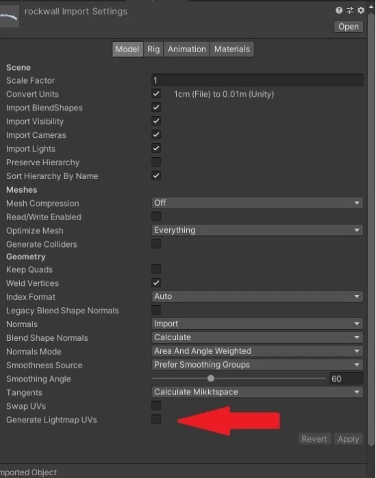

Author: くろしま </br>
参考: https://note.com/watahumi_mina/ by wata23


# VRChat初心者に伝えたい、情報を得るときの基本的で大事なこと
## 情報を得るときの基本的で大事なこと
  - それがいつごろ発信された情報なのか。
    - VRChatのコンテンツがUnityというゲームエンジンをもとにしており、細かくアップデートされている(バージョンごとにサポート期間が決まっている。)
    - Cannyというユーザーの要望・不具合報告サイトをもとにしてアップデートしている。</br>
    canny: https://vrchat.canny.io/
  - 100パーセント信じない。
    - VRChatを始める大多数は、最初はUnityを知らない素人である。
    - VRChat向けの技術的な記事を書いている人の大多数は「独学で学んでいる人」
      - 「正しいやり方ではないけど結果的にうまくいったパターン」が含まれる。
    　- 「自分の環境ではうまくいく」ものが含まれる。
## 効率のいい情報収集の方法
  - 技術的に強い人の X をフォローする。
  - VRChat公式のアップデート内容を都度確認する。
  - Twitterで検索する。
    - 些細なことは X につぶやくことが多い。
  - 詳しい人に直接聞く。
    - ものすごく近道。お礼を忘れずに。

</br>

# VRChat初心者のためのUnityコンポーネント入門
## コンポーネントとは?
  - Unityを開いた時のウィンドウの役割に当てはめる
   </br>
  机の上に置いたものを「ゲームオブジェクト」といい、「ゲームオブジェクト」がどんな形をしていてどんな性質をもっているかは、どんな「コンポーネント」があるかによって決まる。</br>例: </br>
  
  「コンポーネント」を「ゲームオブジェクト」につけることで、色々な機能を付与できる。
## CRChatのコンポーネントの制限
  - 次のサイトで使用できるコンポーネントが確認できる(World)。</br>
    https://creators.vrchat.com/worlds/whitelisted-world-components/
## コンポーネント紹介
  - Transform
    - 全てのゲームオブジェクトについていて、削除することができない。位置、回転、大きさを調整することができる。
  - Mesh Renderer
    - 動かない3Dモデルに使うコンポーネントで、3Dモデルの外見を決めるコンポーネント。
    - 3Dモデルの見え方(どんな模様をしているかやどれくらい透明かなど)を決定する。「マテリアル」を指定する部分をはじめとして色々な項目がある。
    - オブジェクトの「見た目」を調整したいときに触るコンポーネント。
    - このコンポーネントを作ると、Mesh Filterというメッシュと呼ばれる3Dモデルの形状のデータが指定される。
  - VRC Scene Descripter 

     </br>

    ワールドをアップロードするときに必要となる、ワールド限定のコンポーネント。
    - Reference Camera: プレイヤーの目となるカメラのリファレンス。
    - Respone Height Y: リスポーンさせられる高さ。
    - このコンポーネントがついているオブジェクトのZ方向が、ワールドに入ったときの向きになる。
  - Pipeline Manager
    - アップロードされるワールドにはBluePrintIDが付与される。IDが割り振られた後にこのコンポーネント上でDetachというボタンを押すことでBluePrintIDを空欄にすることができる。空欄のままアップロードするとIDが新しくなり、別のワールドとしてアップロードされる。
    - すでにアップロードしたデータに上書きしたい場合は、SDKコンテンツ管理画面からBluePrintIDをコピーして、Detachしたあとの空欄に貼り付けてからAttachすることで、上書きアップロードすることができる。 
  - Animator
    - 3Dオブジェクトの動きを制御できる。
    - 他のコンポーネントの値を、Animator経由で変化させられる。
    - アニメーションを切り替える条件を設定しておくことができる。
  - Tree
    - Unity標準の木を作るシステム。
  - NavMesh系
    - NPCキャラクターなどに自動追尾させることができる。
  - Projector
    - テクスチャを投影することができる。
    - 影の作成などができる

     </br>

  - (Aim/LookAt/Parent/Position/Rotation/Scale) Constraint
    - 他のオブジェクトの変化(位置・回転・スケールの変更)に従って、ゲームオブジェクトに制約を付ける。
      - 他のゲームオブジェクトがある位置に移動するときに、同じ分だけ移動したりなど。
  - VRC_MirrorReflection
    - ミラーとして使える。
  - VRC_AvaterPedestal
    - アバターのペデスタルを置ける。
  - VRC_PortalMaker
    - ポータルを置ける。
  - uGUI系
    - Unity標準のUI
    - ボタンなどがある。 

# VRChat初心者に送る、Unityの親子関係・階層について
## 親子関係・階層
  - ヒエラルキー: Unityの左側のウィンドウ

  

  - ヒエラルキーにあるゲームオブジェクトを長押しでつかんで、ほかのゲームオブジェクト上で離す(ドラッグ＆ドロップと呼ぶ)と、次のようにオブジェクト名が一段下がる。

  

  - ２つのゲームオブジェクトは、「階層」を形作っており、上の階層にあるオブジェクトを親オブジェクト、下の階層にあるオブジェクトを子オブジェクトという。
    - 親子関係とは、ゲームオブジェクト同士の関係性を表した言葉である。
    - 子に対して親は一つだけである。
    - 一番上の親オブジェクトをルートオブジェクトという。
  - 親子関係・階層というシステムがあるのは、そのほうが便利だから。
## 親子関係・階層のメリット
  - 「親を移動させると、子も移動する」
    - 逆は違っていて、子を移動させても親は移動しない。
## 親子関係の特性
  - 各オブジェクトには、そのゲームオブジェクトの位置・角度・大きさの情報を持つ、Transformコンポーネントが必ずついてくる。
  - 子オブジェクトのTransformコンポーネントの位置の値は、親オブジェクトのTransformの位置を基準(=原点)としたものになっている。
    - 親オブジェクトはシーン画面上1個あるワールド座標を原点とする。
    - 子オブジェクトは自分の親となるオブジェクトの座標を基準としている(ローカル座標という)。
# 親の変更は子すべてに波及する
  - 例えば、親のスケールを３倍にしたとき、子も３倍になる。
# 親子関係の相対性の利用方法
  - 扉をはめようと思うと、縦に大きかった場合を考える。
  - 基準の中心位置が真ん中にあった場合、Transformコンポーネントのスケールを変えると、上下に同じ分だけ伸び縮みする。
  - 親オブジェクトが子オブジェクトの基準になることを利用する。
  - 空のゲームオブジェクトを扉の左下に配置する。

  
 
  - 左下が基準(原点)となるため、上方向にスケールすると、オブジェクトの各座標には定数が乗算され、特に下は0のため、定数を乗算しても変わらない。したがって上方向にだけのびる。
  - また、回転をすると、左下を中心に回転する。
## 相対性を利用した値の直接入力(記事内容とはあまり関係ないけど知らなかったこと)
  - オブジェクトのTransformの座標にたとえば、+5 と打ち込むと、５m先に移動する。これをコピーしたオブジェクトごとに行えば等間隔に並べることができる。 

# お勧めのUnityのショートカット【VRChat】
## Sceneの画面移動
  - 前後左右: 右クリック + WASD
  - 上下: 右クリック + EQ 
    - shift 同時押しで加速。
    - 加速量は右クリックを押したまま、マウスホイールをスクロールすると調節できる。
      - Gizumoボタン横のカメラマークでも設定可(Camera Speed)
      
## 操作ツールの切り替え
  - Q: ハンドツール
  - W: 移動
  - E: 回転
  - R: 拡大縮小
  - T: 矩形トランスフォーム
  - Y: トランスフォーム(移動・回転・拡大縮小の組み合わせ)
## Pivot/Center、Local/Global

  - Pivot/Center: 選択ツールの操作を行うときの基準点の位置を選択
    - Pivot: モデルの原点
    - Center: オブジェクトの中心
      - 親子関係にあるときに使えそう。
  - Local/Global: 選択ツールで操作する基準点のXYZ軸を切り替えられる。
    - Local: オブジェクト基準
    - Global: ワールド基準
      - Localでオブジェクトを回転させて、Glbalでワールドに対して平行に下げる、という使い方が可能
## 操作の取り消し・やり直し
  - Ctrl + Z: 取り消し
  - Ctrl + Y: やり直し
## フォーカス
  - オブジェクトを選択しているときにFキーを押すと、そのオブジェクトに注視する。(Hierarchyのオブジェクト名ダブルクリックでもできる。)
  - 「近づくと消える」場合、大きいオブジェクトを編集した後になっている。(適当に小さいオブジェクトを注視すると直る。)
## スナップ機能
  - オブジェクトを選択した状態でvキーを押しながら移動: 頂点スナップ
    - 操作するときの基準点をマウスポインタの位置に持ってこれる。
    - 移動操作で角あたりをおすとオブジェクト同士をぴったりくっつけられる。
## Sceneビューにオブジェクトの位置を合わせる
  - オブジェクトを選択した状態で、Ctrl + Shift + F を押すと、Sceneで見ている位置にオブジェクトを持ってくることができる。
  - MainCameraを選択した状態で、このショートカットキーを使うことで、GameビューとSceneビューを一致させることができる。
## Hierarchyでよく使うやつ
  - オブジェクトを選択した状態でDelete: 削除
  - オブジェクトを選択した状態でCtrl + D: 複製
  - Altキーを押しながら、ツリーの矢印を押す: ツリーをすべて展開、またはすべて閉じる
## Windouws共通
  - Ctrl + C: 値などの文字コピー
  - Ctrl + V: Ctrl + Cでコピーしたものの貼り付け
  - オブジェクトやファイルなどを選択中にF2: 名前の編集
  - ファイルなどが連続している場所で、１つクリックした後にもう一つをShift+クリック：最初にクリックした場所からShift+クリックした部分までをまとめて選択
  - Ctrl押しながらクリック：現在選択しているものに、追加して選択
  - Ctrl+A：全選択
  - Ctrl+S：編集中のファイルのセーブ


# アバターからワールドまで！VRChatユーザーのための Unity Scene入門ガイド
## UnityのSceneとその本体について
  - UnityのSceneファイルは、Unityでアバターの改変やワールド制作を行った後に保存されるセーブデータに該当する。
    - UnityのHierarchyの状態や環境設定などが保存されている。
  - 本体は、Hierarchy上ではなくプロジェクトウィンドウ内に保存されている。
## そもそものSceneの使われ方
  - VRChatでは一つのScene上でデータを編集し、それをVRCSDKを通してアップロードする形が一般的。
  - Unityでゲームを制作する場合は、「複数のSceneを切り替えて使う」方法がある。
    - 例えば、次の図のようにゲームの進行に合わせて、シーンの切り替えを行うことが可能である。
    
    - VRChatは１つのシーンしか扱えない。
## UnityのSceneに保存されている情報について
  - UnityのSceneファイルには、Hierarchy上の情報だけではなく、環境設定系のデータも紐づけて保存されている。
    - RenderSettingとLightmapSettings(どちらもLightningウィンドウにある)
    -NavMeshの設定。
      - NavMesh: シーン上をAIで自動に移動する3Dモデルを作れる機能。
    - ゲームのシーンが切り替わるときにライティングなどの設定が変わる。
    - 独自レイヤーを使用しているオブジェクトがあるシーンを、別のプロジェクトで開いてみると、レイヤーの割り当てがない状態となる(default layer)。
## Scene の複数編集について
  - Unityでは複数個のシーンを同時に開いて、編集することができる。
    - シーンファイルをヒエラルキー上にドラッグ＆ドロップする。
    - 展開されたシーンのオブジェクトは自由に操作することができ、別のシーンにドラッグ＆ドロップでオブジェクトを移動させることなども出来る。
    参考: https://summer2022.vket.com/docs/submission_tips_how_to_object_copy
    - 消すときはシーンファイル名のところで右クリックし、Remove Sceneを選択すると消すことができる。
      - ライティング・オクルージョンカリングなどの環境設定は、すでに開いているシーンのものになっている。そのため新規に開いたシーンの環境設定は無視される。
## Unityアセットのでもシーンを使った
  - Unityアセットにはでもシーンがあるため、ドラッグ＆ドロップでシーンを並べた後、ゲームオブジェクトを一つにシーンに統合する方法がある。
    - シーンが整っているため、オブジェクトの配置に手間をとられないのがメリット。
    - 高負荷のものがあるため、負荷を減らしたいと思ったときに最適化の技法と時間が求められる。
    - インポート時にエラーが起こるため、初心者には勧めづらい。
## Sceneファイルの中身について
  - プロジェクトタブ上でシーンファイルを右クリックし、「Show in Explores」エクスプローラーで開く。
  - エクスプローラー上で右クリックし、「プログラムから開く」を選択。その他のオプションからメモ帳を選ぶ。
  - シーンファイルは、YAMLと呼ばれるフォーマットに従って書かれた文字列である。
    - シーンファイルは、あくまでそのデータがおかれている場所、すなわち参照のみを保存している。
    FBXやプレハブを消すと、Hierarchy上で赤く表示される現象は、参照先のデータが失われているために起こる現象。
## シーンに関する小ネタ
### シーンファイルの複製
  - プロジェクトタブ上で ctrl + D でシーンファイルを複製することができる。Hierarchyを大幅に変更するときはこれでバックアップを取ることができる。
    - シーンは複数編集できるため、うっかり消したゲームオブジェクトを部分的に戻したいと思ったときは、バックアップしたシーンをドラッグ＆ドロップして、ゲームオブジェクトを戻す、ということも可能。
### 未セーブ状態で突然Unityが落ちた時のリカバリー
  - Unityを開く前であれば、シーンファイルのバックアップが保存される。
    - 使っていたプロジェクトのフォルダ内にバックアップ用のファイルがある。
    - Asset フォルダに中身を移したうえで、拡張子を「.unity」にすることでシーンファイルになるため、ダブルクリックすると開ける。
### シーンファイル名「Sample Scene」は危険！？
  - (VCC以前)Unityアセットストアのシーンファイル名もSample Sceneであることがあり、上書きされてこれまでのデータが消える可能性があった。


# VRChat初心者の躓きやすいUnityエラーの対処法
## VRSDKのBuildボタンが消えた！
  - 画面左側にあるConsoleというタブを開く。
  
  - 項目がたくさん出てくる(Unityのログの一覧)。
  
  - 重要度に応じて、白<黄色<赤 となっている。
    - 白い吹き出しにビックリマークのアイコンは最も影響が無いもの。</br>
    
    - 黄色に三角形にビックリマーク。ちょっと問題はありますが、大きい影響はありません。</br>
    
    - 赤い8角形にビックリマーク。明確に問題があるエラー。</br>
    
      - 無視してもUnityが問題なく動くものと、Unityが上手く動かなくなるものが混在している。
      - 優先的に直すべきものは、「Consoleタブの左上のClearボタンを押して、残ったエラー」。
        - ログをクリックして選択すると、下の方に文章が現れるので、それをgoogleなりtwitterに検索をかけて対処。
        - 一通り対処できると、Clearボタンを押しても何も出てこなくなる。この状態になるとUnityは正常に動くようになり、VRCSDKのBuildボタンは復活している(はず)。
## そもそもエラーを起こさないためには
  - 一番大事なのは「導入手順とその順番をきちんと守る」。
    - 規定された動作しかできない機械。
    - 導入手順とその順番をきちんと守れば、エラーが起きる可能性はぐっと減る。
## エラーの原因を少なくしよう
  - 新しい何かを追加(インポート)したら、コンソールをチェックする。
  - すでにある何かを削除したら、コンソールをチェックする。
    - 基本的に今まで大丈夫だったプロジェクトがエラーで動かなくなるタイミングは、何かをインポートしたときか何かを間違って削除したときである。
      - インポートしたときに起こるエラーは、何か前提となるものが入っていないケースや、その環境では利用できないものを入れてしまった場合が多い。
      - 間違って削除したときは、依存関係を壊してしまって、エラーになっていることが多い。
    - インポート時にエラーが起こった場合は、その時インポートされたファイルを削除するだけでエラーが解消される。
      - インポートされたファイルについては、インポート時に以下のようなリストが出てくるが、このチェックが入っているものが追加される。
      - 削除したいときは、このリストに載っているものを削除すれば良い。
      
    - 間違って削除したときは、削除してすぐなら、冷静に Ctrl+Z のショートカットを押すことで元に戻る。
      - Unityを一度閉じてしまうとダメなので、そのときは消してしまったファイルのあるUnityPackageを再インポートする。
  - Unityの動作がおかしくなっているケースもある。
    - 謎のエラーが起こったときは、何も考えずにUnityを閉じてもう一回開きなおすと直ることもある。


# 同じワールドやアバターを、別のデータとしてアップロードする方法 ～VRChatのBlueprint IDについて～
## BlueprintIDについて
  - Blueprint IDは、VRChat側がワールドやアバターを管理するためにつけているID
    - Unityを使って、VRChat上にデータをアップロードするときに自動的に割り当てられるもの。
    - このIDはユニークなものであり、ほかの人と被らないようになっている。
  - Blueprint IDの仕様をうまく使うことで、同じアバターやワールドを別データとしてあげたり、アップロード済みの既存のデータに上書きしたりすることが可能である。
## Blueprint IDの新規作成・切り替えなどについて
  - Blueprint IDを管理するためにPipeline Managerという名前のコンポーネントがある。
    - ワールドであれば、VRCWorldという名前のゲームオブジェクトについている、VRC Scene Descripterコンポーネントの下にある。
    - 一度でもアップロードしたデータであれば、以下のようにアップロード時のBlueprint IDが記載されている。
    
    - 一度もアップロードしたことがない場合は以下のように空欄になっている。
    
      - この空欄の状態でアップロードすると、自動的に新しいBlueprint IDが割り振られて、Blueprint IDが表示されるようになる。
## 別データとしてのアップロード方法
  - 別データとして、アップロードしたい場合はPipeline ManagerのDetachボタンを押す。
  - 紐づけられていたBlueprint IDが解除され、新しい状態になるので、この状態でアップロードすると新規IDが割り振られて、別データとしてアップロードすることができる。
## 既存データへの切り替え・上書き・削除など
  - VRChat SDKのタブにContent Managerというタブがある。
  - 現在紐づけられているBlueprint IDがあるときは、データの横に(Current)という表記がつく。 
  - この状態から別のデータに切り替えを行いたいときは、切り替えを行いたいデータのところにあるSet Currentボタンを押す。
  - 削除したい場合は、Deleteボタンを押すことで削除ができる。
## Blueprint ID で注意したいこと
  - ワールドやアバターの販売・配布時にBluprint IDが残ったデータを配布してしまうと、アップロードしようとしたときにエラーが発生する。
    - 他人にデータを販売、配布するときはBlueprint IDを空欄にしておく。
  - ワールドは複数Pipeline Managerがあると、一つにするようにと注意書きが出る。
## PC・Quest両対応したいときについて
  - PC版をすでにアップロード済みだとする。このときAndroid向けに切り替えたプロジェクトで、"PC版と同じBlueprint ID"に対してアップロードを行うことでQuest版を追加することができる。


# 簡単なUnityプロジェクトのバックアップ方法
## 各種バックアップ方法
  - ファイルごとコピー
    - 簡単、無料、手動、非常に時間がかかる、全部コピーする必要がある。
  - VCCのバックアップ機能
    - ファイルごとコピーを必要最低限のフォルダのみ行う。
      - **ワールドのバックアップにはおすすめできない。**(キャッシュ情報はなくなる)
  - Collaborate
    - Unity上でできる、無料、差分セーブ可能、容量が少ない
      - クラウド容量1GBのため、もはや使えない。
  - Github
    - 難しい、無料、差分セーブ可能、容量は外付けHDD等に保存することで解決する。
      - 無料で使えるクラウドの容量は5GB。
  - **Turbo Backup PRO(おすすめ)**
    - 簡単、有料(52.8ドル(約８千円...))、差分セーブ、自動セーブ、保存場所は自由


# ライトベイクに挑戦する前に読むと良いかもしれない記事
## 前提知識 : VRCの映像ができるまで
  - 1秒間にFPS枚の絵が描かれ、更新される。
  - 描画処理が何らかの理由で間に合わないときに、FPSが下がる。
  - 絵を表示する側のHMDやモニター側にも更新速度があり、こちらはリフレッシュレートと呼ばれる(単位はHz)。
  - PCのスペックが200FPSでも、絵を表示する側が50Hzだと、FPSは50しか出ない。
## ライトベイクのいいところ
  - Unityではライトコンポーネントのついたゲームオブジェクトを置くことで、光源を作ることができる。
  - オブジェクト・光源の数が多ければ多いほど、負荷は増大する。
  - 静止している光源については、光と影が動くことはない。だから、事前に計算をして、その結果を保存しておけばよい。
  - 計算結果は、ライトマップと呼ばれるテクスチャで保存される。
  - ライトベイクの影響する各要素の関連性が見えていない。
## ライトマップができるまで
  - アバターには画像を、UVと呼ばれる3Dモデルを平面に展開した、展開図に対して画像を重ねている。
  - ライトマップもテクスチャのため、3Dモデルに対応するUVが必要。そのためのUVはライトマップを作るときに同時に作られる特別製のもの。
    - 1枚のライトマップで、複数の3Dモデルを担当するために、複数の3DモデルからUVを集めてきて、ライトマップを作る。
    - １枚のライトマップの中には、複数のオブジェクトの光と影の計算結果が詰め込まれている。これにより、沢山のオブジェクトがあってもライトマップの枚数は少なくて済む。
    - この時に収集されてくるUVは、Unity上ではUV2と呼ばれる２枚目のUVになる。
    - ライトマップが作られるまでの流れ
      1. Staticフラグがつけられているオブジェクト群からUV2の情報を集めてくる。
      2. 集めてきたUV2を敷き詰めることで、ライトマップ用のUVを作成する。
      3. 最終的に出来上がったライトマップ用UVをもとに、ライトマップを計算、生成する。
## UV2に求められる制約について
  - UV2は普通のテクスチャ用である１枚目のUVと比較して、特殊な制約を求められる。(だからこそ、別枠の２枚目になっている。)
    - UV展開図に重なりがないこと。
      - 光と影の計算結果が２重に保存されてしまうため。
    - UV展開図の展開されたパーツ間に十分な隙間があること。
      - 暗い部分に明るい部分がにじむことを防ぐため。
    - UV展開図が0~1に収まっていること。
      - 範囲外にはみ出すのを防ぐため。
    - 3DモデルにUV2があるかどうかを確認する必要がある。
      - 確認したいオブジェクトのメッシュデータを探す。
      - Meshfilterのところにあるアイテムをクリックするとわかりやすい。
      
      - メッシュデータの右下のプレビューが表示され、UV2が格納されていると、uv2と表記されている。
    - UV2がないときは、FBXを選択したときに、modelタブの一番下あたりにgenerate lightmap uvsという項目があり、ここにチェックを入れることで、UV1の情報をもとにUnityがUV2を自動生成される。
    
## ライトベイクに必要なこと！
  - ベイク設定のライト
  - staticのチェック
  - UV2
## ライトマップの解像度について
  - ライトマップにも解像度があり、沢山のUV2を敷き詰める必要があるため、解像度が重要になってくる。
  - ライトマップの解像度を確保する方法。
    1. ライトマップ自遺体の解像度を上げる
      - ライトマップ自体のサイズを大きくすればよいが、その分ライトマップの容量は大きくなってしまう。
      - Unityでは「Lightmap Resolution」と表記されているパラメーター。デフォルトでかなり大きい。
    2. 各モデルごとに割り当てられるUV2の領域を変える。
      - 各UV2ごとに、敷き詰められる時のサイズを変えることもできる。MeshRendererにあるScale in Lightmapという項目がそう。
      - ベイクする前には隠れていて、Contributed Global Illuminatorという項目にチェックを入れるか、Staticフラグにチェックを入れると出てくる。
      
      - 重要ではないオブジェクトの割り当て領域を小さくして、重要なオブジェクトに領域を割くなどの工夫をすれば、容量を節約しながら綺麗に見せることも可能
    3. UV2を作り直して再展開する。
      - Blender等のモデリングソフトでUV2を展開・編集するという手もある。これは各モデルのUV2に対して行う。
## その他
  - color temparature mode で寒色から暖色に変えられる。

# "反射"を制して綺麗なワールドを！クオリティを上げるReflection Probeとは？
## Reflection Probeとは？
  - 反射する物体に映りこむ景色の情報を与えるもの。
  - デフォルトの反射の景色はSkybox。Reflection Probeを設定することではじめて反射に映りこむ景色を「上書き」できる。
  - Reflection Probeはキューブマップと呼ばれる特殊なテクスチャを生成して使う。
    - キューブマップを使ってできた疑似的な立方体による風景は、境目をうまく処理することにより球体のように見えるので、Skyboxなどにもキューブマップが利用されたりする(なので、Sky"box")。
## デフォルトの反射光設定変更
  - デフォルトの反射で使われている景色を変更する場所は、[Windws]→[Rendering]→[LightingSettings]のウィンドウの中にあるEnvironment Reflectionという項目。
  
    - デフォルトではSourceがSkyboxになっているが、Customを選択することにより独自のcubemapを使用することができる。
## shader側の設定項目
  - MetallicとRoughnessはどちらもReflection Probeに関わりのあるパラメータ。
  - Metallicはそもそもの反射率に、Smoothness(ShaderによってはRoughness)は映り込むReflection Probeの粗さに関係する。
## Reflection Probe側の設定
  - 上部アイコン二つ
    - 全射は Refection Probeの影響を受ける範囲を設定し、後者はCubemapを撮影する位置を設定する。
  - TypeをCustomにし、Dynamic Objectにチェックを入れると、Staticのチェックに関係なく、すべてのオブジェクトを撮影する。
## Reflection Probeの細かい制御方法
  - 調整したいゲームオブジェクトのMeshRendererのAnchor OverrideにReflection Probeのゲームオブジェクトを入れることで、そのReflection Probeの影響だけを受けるようになる。


# VRChatでの音の付け方 ～AudioSource周りのあれこれ～
## AudioClipとAudioSourceについて
  - 現実で音楽を聴きたいとき、必要なものが二つある。
    - 音源データ
    - 音源データを再生するための機器
  - Unityでも同じ働きをするものがある
    - AudioClip
    - AudioSource
  - Unity上にインポートされた音源データは、AudioClipの設定に従って再構成されて扱われる。
  - AudioListenerもあるが、自動で設定される(たしかカメラとかについてる)
## 2D・3D音源について
  - 生活の中でなっている音は、音の発生源があり、左右のボリューム差によって、音の発生源がどこにあるか聞き分けることができる。
    - 音の発生源が決まっていて、一夜向きによって聞こえ方が変わる音源をUniity上では3D音源として扱う。
  - 2D音源は、どのような位置、向きにおいても同じ聞こえ方をするものになる。
  - 2D音源はBGMに使われ、3D音源は効果音などに使われる。
  - Spatial Blendにより、中間の性質を持たせることができる。
## 具体的な設定方法について
### AudioClipの設定

  - Force To Mono: ステレオの音源をモノラル音源にする。
    - 表現力は下がるが、容量が半分になるという利点がある。
  - Compression Format
    - 基本的にVobisで問題ない。PCMは無圧縮、ADPCMはPCMの1/3.5の圧縮率で、高品質になるが、容量が非常に大きくなる。
  - Quality
    - 下げると高音域(15kHz)が削られるらしい。重要でな効果音はこれを利用することにより、ワールド容量を減らすことができる。圧縮形式がVovisのときのみ使える。
  - Sample Rate Setting
    - PCM、ADPCM用の軽量化オプション
### BGMなどの2D音源
  - Loop
    - デフォルトだと、１回再生し終わると終わる。
  - Volume
    - 0～1の値で設定する。基本大きいので、小さめの値から設定する。
### 効果音などの3D音源
  - VRC Spatial Audio Sourceと呼ばれるコンポーネントを利用するかしないかでかわる。
  -Spatial Audio Sourceを使わない場合
    - Volume
      - 2D音源と同じ。
    - Spatial Blend
      - 2D音源と3D音源のブレンド具合。
    - 3D Sound Settings
      - Doppler Level
        - 今はもう無効。
      - Spread
        - 音が聞こえる角度を示す。180°だと均等に聞こえる。
      - Volume Rolloff
        - 音量や各種エフェクトを距離に応じて制御する波形のタイプ。
      - Min Distance
        - 最大の音量が維持される距離。この数値より近い距離にいた場合、常に最大になる。
        - 音量が０になるポイントで**はない**。
    - 波形グラフ
    
      - 横軸が音源からの距離で、縦軸が大きさ。横軸の大きさはMax Distanceに対応する。
      - 4つのパラメーターを距離ごとに設定することができる。
      - 制御点を加えたりのぞいたりすることで、曲線を調整できる。
  - Spatial Audio Sourceを使う場合
    - AudioSourceのついたゲームオブジェクトを追加する形で使う。
    
      - GainはVolumeと同時に機能し、音が小さすぎるときに使うとよい(あげすぎると音割れする。)
      - Volumetric Radiusは音が回り込んでくる距離を示す。
      - Enable Spatializationはつけていないと3D音源にならない。
      - Use Audio Source Volume Curveはチェックを入れていないと、波形グラフによるVolumeの調整がNearとFarの逆２乗の波形で上書きされる。
  - 全ての音源にエフェクトをかけたい場合
    - 適当なゲームオブジェクトにAudio Listenerというコンポーネントをつけて、それにつけたいエフェクトのコンポーネントをつける。
      - フィルター系はワールド開始時にオンになっていないと作動しない。
  - 音源ごとにエフェクトをかけたい場合
    - AudioSourceのついたゲームオブジェクトに、エフェクトのコンポーネントをつける。
  - エリアごとにリバーブをかけたい場合
    - AudioReverbZoneコンポーネントのついたゲームオブジェクトを配置することで、そのAudioReverbZoneの影響範囲に入ったときだけエフェクトをかけることができる。
      - VRC Audio SourceつきのAudioSourceでは無効化される。
  - Spatial Audio Sourceコンポーネントはシームレスに音が変化してよいらしい。

# VRChatワールド制作における『Layer』の役割
  - 公式マニュアル
    https://creators.vrchat.com/worlds/layers/
## 『Layer』とは
  - Unityにおけるレイヤーはグループ分けのようなもの。
    - グループ分けをしておくと、ある特定の効果を反映するか・しないかをグループごとにコントロールすることができる。
    - グループ分けは、各ゲームオブジェクトごとに行われる。
  - 0番から31番まであって、そのいずれかが必ずゲームオブジェクトに割り振られている。
  - 初期状態では、0番目の「Default」 レイヤーに、ゲームオブジェクトが所属している。
  - 具体例としては、一つの光源があったとして、その光源によって明るくなる・明るくならないをレイヤーごとに決めることができる。
    1. 光が当たる・当たらんないをオブジェクトごとに制御できる。
    2. 影ができる・できないをオブジェクトごとに制御できる。
    3. 光源の影響を受けないオブジェクトは光源の計算がいらなくなるので軽量化につながるケースがある。（つかえそう！）
## レイヤーに関係しているもの
  - カメラの描画設定
  - ミラーの描画設定
  - コライダーの衝突設定
  - 光源が影響を与えるオブジェクトの設定
  - PostProcessingの設定
  - Udonの制御(レイキャストなど)
  - パーティクルのプレビューの表示非表示
### カメラの描画設定
  - カメラに対して映る・映らないを設定することができる。
  - カメラコンポ―ネントの上あたりにあるCulling Maskで映したいレイヤーにチェックを入れ、それ以外はチェックをはずせばよい。
    - Main Cameraでこの項目をいじっても、VRChat内のプレイヤーの視界に映らなくなるわけではない。
### ミラーの描画設定
  - ミラーに映る・映らないを設定することができる。
  - VRC_Mirrorコンポーネントの下あたりにあるReflect Layersで映したいレイヤーにチェックを入れ、それ以外はチェックを外せばよい。
  - 面倒であれば、「Show only players」や「Show players/world」を押すとレイヤーのプリセットが利用できる。
### コライダーの衝突設定
  - 各レイヤ同士が衝突するか・しないかを設定することができる。
    - 左上のメニュー[Edit]→[Project Settings]→[Pysics]のところで設定できる。
      
### 光源が影響を与えるオブジェクトの設定
  - 特定の光源からの光を受ける・受けないを設定することができる。
  - Lightコンポーネントの下の方にあるCulling maskで光を受けてほしいレイヤーにチェックを入れ、それ以外はチェックを外せばOK。
### PostProcessingの設定
  - 影響を与える・与えないではなく、PostProcessing Volumeのコンポーネントが付いたオブジェクトを指し示すために使われる。
### Udonの制御
  - レイキャストを飛ばすときに特定のレイヤーだけ検出するようにすることができる。
### パーティクルのプレビューの表示非表示
  - Hierarchyでパーティクルを選択したときに、Sceneビューの右下に出てくる小さいウィンドウの中に、Simulate Layersという項目がある。
    - デフォルトは選択したパーティクルをプレビューしますが、Simulate Layers を Nothing 以外にすると選んだレイヤーに所属したパーティクルが常時プレビューされる。
    - Everythingにすると全てのパーティクルが常時プレビューされる。
## 既存レイヤーについての説明
### Layer 0～7
  - Unityのデフォルトレイヤーとなっており、書き換えができない。
  - Default
    - Unityのゲームオブジェクトでデフォルトで使われているレイヤー
  - TransparentFX
    - レンズフレアの遮蔽物にならないレイヤー
  - Ignore Raycast
    - レイヤーマスクの指定がない場合、Unityのレイキャストによって無視される。
  - Water
    - 昔のUnityの標準アセットの名残。VRC看ミラーで映らないようになっている。PostProcessレイヤーの標準レイヤーとしても使用されている。
  - UI
    - VRC内のメニューなどいろいろなUI系が入っている。使用は非推奨。
    - ここに所属しているオブジェクトはVRCのメニューを開いている時だけ表示され、インタラクトについてもメニューを開いた状態でレーザービームを当てた状態でのみインタラクトできる。
    - 他の既存のどのレイヤーとも衝突しない初期設定になっている。そして、VRカメラに映らないレイヤー。
### Layer 8～21
  - VRChat側でセットアップされていて、実際に既に利用されているレイヤー。
  - Player
    - 自分以外のプレイヤーのアバターが所属している。
  - PlayerLocal
    - 自分の頭を除いた、アバター部分が所属している。頭は自分自身には見えないので省かれている。ミラーやカメラへの自分自身の描画はPlayerLocalの代わりにMirrorReflectionを使用することで、頭を含めた全身を描画する。
  - UiMenu
    - レイヤー5のUIと性質は同じ。プレイヤーのネームプレートは子のレイヤーに所属している。
  - Pickup
    - 持てるオブジェクト用のレイヤー。PlayeとPlayerLocalに衝突しない設定になっている。
  - PickupNoEnvironment
    - Pickupのみと衝突する設定になっている。
  - Walkthrough
    - プレイヤーはこのレイヤーと衝突しない設定になっている。コライダー付きの机や椅子をこのレイヤーにすると、プレイヤーにぶつからず、Pickupはぶつかる設定になっているので便利。
  - MirrorReflection
    - ミラーやカメラで自分のアバターを描画するためのレイヤー。
    - PlayerLocalとの違いは、こちらでは頭も描画される。PlayerLocalも同時に描画対象にすると自分自身の首から下を２回描画することになり、Z-Fightingとかが起こる。
    - このレイヤーはピックアップできず、衝突もなく、レイキャストの対象外なので、プレイヤーやオブジェクトのコライダーへの進入を判定するのにちょうどいいレイヤー。
  - reserved2～4
    - 基本的に使用は非推奨。このレイヤーにオブジェクトを所属させると、アップロード時に強制的にレイヤー0(default)に動作させられる。
  - 上記以外のレイヤー
    - 使われていないので自由に使ってもよさそう。衝突設定やCulling maskなどは要注意。
  - Layer 22～31
    - 自由に使えるレイヤー。新しく作ることができる。
    - PlayerとPlayer Localには衝突しなくて、Pickupには衝突するレイヤーを作って、そこにコライダーのついた壁のオブジェクトを所属させると、ピックアップは持っていけないプレイヤーのみがすり抜ける壁、などが作れる。
## よく使われるテクニック
### アバターにのみリアルタイムライトを当てる
  - レイヤーをPlayerとPlayerLocalとMirrorReflectionに設定したリアルタイムのライトで、アバターのみに光を当てるテクニックはよく使われる。
### 影絵付きのリアルタイムライトを必要とするシェーダーへの保証
  - 一部のシェーダーは影付きのリアルタイムライトを必要とする、影付きのリアルタイムライトがないと深度情報が得られないため。
    - 影付きのリアルタイムライトは重い。
  - 何もオブジェクトが無い一つのレイヤーのみを照らす影付きのリアルタイムライトを用意する。何もオブジェクトが無くても何故かDepthが取れるので、最低限の負荷でDepthを必要とする一部のシェーダーの動作を保証できる。
### VRカメラに映らないスイッチやピックアップを作る
  -  Ignore Raycastレイヤーに突っ込んでおくと、カメラに映らず、操作も可能。
## レイヤーに関するあれこれの検証
  - Waterレイヤーはミラーに映らない仕様。
  - Bakeryどころか、そもそも標準のライトベイクシステムもCulling maskの設定を考慮していない
    - culling mask : カメラについている設定項目。映る、映らないレイヤーを指定可能。

# ライトベイクに慣れてきたころに読むといいかもしれない記事
## ライトマップのテクスチャ設定
  - テクスチャの圧縮形式は、テクスチャを選択したときに一番下に出てくる項目でできるが、タブを切り替える必要がある。PCとandroi用の設定があるので、必要に応じてチェックを入れて設定を上書きする。
    - 「RGB9e5 32 Bit Shared Exponent Float」を選択することがよい。
## 自身にライトベイクせず、他オブジェクトに影を落としたいとき
  - MeshRendererで、Staticフラグにチェックを入れているときに出てくる、Scale in Lightmapの値を0にすることでこの状況にできる。
  - ライトマップに自身の影の影響をだしつつ、自分はライトベイクされないので、ライトマップ容量を節約し、余った部分でほかのライトマップUVを大きくして綺麗に焼いたりすることができる。
    - ライトベイクの影響を受けにくいオブジェクト(金属など)に対して、この手法を使うとよい。
  - 凹凸が少ないオブジェクトに対して、Scale in Lightmap の値を０にした状態で、自分自身の明るさをLightprobeで確保することで、疑似的にライトベイクしたかのように見せられる。
## ライトベイクは軽い？Static batchingについて
  - Batching staticをチェックを入れて、ライトベイクを実行するとStatic batchingが有効化される。
  - Static batchingはゲーム中に自動でメッシュを結合する機能。メッシュが結合されると、描画命令の回数が減って、その分軽くなる。
    - ライトベイクの働きは、Contributed GIの項目。
  - しかし、同一の３Ｄモデルであっても複製されたメッシュで結合する。
  - ゲーム中に結合されたメッシュがCPUに乗る上に、アップロード時のワールドデータにもそのメッシュ情報が格納されている(著者の調査)。
  - お勧めの方法
    - **同じメッシュ・マテリアルのオブジェクトはGPU Instancingを使う。そのうえで、一つしかないユニークなオブジェクトにだけStatic batchingを使う。**
      - GPU Instancingは同じメッシュ・マテリアルのときに、同じオブジェクトを使いまわしてくれる機能。同じオブジェクトであれば、描画命令がオブジェクト１個分で済む。
      - GPU Instancingしたとき、Contributed GIにチェックを入れ、Batching Staticのチェックを外した状態でベイクすればライトベイクできる。
## ライトベイクに非対応のShader
  - ライトベイクに非対応なシェーダーが存在する。
    - 対応シェーダーは、Standard シェーダーやAutodeskシェーダー、Fillamented Shader、mochie shaderなど
    - liltoomも設定すればベイクできるらしい
      参考: https://x.com/wata23_37/status/1801923080605880454


## 『特定の角度から見たときにオブジェクトが消える！』の解決方法 ~VRChatに適したオクルージョンカリングの使い方~
## はじめに
  - オクルージョンカリング -> 見えないところを非表示にする機能。
  - VRでは制御しにくい。
## オクルージョンカリングについて
  - 遮蔽物と遮蔽されるものをあらかじめ設定し、「この場所からこのオブジェクトは見える/見えない」を事前に計算・保存しておく。ゲーム内ではその設定に基づいて、プレイヤーの視界に映らないものを消す機能。
  - Unityでは遮蔽されている物体に対しても、描画するための処理が走る。
    - 一部描画処理が省かれるため、多少負荷は下がるが、描画負荷がかかってしまう。
## 動的オブジェクトのカリング
  - Renderer 系のコンポーネントの Dynamic Occlusion をオンにする(デフォルトオン)と動的オブジェクトでもカリングされる。
## オクルージョンカリングの問題点
  - VRChatにおいてオクルージョンカリングは相性が悪い。
    - PlayerSpaceMover(https://github.com/naelstrof/VRPlayspaceMover/releases)やSpace Dragを併用して、ありとあらゆる場所・角度からオブジェクトを見てしまうことができるので。
    - 遮蔽物の内部から見たときの挙動は未定義。
## VRChat内でのオススメの使い方
  - 絶対にプレイヤーが行かない場所に遮蔽する物体を配置する。
    - 壁や地面自体にOccluderを設定すると壁や地面に視点を近づけただけで、オクルージョンカリングが発動してしまう(近づいても暴発しなくなった模様)。
  - ソファーや椅子といったプレイヤーがいける位置にはOccluderを設定しない方が良い。

# shader
  - unityではマテリアルとシェーダーが1対1でひもづく。
  - サーフェスシェーダー
    - 頂点情報を処理(Vertex) -> オブジェクトの色を決める(Surf) -> ライティング(Lighting)
      - VertexとLightingはUnityが自動生成する。
  - shaderファイルの構成
    - Parameters
      - インスペクタに公開する変数
    - Shader Settings
      - ライティングや透明度などのシェーダーの設定項目
    - Surface Shader
      - シェーダー本体のプログラム -> この部分を修正して目的のシェーダーを作成する
  - surf shader
    - Vertexシェーダから出力された値(Input構造体)を入力に取り、オブジェクトの表面色(SurfaceOutputStandard)を出力する。
      - Input構造体が持つ情報
        - uv_MainTex: テクスチャのuv座標
        - viewDir: 視線方向
        - worldPos: ワールド座標
        - screenPos: スクリーン座標
      - Output構造体が持つ情報
        - Albedo: 基本色
        - Normal: 法線情報
    - surf関数がサーフェイスシェーダの肝
      - 出力用の構造体がもつAlbedo変数に色情報を指定する。
  - オブジェクトを半透明にするには次の３点を設定する必要がある。
    - Queue
      - "Transparent"の綴り間違えたら、透明すぎて見えなくなった。
    - alpha:fade
    - SurfaceOutputStandard
  - shaderプログラムのエラーを確認するにはunityのコンソールを見る。
  - サーフェスシェーダーでは1ピクセルごとにsurfメソッドが実行される。
    - サーフェスシェーダーは現在処理しているテクスチャの位置を知らなければならない。
    - 入力構造体に、uv[テクスチャ変数名]という名前のメンバ変数を宣言しておく。これによりサーフェイスシェーダには処理すべきテクスチャのuv座標が自動的に渡される。
    - surfメソッドの中でtex2Dメソッドを使って、?MainTexからuv_MainTexで指定された座標の色を取得して、それを出力する色としてAlbedoに指定している。
  - Propertiesブロックにテクスチャファイルを宣言することにより、インスペクタからテクスチャを設定できる。
  　- 「公開変数名」「インスペクタの表示」「型名」「初期値」の順 
      - 公開する変数名が_MainTex、インスペクタ上の表示がTexture、型名が2D、初期値が"white"になる。
  - (判定条件) ? (trueの時の値) : (falseのときの値)
  - _Time変数はUnityのシェーダにデフォルトで用意されている変数で、時間とともに値が増加する。
  - Unityのシェーダは HLSL と呼ばれる言語で書かれている。
  - shadertoy: https://www.shadertoy.com/
  - v2f は ulint shader 内に定義されている。
  - ulint shader
    - ライティングなし: 光源の影響を受けずに、常に一定の色で表示される。
    - 高速描画: ライティング計算が不要なため、描画が高速。
    - 透明度のサポート: 透明なオブジェクトを描画する際に使用されることが多い。
  - float lerp(float a, float b,float x)
    - a: 補間の開始値
    - b: 補間の終了値
    - x: 補間の割合 (0.0 から 1.0 の範囲)
  - Udon sharp では頂点処理はできない。
  - unity の shaderLab において、パスの順番はシェーダのレンダリング順序を制御する。パスは定義された準に制御される。
    - 各パスは異なるレンダリング設定やシェーダプログラムを持つことができるため、複数のパスを使用することで複雑なレンダリング効果を実現することができる。
    ```C#
    Shader "Examples/MultiPass" {
        SubShader {
            Pass {
                Name "FirstPass"
                // 最初のパスの設定
            }
            Pass {
                Name "SecondPass"
                // 次のパスの設定
            }
        }
    }

    ```
  - デプスバッファ
    - カメラからオブジェクトまでの距離を格納したバッファ
    - 被写界深度のエフェクトや影の計算など、様々な場面で使われる。
  Legacy shader/Particles/Additive (soft) で光芒とかを表現できそう。あとgradationした画像テクスチャを使う

# Bakery - GPU Lightmapper
  - Geforce および Quadro シリーズのGPUで高品質かつ高速実行が可能なライトマッパー
  - CPU で1時間以上かかるベイクもわずか５分で終わらせることができる。
  - GPU が Geforce および Quadro 出ない場合、また、 Geforce でも700番台(Kepler)より前のGPUの場合は使えない。
  - 公式マニュアル: https://geom.io/bakery/wiki/index.php?title=Manual
## 基本的なベイクとUnity標準ベイクとの共通事項
### Mesh Lenderer の設定
  - Staticのチェック
    - ライトマップを生成だけをしたい場合は、「Contribute Global illumination」のみチェックする。
  - Cast Shadow
  - Receive Shadows
    - 影を作る、受けてライトマップに書き込む場合にチェックをonにする。
  - Scale in Lightmap
    - Contribute Global Illumination をオンにするとでてくる。
    - オブジェクトごとにライトマップの解像度を倍率で変更できる。
      - 広い屋外エリア（都市）：1-5
      - 中程度の屋外エリア（路地等）：10-20
      - 高品質のインテリア：100  など
### BakeryLightコンポーネントを配置
  - Bakery ライトにはタイプが存在せず、コンポーネント毎に動作が異なる。
  - 設置方法は、Add Component もしくは Bakery>Create から行う。
#### Bakery Direct Light
  - Directionalライトと対応。
  - 太陽光として使われる、エリア全体に平行に来るライト。
    - Intensity
      - ライトの明るさ
    - Indirect Multiplier
      - 光が反射したときの減衰率。
      - 間接光が不要な場合に0、0から1の場合は反射するごとに暗くなり、1以上だと反射するごとに明るくなる。
    - Shadow spred
      - 影のぼやけ方を調整する。ギザギザの影ができる場合は、この値を上げれば改善される。
#### Bakery Point Light
  - Projection mask によって特性が変わる。
  - Omni は Point ライトと同じ。
  - Cone は Spot ライトと同じ。
    - Intensity
      - ライトの明るさ。
    - Range
      - ライトの設置位置からの到達距離。
      - 大きければ明るくなり、小さければ暗くなる。
      - 反射にも影響を及ぼすため狭い場所だとこれを下げるとかなり暗くなる。Intensityと合わせて明るさの調整ができる。
    - Outer angle
      - Cone/cookieライトで光を発する角度。円錐形上に光が出ていく。
#### Bakery sky Light
  - 環境光、Environment Lightingと対応している。
  - 空気中の塵や水分による屈折や反射などによる非常に弱い光の再現に使う。
### Bakery Renderウィンドウ
  - "Bakery"から"RenderLightmap"を選ぶと出てくる。
  - Renderを押せばレンダリングが開始される。
  - 詳細な設定をする場合は、"Simple"を"Experimental"に変更することで設定項目が出てくる。
    - Texel per unit は16で十分
    - RTXmodeをonにすると、ベイク時間が３分の１ぐらいになる。
### その他
  - Bakery 設定販売ワールド: https://sc-const.booth.pm/items/3078418
## Bakery マニュアル レンダリング設定
### レンダリング設定
#### Render Mode
  - どのように Lightap をベイクするかの設定。
  - Full Lightning
    - 全ての Bakery ライトの直接光および間接光をベイクする。
  - Indirect
    - 基本的な混合モード。
    - 全てのライトの Baked Contribution を参照する。
    - Direct And Indirect に設定されている場合、Full Lighting モードと同じようにベイクする。
    - Indirect Only に設定されている場合は、このライトからの間接光のみベイクする。
  - Shadowmask
    - ２種類のライトマップを生成することで機能する。
      - 一つはベイクされた色で、もう一つは静的なオブジェクトからの影。
        - リアルタイムな影はシーン全体ではなく一握りの動的なオブジェクトのみで計算される。
        - リアルタイムな影とベイクされた影は正しくブレンドされる。
        - リアルタイムライトは、法線や鏡面反射などの表面効果をレンダリングしながら、高品質なベイクされた影によって隠蔽させることができる。
    - Shadowmask が設定できるライトは Direct, Poit, Spot ライトのみ(Unityがリアルタイム処理に対応しているため)。
    - この動作を有効にするには、UnityとBakeryの両方のライトが同じオブジェクトにあり、Baked ContributionがIndirect And Shadowmaskに設定されている必要がある。設定されていないライトはIndirectモードのようにベイクされる。
  - Distance Shadowmask
    - Shadowmaskを選択した場合のみに表示され、プロジェクトの Quality Settingsで同名の設定を単純に切り替える。
  - Subtractive
    - ライトマップに特別なことは何もせず、FUll Lightingと同じように動作する。
    - 唯一の違いは、リアルタイムのUnityライトが減算モードで動作するように設定される点である。
    - UnityのLightingウィンドウで、global subtractiveパラメータを追加設定する必要がある。

# Particle
 - Duration
   - パーティクルの表示時間を指定する。
   - ループをOFFにした場合は、アニメーションを開始してからDurationの時間が経過したらアニメーションが終了する。
   - ループにチェックを入れている場合は、Durationは1サイクルの長さになる。
  - Looping
    - アニメーションを繰り返すか否かのチェックボタン。チェックを入れると、繰り返しアニメーションが表示される。
  - Prewarn
    - チェックを入れるとすぐにアニメーションが開始される。
  - Start Delay
    - アニメーションが開始されるまでの待ち時間。設定した時間分、遅れてアニメーションが開始される。
      - Prewarn にチェックを入れていると、利用できない。
  - Start Lifetime
    - パーティクルの表示時間。
    - 数値を大きくするほど、一つ一つのパーティクルが長い間表示される。
  - Start Speed
    - パーティクルの表示速度。
  - Start Size
    - 一つ一つのパーティクルのサイズを指定する。数値が大きくなるほど、パーティクルも大きくなる。
  - Start Rotation
    - パーティクルの開始時の向きを指定する。
    - 球体であれば、向きによって表示が異なることはないので関係ないが、形が違ったりマテリアルを反映したりすると使うようになる。
  - Start Color
    - パーティクルの色を指定する。
  - Gravity Multiplier
    - パーティクルに重力を加える。
  - Max Particles
    - 画面内に表示するパーティクルの最大数。
    - 指定された数のパーティクルが表示されると、それ以上はパーティクルは出現しない。
    - パーティクルが消えて数が減ると、新しいパーティクルが表示される。
  - パーティクルの数値変化方式
    - Constant
      - デフォルトの設定で、定数
    - Curve
      - グラフを描き、そのグラフをもとに値が変化する
    - Random Between Two Constants
      - 2つの数値を入力し、その間の値がランダムに設定される。
    - Random Between Two Curves
      - ２つのグラフを用意し、その間の値がランダムに設定される。
  - Curveグラフの作り方
    - 赤線の端や間の点をドラッグ＆ドロップで動かすことで、線を傾けたり曲線にすることができ、数値がそのグラフのように変化する。
  - バーストで一定間隔で大量のパーティクルを放出できる。
  - shapeにメッシュを設定して、その形でパーティクルを放出できる。
  - シミュレーション空間をworldに設定すれば、パーティクルがついてこない。
  - Inhered Velocityで動かすと徐々に動くようにできる。
  - ノイズで動きにランダム性を与えることができる。
  - ライトでパーティクルにライトを追加できる。
  - 参考: https://styly.cc/ja/tips/unity-introduction-particle/
  - Prewarmをオンにするとあらかじめパーティクルを放出させておくことができる。

# Tree
## Tree (樹木) の作成
### 新たなTreeの追加
  - GameObject > 3D Object > Tree を選択すると、プロジェクトビュー内に新しい Tree アセットが作成され、現在開いているシーンでインスタンス化される。この新しい Tree は枝が1本しかない基本的なもの。
### Branch (枝) の追加
  - Inspector上の Tree ウィンドウで表示したい樹木を選択する。
  - このインターフェースに、樹木の変形、整形に必要なすべてのツールがある。
  - Tree Hierarchy で２つのノードが表示される。
    - Tree Root ノード
    - Branch Group ノード
  - Branch Group を選択し、Add Branch Groupボタンをクリックすると、メインの Branch につながった新たな Branch Group が表示される。
    - Branch Groupの設定をいろいろと変えると幹につながった枝のバリエーションを見ることができる。
      - Distribution を wholred (渦巻) が割と木っぽくなるかも。
  - さらに Branch Group ノードを追加して小枝を追加していく。
### Leaf (葉) の追加
  - Branch Group ノードを選択して、 Add Leaf Group ボタンをクリックする。
    - Leafプロパティ値 (大きさ、位置、回転)を調整するために透明でない平面としてレンダリングされる。
### マテリアルの追加
  - Branch: マテリアルを作成し、シェーダーのドロップダウンから、 Nature -> Tree Creator Bark を選択する。
  - Leaf: マテリアルを作成し、シェーダーを Nature -> Tree Creator Leave を割り当てる。
  - Tree のことなるグループノードにマテリアルを割り当てる。
       
# Custom Vertex Streams
  - Particle System と シェーダーを連携させて使える機能。
  - Particle System からシェーダーのパラメーターをコントロールしたり、Particle Systemの情報をシェーダーに送って、シェーダー側で処理したりすることができる。
  - RendererのCustom Vertex Streamsにチェックを入れるのが大事。
    - ここで設定した項目がシェーダーに渡される。

# Unity Shader Programming Vol.01
## はじめに
  - Unlit Shader
    - 「Un Lighting Shader」の略称で、陰影や輝きを表現する「ライティング」や「シェーディング」といった処理を含まないシェーダ
    - オブジェクトに設定された色やテクスチャがそのまま描画される、もっともシンプルなシェーダー。
## 第1章
### シェーダーとレンダリングパイプライン
  - オブジェクトが描画される順序
    1. 頂点の映る位置を算出する (Vertex Shader)
    2. ポリゴンの表裏を確認する (Culling)
    3. 描画する画素を決定する (Rasterize)
    4. Z Buffer の値を比較する (Z Test)
    5. 画素を描画する (Fragment Shader)
    6. Z Buffer の値を更新する (Z Write)
  - 頂点の映る位置を算出する
    - あるオブジェクトは、その形状を定義する複数のメッシュから構成される。さらに、メッシュは複数のポリゴンから構成され、ふつうポリゴンは３つの頂点から構成される。
    - レンダリングパイプラインは、はじめに、画面上のどの位置にポリゴンの頂点が映し出されるかを算出する。
    - 一つのポリゴンは３つの頂点からなるため、3回分の算出が実行される。
  - ポリゴンの表裏を確認する
    - ポリゴンには表裏が設定されており、描画負荷を下げるために裏面を向いているポリゴンは描画されない。
    - 裏面を向いているポリゴンを描画しないようにする処理を「カリング(CUll・ing)」と呼ぶ。また、シェーダにおけるカリングをとくに「Backface Culling」と呼ぶ。
    - ポリゴンの表裏はその頂点が定義される順序によって決定される。Unity では、ポリゴンを構成する頂点が時計回りに見える方向を表向きと定義している。
      
      

  - 描画する画素を決定する
    - 表側を向いた頂点が映し出される位置が算出できたため、そのポリゴンが画面上のどの画素に描画されるかを決定する。この処理を「ラスタライズ(Rasterize)」と呼ぶ。
    - ポリゴンを画素の集合で表現するというイメージ。

      

  - Z Buffer の値を比較する
    - 描画する画素を決定後、その画素に描画済みのポリゴンががないかを確認する。
    - 描画済みのポリゴンが存在するかどうかを表す情報は、「Z Buffer」に書き込まれている。
      - Z Buffer は 描画する画面と同じ解像度を持った異なる画面で、Depth Buffer や 深度バッファ とも呼ばれる。
    - 異なるポリゴンが一つだけ先に描画されているとする。図の左がポリゴンを描画する画面で、右がZBuffer。Z Buffer の画素には、カメラからポリゴンまでの距離を表す値が書き込まれている。すなわち深度の値 Z である。
      
      

    - 現在描画しようとしているポリゴンは、既存のポリゴンが描画されている画素に部分的に重なる。
      - 描画しようとしているポリゴンの Z の値が、すでに Z Buffer に書き込まれている Z の値よりも小さい場合は、描画しようとしているポリゴンを上書きして描画できる。
        - 描画しようとしているポリゴンが、既存のポリゴンよりも手前にある。
      - 描画しようとしているポリゴンの Z の値が、すでに Z Buffer に書き込まれている Z の値よりも大きい場合は、描画しようとしているポリゴンを上書きできない。
        - 描画しようとしているポリゴンは、既存のポリゴンよりも奥にある。

      
      
      - ポリゴンを構成する頂点は３次元座標で表されるため、その面が奥行方向に傾くことがあるため、描画しようとするポリゴンの一部が既存のポリゴンの手前にあり、ほかの部分は奥にあることがある。
    - Z 値を比較する処理を「Z Test」と呼ぶ。あるいは Depth Test とも呼ぶ。また、Z 値を比較して新しいポリゴンが描画できる状態を「Z Test に 成功する」等という。
  - 画素を描画する。
    - 描画する画素が決定され、Z Test に成功すれば、そこに描画する色を算出して描画する。描画する色は、たとえば光源や他のオブジェクトの影を考慮したり、あるいはテクスチャを参照するなどして算出する。
    - この処理は、ラスタライズ時に決定された画素数分だけ繰り返し実行される。
      
  - Z Buffer の値を更新する
    - 画素の描画に成功したら、Z Buffer に新しい Z の値を書き込んで更新する。この処理を「Z Write」と呼ぶ。
    - ここで書き込まれた Z 値は、異なるほかのポリゴンを描画するときの Z Test によって参照される。
      
  - ここまでが１つのポリゴンを描画する一連の処理となる。多くの場合にオブジェクトは複数のポリゴンから構成されるため、そのポリゴンすべてに対して一連の処理が実行される。また、異なるほかのオブジェクトを描画するときも同様。
  - あるカメラが映すオブジェクトがすべて描画されるまで、Z Buffer は値が書き込まれたままになるため、オブジェクト間の前後関係も表現できる。
### VertexシェーダとFragmentシェーダ
  - レンダリングパイプラインの、2,3,4,6 の処理はあらかじめ決められた設定を変更することのみができる。あらゆるオブジェクトの描画に対して共通の処理。
  - 1 と 5 の処理は、任意のプログラムを実装して、自由に変更できる。
    - 頂点を操作するためのプログラムを「Vertexシェーダ」、画素を描画するためのプログラムを「Fragmentシェーダ (Pixelシェーダ)」と呼ぶ。
      - Vertexシェーダに頂点を動かすような実装をすれば、オブジェクトの形を変形できる。
      - Fragmentシェーダに赤色だけを描画するような実装をすれば、オブジェクトはどんなときも赤色で描画される。
### 固定機能・プログラマブルシェーダ
  - VertexシェーダやFragmentシェーダのように、オブジェクトの描画方法を任意に実装するプログラムによって制御する仕組みを「プログラマブルシェーダ」と呼ぶ。
  - レンダリングパイプラインから与えられた方法のみによってオブジェクトを描画する」仕組みを「固定機能パイプライン」や「固定機能シェーダ」と呼ぶ。
    - かつてはハードウェア性能やソフトウェア技術が十分に発達していなかったため、このような仕組みでしかリアルタイムに描画することができなかった。
  - 昨今のシェーダはすべてプログラマブルシェーダで、高速かつある程度自由に描画できる仕組みが導入されたことで様々な表現が生み出されるようになった。
## 第2章 シェーダの基本的な構造と役割
```
Shader "Sample/UnlitShader" 
{  
  SubShader 
  {  
    Pass 
    {  
      CGPROGRAM  
      #pragma vertex vert 
      #pragma fragment frag 
      #include "UnityCG.cginc"

      struct appdata 
      {  
        float4 vertex : POSITION; 
      }; 
      struct v2f 
      {  
        float4 vertex : SV_POSITION; 
      };  

      v2f vert (appdata v) 
      {  
        v2f o; o.vertex = UnityObjectToClipPos(v.vertex); 
        return o; 
      }  
      fixed4 frag (v2f i) : SV_Target 
      {  
        fixed4 color = fixed4(1, 0, 0, 1); 
        return color; 
      }  
      ENDCG 
    } 
  } 
}
```
### 2.1 Shader構文
  - Shader構文は、シェーダーの名前を定義するものである。
    - UnityEditor上から参照する名前にもなる。
  - 一般的なファイルシステムと同様に"/"によって階層を定義して整理できる。
    - ほとんどの場合、"種類/名前"のように定義される。
### 2.2 SubShader / Pass 構文
  - １つのシェーダープログラムの中には、あるオブジェクトを描画するための方法を複数定義することができ、そのひとつの方法をSubShaderとして定義する。
  - あるオブジェクトを描画するために複数回の工程を要する場合があり、その工程の一つをPassとして定義する。
### 2.3 CGPROGRAM / ENDCG 構文
  - CGPROGRAM と ENDCG 構文はセットで使われ、そこに書かれたソースコードが「HLSL (High Level Shader Language)」言語であることを定義する。
    - HLSL は Microsoft 社が主体となって開発するプログラマブルシェーダー用の言語で、C言語に近い構文と機能を有している。
    - Microsoft 社は HLSL に関する多くの資料を公開している。
    - 類似する言語にOpenGL環境で使われる「GLSL (OpenGL Shader Language)」や、NVIDIA 社の提唱していた「Cg言語」がある。
  - それ以外のソースコードは、Unity 固有の「ShaderLab」という言語で記述されている。
### 2.4 #pragma 構文
  - Vertex シェーダと Fragment シェーダを定義するための構文。
    - Vertexシェーダは頂点が画面上のどこに映るかを算出する。
    - Fragmentシェーダは画素を塗る色を算出する。
  - それぞれのシェーダの実体は関数である。
    - 関数には任意の名前が付けられるため、レンダリングパイプラインに対し、どの関数がVertexシェーダ、Fragmentシェーダであるかを明示する必要がある。
      - レンダリングパイプラインにどの関数がそれぞれのシェーダに相当するかを理解させる。
  - #pragma に続き、vertex 関数名と記述することで Vertexシェーダを定義する。
  - #pragma に続き、fragment 関数名と記述することでFragmentシェーダを定義する。
    - ここでは vert, frag 関数をそれぞれ指定しているが、必ずしもこの名前にする必要はない(Unity で標準採用)。
### 2.5 #include 構文
  - 外部のファイルに定義されたソースコードをこのソースコードに取り込む。
    - C言語などの include 構文と同じ。
  - Unityのシェーダでは多くの場合に"UnityCG.cginc"を参照する。
    - このファイルには多くの基本的な関数、構造体などが定義されている。
### 2.6 Vertexシェーダ
  - Vertex シェーダの基本的な役割 -> 入力された頂点が、最終的に出力する2次元の画面のどの位置に映し出されるかを算出する。 
  - Vertexシェーダの実体は関数で、ここでは vert 関数である。この関数は入力される頂点ごとに呼び出される。
#### 2.6.1 Vertexシェーダの入力
  - レンダリングパイプラインは、オブジェクトの頂点を Vertex シェーダへの入力とする。入力とは、関数における引数である。
  - vert 関数の引数となる構造体 appdata に、頂点を表す変数 float4 vertex : POSITION; が定義されている。
    - 描画しようとしているオブジェクトのオブジェクト空間中の座標として定義されている(ローカル座標のこと)。
      - オブジェクト空間とは、そのオブジェクトの原点を中心とする座標系。
    - 変数の型 float4 は、４つの float型から構成される型。
    - appdata は Unity で標準的に採用される名前だが、必要なら変更できる。
      - appdata は application data の略称で、レンダリングパイプラインに対し、アプリケーション側から渡されたデータであることを示す。
    - ここでは頂点のみ与えられているが、UV 情報などがこれに定義されて与えられることがある。
#### 2.6.2 セマンティクス
  - 頂点を表す変数 float4 vert; POSITION の POSITION は、「セマンティクス」と呼ばれる。
    - セマンティクスの役割は、その値の意味や目的をレンダリングパイプラインに明示することである。
    - 変数や構造体はプログラマが自由に設計して定義できるため、セマンティクスがなければ、レンダリングパイプラインはどの変数が頂点を示すかわからない。
    - セマンティクスが導入される理由は、#pragma を使って、Vertex, Fragment シェーダを明示した理由と同じ。レンダリングパイプラインは POSITION が与えられた変数に頂点の値を代入して、Vertex シェーダへの入力とする。
#### 2.6.3 座標空間の変換
  - vertex シェーダは、受け取った頂点データが画面上のどの位置に映し出されるかを算出する。
    - この算出は、Unity では、UnityObjectToClipPos 関数を使う。
#### 2.6.4 Vertex シェーダの出力
  - Vertex シェーダは後に続くレンダリングパイプラインの処理工程のために、変換した座標の情報をレンダリングパイプラインに返す。
    - 後に続く処理とは、ポリゴンの表裏を確認するカリング処理や、描画する画素を決定するラスタライズ処理である。
    - ここでは、vert 関数は v2f 構造体を返す。算出した座標情報を返す必要があるため、v2f 構造体には float4 vertex 変数が定義されている。
    - セマンティクスは SV_POSITION になっている。SV_POSITION は、役割的には POSITION と変わりなく、その変数が座標を示すことを意味する。
    - SV_POSITION を POSITION に変更してもコンパイルされるが、レンダリングパイプラインに返す座標情報には、SV_POSITION を設定することが強く推奨される。
    - v2f は "Vertex to Fragment" の略称で、Unity で標準的に採用される名前。

### 2.7 Fragmentシェーダ
  - Fragmentシェーダは、描画する画素の色を算出するための関数。
  - 塗りつぶす画素ごとに呼び出される。
  - v2f 構造体を引数とし、fixed4 を戻り値とする。
    - fixed4 は、４つの"固定"小数点数値から構成される型。
  - Fragmentシェーダは、各画素が描画されるタイミングで実行される関数で、座標情報を参照する必要がないため、 Vertexシェーダから与えられる座標情報 vertex: SV_POSITION が参照されていない。
    - Vertex シェーダが算出した座標情報はカリングや Z Test に使用される。
#### 2.7.1 出力先を示すセマンティクス
  - SV_Target は、この Fragment シェーダの出力先を示す。
    - Fragment シェーダの出力先が一つではない可能性がある。
### 2.8 オブジェクトの色を変える
  - 透明度を表す A に0.5を入れても、半透明になるための処理を実行していないため、半透明にはならない。

## 第3章 Inspector からシェーダの値を変更する
  - 赤と緑のオブジェクトを描画するためにほとんど変わらないソースコードを２つ用意することはよくない。
    - この問題を解決するにはマテリアルを使う。普通、シェーダはマテリアルに設定して使うが、マテリアルにはシェーダに与えるパラメータを設定できる。
### 3.1 Properties 構文
  - マテリアルの Inspector 上にパラメータを表示するときは Properties 構文を使う。
  - Properties は CGPROGRAM 構文の外にあるので、Unity固有の言語 ShaderLab に定義される構文。
  ```
  Properties 
  {  
    _Color("Color Property", Color) = (1, 0, 0, 1) 
  }  
  SubShader 
  {  
    Pass 
  {  
    CGPROGRAM ...  
    struct v2f 
    {  
      float4 vertex : SV_POSITION; 
    };  
    fixed4 _Color; 
    ...
  ```
  - 「変数名("Inspector上の表記", 値の型) = 値の初期値」がこの構文の書式。
  - CGPROGRAM 内にも Properties と同じ _Color が定義されており、Properties に定義され、Inspector 上から操作された値は、CGPROGRAM内の対応する変数の値に代入される。
  - CGPROGRAM 内では型が fixed4 である。
    - Properties の型、Color が、CGPROGRAM の型、fixed4 に対応するため。４つの小数点を取りうる方であればよいので、float4 でも動作する。
  - Inspector 上の表記が、変数名と異なることは問題にならない。
  - 次の Fragment シェーダは、Inspector 上から変更された色の値をそのまま返すので、Inspectorで色を変更すると、オブジェクトの色も連動して即時変更される。
  ```
  fixed4 frag(v2f i) : SV_Target 
  {  
    return _Color; 
  }
  ```
### 異なる型のProperties
  - 4つの浮動小数点数で指定できる Vector 型、単一の浮動小数点数値の Float 型、単一の整数値の Int 型 がある。Texture 型もある。
  ```
  _Vector("Vector Property", Vector) = (1, 0, 0, 1) 
  _Float ("Float Property", Float) = 1.0 
  _Int ("Int Property", Int) = 0 
  ...  
  CGPROGRAM 
  float4 _Vector; 
  float _Float; 
  int _Int;
  ```
  - 単一の値を示す型であれば、型に Range を指定できる。 Range を使うと、 Inspector 上で操作する UI の最小値と最大値を指定できる。
  ```
  Properties 
  {  
    _GrayValue("Gray Value", Range(0, 1)) = 0 
  } 
  ...  
  fixed _GrayValue; 
  ...  
  fixed4 frag (v2f i) : SV_Target 
  {  
    return fixed4(_GrayValue, _GrayValue, _GrayValue, 1); 
  }
  ```

## 第4章 テクスチャを設定して描画する
### 4.1 Properties にテクスチャの項目を追加する
  - Properties にテクスチャの項目を追加するときは、 2D 型 を使う。
  ```
  Properties 
  {  
    _MainTex("Texture", 2D) = "white" {} 
  }  
  SubShader 
  {  
    Pass 
    {  
      CGPROGRAM 
      ...  
      sampler2D _MainTex; 
      ...
  ```
  - 初期値はテクスチャが設定されないときに代わりに得られる色。
    - white, black, gray, bump, red が使える。
    - ""として値を与えないときは gray に等しくなる。
  - 後に続く {} は、このように記述するもの。Unityでは活用されていない。
  - 変数名の _MainTex は Unity で標準的に定義される変数名で任意に変えられる。
    - CGPROGRAM に対応する変数が定義されており、CGPROGRAM に定義する変数の型は sampler2D である。
#### 4.1.1 sampler2D 型
  - sampler2D 型はテクスチャへの参照そのものが代入される型。
  - ふつう、sampler2D 型は単体では使わず、 tex2D 関数と合わせて使う。
    - tex2D 型はテクスチャの一部分を参照するための関数。
### 4.2 UV座標
```
struct appdata 
{  
  float4 vertex : POSITION; 
  float2 uv : TEXCOORD; 
};

struct v2f 
{  
  float4 vertex : SV_POSITION; 
  float2 uv : TEXCOORD; 
};

sampler2D _MainTex;  
  
v2f vert(appdata v) 
{  
  v2f o; o.vertex = UnityObjectToClipPos(v.vertex); 
  o.uv = v.uv; return o; 
}  
  
fixed4 frag(v2f i) : SV_Target 
{  
  fixed4 color = tex2D(_MainTex, i.uv); 
  return color; 
}
```
  - ポリゴンの各頂点には、テクスチャの座標情報が含まれる。
    - テクスチャの座標情報とは、貼り付けられるテクスチャのどの画素(部分)が、その頂点の位置に対応するかを示す情報。個の座標を「UV座標」と呼ぶ。
    - UV 座標は 0~1 で正規化され、テクスチャの左下が (0, 0)、右上が (1,1)である。
    - Unity の標準的なキューブの正面側の面には４つの頂点があり、その左下の頂点には UV 座標 (0,0) が与えられており、右上の頂点には (1,1) が与えられている。
      - UV 座標 (0,0) が与えられた画素には、テクスチャの座標 (0,0) の色が描画される。
      
  - Fragmentシェーダは UV 座標を使って出力する画素に対応するテクスチャの画素を取得する。
  - UV 座標は頂点に対して設定されるものなので、画面上のある画素に対して、UV座標がどのように投影されるかを算出するのは Vertex シェーダである。
  - UV 座標の UV は、3次元座標を示す X,Y,Z,W の直前に並ぶため U, V を採用した経緯がある。
### 4.3 レンダリングパイプラインから UV 座標を受け取る
  - レンダリングパイプラインから Vertexシェーダに UV 座標を渡してもらうときは、TEXCOORD セマンティクスを使う。文字通り「テクスチャの座標」。
  - Vertex シェーダでは頂点を平面上に投影するが、UV座標の情報は頂点に与えられているため、UV座標の情報も平面上に投影される。
  - Fragment シェーダにも UV 座標が渡るように、構造体 v2f にも変数 uv を定義する。
    - 変数 uv に設定するセマンティクスは、Vertex シェーダへの入力と同じように、TEXCOORD を使う。
### 4.4 ラスタライズ
  - キューブの正面に位置する面一つだけ考える。この面の４つの頂点には、それぞれ UV 座標の (0,0), (1,0), (0,1), (1, 1) が設定されている。
    - あるポリゴンの面を画素の集合に置き換えて表すための処理がラスタライズ。
    - 頂点に与えられた値は、各画素に対して線形補間して与えられる。
      
    - Fragmentシェーダに入力される構造体 v2f の値 uv には、ラスタライズ処理によって補間された値が与えられる。
#### 4.4.1 Fragmentシェーダの実装と tex2D 関数
  - tex2D 関数は、テクスチャから、指定した UV 座標の値を取得する関数。
    - (0, 0) を指定すればテクスチャの左下の画素を、(0.5, 0.5) を指定すれば、テクスチャの中央の画素の色を取得する。
    - ここでは _MainTex に与えられたテクスチャから色を取得している。
      ```
      fixed4 frag(v2f i) : SV_Target 
      {  
        fixed4 color = tex2D(_MainTex, i.uv); 
        return color; 
      }
      ```
### 4.5 Tiling と Offset
  - テクスチャの設定を Properties に追加すると、 Inspector 上には Tiling パラメータと Offset パラメータが表示される。
    - これらの値を設定すれば、テクスチャを繰り返したり、開始地点をずらしたりできる。
  - これまでのシェーダのままでは、シェーダはTiling と Offset を考慮しない。
    - Unity にはこれらの値を適切に処理するための仕組みが用意されている。
#### 4.5.1 _MainTex_ST
```
Properties 
{  
  _MainTex("Texture", 2D) = "white" {} 
}  
SubShader 
{  
  Pass 
  {  
    CGPROGRAM 
    ...  
    sampler2D _MainTex; 
    float4 _MainTex_ST; 
    ...  
    
    v2f vert(appdata v) 
    {  
      v2f o; 
      o.vertex = UnityObjectToClipPos(v.vertex); 
      o.uv = TRANSFORM_TEX(v.uv, _MainTex); 
      return o; 
    }
```
  - 新たに変数 _MainTex_ST を追加している。
    - 個の変数は TRANSFORM_TEX 関数によって参照される。
    - 「テクスチャの変数名_ST」と定義される必要がある。
    - 例えば、変数名を、_SubTex としたときは、TRANSFORM_TEX 関数は float4 _SubTex_ST を参照する。
#### 4.5.2 TRANSFORM_TEX
  - TRANSFORM_TEX 関数は UnityCG.cginc に定義される関数で、テクスチャのパラメータ Tiling と Offset を考慮した UV 座標を取得するために使う。
  - TRANSFORM_TEX 関数は float4 _MainTex_ST を参照するため、 _MainTex_ST が定義されないときはエラーになる。
  - 関数は Vertex シェーダの中で使用し、引数に UV 座標と参照するテクスチャを指定するだけ。
#### 4.5.3 Tiling と Offset を使わないとき
  - Tiling や Offset を使わない場合は、NoScaleOffset 属性(アトリビュート) を設定することで、Tiling と Offset のパラメータを非表示にできる。
    ```
    Properties 
    {  
      [NoScaleOffset] 
      _MainTex("Texture", 2D) = "white" {} 
    }
    ```

## 第5章 Vertex, Fragment シェーダの再確認
### 5.1 Fragment シェーダによる UV 座標の可視化
```
fixed4 frag(v2f i) : SV_Target 
{  
  fixed4 color = fixed4(i.uv.x, i.uv.y, 0, 1); 
  return color; 
}
```
  - (0,0)のときは黒、(1.0)の時は赤、(0,1)のときは緑(1,1)のときは黄色となる。
  - 各頂点を補完する画素は、その値の間を示す色となる。
### 5.2 Vertex シェーダによる頂点の移動
  - Vertex シェーダも Fragment シェーダと同様に、入力された頂点の情報を自由に操作して出力できる。
    ```
    v2f vert(appdata v) 
    {  
      v2f o;  
      if (v.vertex.x > 0 && v.vertex.y > 0 && v.vertex.z > 0) 
      {  
        v.vertex.xy += 0.5; 
      }  
      
      o.vertex = UnityObjectToClipPos(v.vertex); 
      o.uv = TRANSFORM_TEX(v.uv, _MainTex);  
      return o; 
    }
    ```
      - 原点が中心にあり、各辺の長さが１となるキューブの右上の座標は(0.5, 0.5, 0.5)であるから、Vertexシェーダに入力される座標 v.vetex から右上の頂点を判定し、+X, +Y 方向にわずかに移動する。
## 第6章 カリングの制御による背面の描画
  - カリングは Vertex シェーダの後に実行され、画面上に映されたポリゴンの表裏を確認して、ポリゴンが裏側を向くときは描画しないようにする。
  - ポリゴンの表裏が描画できると、葉や草、紙や紙などを表現しやすくなる。
### Cull 構文
  - カリングの設定は Cull 構文によって制御する。
  - Cull Back ならポリゴンの裏面を、cull Front ならポリゴンの表面を描画しない。
  - Cull Off はポリゴンの両面を描画する。
  - 既定値は Cull Back で、普通は省略される。
    ```
    SubShader 
    {  
      Cull Off  
      Pass 
      {  
        CGPROGRAM  
        #pragma vertex vert 
        #pragma fragment frag 
      ...
    ```
## 第７章 Z Test と Offset による描画順の制御
  - Z Test はラスタライズされた画素毎に実行される。
  - Z Buffer の既存の Z 値を参照して、現在の Z 値の方が小さいときだけ成功する。
  - Z Test が成功するとき、Fragment シェーダはその画素を描画する。
  - Z Test の設定を変更して、Z 値の方が大きいときだけ成功させたり、あるいは常に Z Test に成功させて、絶対に描画することができる。
### 7.1 Z Test 構文
  - Z Test の設定は、Z Test 構文によって制御する。規定値は ZTest LEqual で、普通は省略される。
  - Z Test Always を設定して常に Z Test に成功させている例
    ```
    SubShader
    {  
      ZTest Always  
      Pass 
      {  
        CGPROGRAM  
        #pragma vertex vert 
    ...
    ```
  |値|効果|
  |--|--|
  |Less|既存の値より小さいとき成功。|
  |Greater|既存の値より大きいとき成功。|
  |LEqual|既存の値以下の時に成功(規定値)。|
  |GEqual|既存の値以上の時に成功。|
  |Equal|既存の値と等しいときに成功。|
  |NotEqual|既存の値と等しくないときに成功。|
  |Always|既存の値に関わらず常に成功。|
### 7.2 Offset 構文
  - Offset 構文は、Z 値にオフセットをつけるための構文。オフセットとは「差」や「ある基準点からずらす量」のこと。
  - 同じ Z 値にあるポリゴン（の画素）が重なって描画されるとき、お互いに描画しようとするなどして、出力結果がチラつく。この現象を「Z Fight・ing」と呼ぶ。
    
  - Z Fighting が起こるとき、重なるオブジェクトのいずれかにオフセットをつけることで、同じ Z 値にあるポリゴンの描画が重なることを防ぐことができる。
  - 壁に生じる傷などの効果を動的に生成するポリゴンを使って表現するとき、そのポリゴンと壁の間に距離があれば付箋に見える。一方で壁と同じ距離では Z Fighting を起こすため、効果を手前に描画するように制御する。
    ```
    SubShader 
    {  
      ZTest LEqual 
      Offset 0, -10  
      Pass 
      {  
        CGPROGRAM

        #pragma vertex vert 
        #pragma fragment frag 
    ...
    ```
  - Offset 構文は、 「Offset {factor} {units}」のように設定する。
  - オフセットの値は「factor*(Z の変化=傾き) + units*(Z の最小の単位の値)」によって算出される。
  - 負の値が得られるとき、Z 値は小さくなるので、よりカメラに近づくことになる。
  - Z の値は、透視投影や小数の精度の影響によって、必ずしも線形に変化しない。その変化に応じて乗算される値が factor で、一律にかかる値が units である。
  - 基本的には Offset 0, units あるいは Offsets -1, units で設定すれば問題は解決する。
  - factor が 0 のとき、units だけが考慮されるため、すべての Z 値が一律に変化する。
  - 3D ではポリゴンの傾きを考慮して factor に -1 を設定する。傾きの程度に拘わらず、すべての Z 値がカメラ側に近づくことが保証される。あとはオフセットの程度を units に指定すればよい。
## 第8章 Blending と描画順の制御による透過表現
  - 半透明なオブジェクトを描画するには、
    1. オブジェクトの描画順を制御し
    2. 半透明に見えるように色を合成する必要がある。
### 8.1 レンダーキューによる描画順の制御
  - レンダリングパイプラインがオブジェクトを描画するとき、Z Test によって、すでに描かれているオブジェクトよりも手前にあるオブジェクトだけが上書きして描画される。
  - 半透明なオブジェクトを描画するには、それよりも後ろにあるオブジェクトをあらかじめ描画しておく必要がある。
  - Unity では「レンダーキュー」によって、オブジェクトの描画順を制御する。
    - Queue の前方に追加されたオブジェクトは、それよりも後方に追加されるオブジェクトより先に描画される。
### 8.2 ブレンディングによる色の合成
  - オブジェクトの描画順を制御することで、半透明なオブジェクトの背景がすでに描画されている状態にできる。
    - この状態から半透明を表現するためには、その後ろにあるオブジェクトが透けて見えるように描画する必要がある。
    - すでに書き込まれている色とすでに書き込まれている色を合成する。この合成処理を「ブレンディング」と呼ぶ。
  - 透過の程度を表すアルファ値を考慮したブレンディングをとくに「アルファブレンディング」と呼ぶ。
  - ブレンディングは Fragment シェーダが算出した色を画素に描画するタイミングで行われる。
  - ブレンディングの項目を追加したレンダリングパイプラインのイメージは次のようになる。
    1. 頂点の映る位置を算出する。
    2. ポリゴンの表裏を確認する。
    3. 描画する画素を決定する。
    4. Z Buffer の値を比較する。
    5. 画素を描画する。
    6. 描画する色を合成する。
    7. Z Buffer の値を更新する。
### 8.3 Tags 構文
  - Tags は ShaderLabs に定義される構文
    ```
    SubShader 
    {  
      Tags 
      {  
        "Queue" = "Transparent" 
        "RenderType" = "Transparent" 
      }  
      Blend SrcAlpha OneMinusSrcAlpha  
      
      Pass 
      {  
        CGPROGRAM 
      ...
    ```
  - Tags は Unity のレンダリングパイプラインに対して情報を渡すための構文。
    - 必ず "Key" = "value" の形で定義される。
    - ここでは Key として、Queue と RenderType について説明する。
### 8.4 Queue タグ
  - Queue タグは、描画するオブジェクトを、レンダーキューのどの位置に追加するかを決定する。
    - Queue に与えられる値が小さいほどレンダーキューの前方に追加され、それより後方にあるオブジェクトよりも先に描画されるようになる。
      |タグ|値|用途|
      |--|--|--|
      |Background|1000|背景の描画、Skyboxなど|
      |Geometry|2000|不透明なオブジェクトの描画|
      |AlphaTest|2450|部分的に透過するオブジェクトの描画|
      |Transparent|3000|半透明なオブジェクトの透過|
      |Overlay|4000|最後にレンダリングする表現や効果|
    - 既定値は Geometry
    - 規定値以外の値を設定するときは、例えば"3100"のように"数値"で指定するか、あるいは、"Transparent+1"や"Transparent-1"のように"規定値±数値"で指定する。このときスペースは含めることはできない。
    - レンダーキューの値はマテリアルの Insspector から変更できる。
       
### 8.5 RenderType タグ
  - 概ね、そのシェーダがどのような目的で利用されているかを示すためのタグ。
    |タグ|用途|
    |--|--|
    |Opaque|ほとんどのオブジェクト|
    |Transparent|透明なオブジェクト|
    |TransparentCutout|部分的に透明なオブジェクト|
    |Background|背景、Skyboxなど|
    |Overlay|GUI やハロ、フレアなどの効果|
    |TreeOpaque|Terrain エンジンの樹皮|
    |TreeTransparentCutout|Terrain エンジンの葉|
    |TreeBillboard|Terrain エンジンの幹|
    |Grass|Terrain エンジンの草|
    |GrassBillboard|Terrain エンジンのビルボード|
### 8.6 Blend 構文
  - 色の合成方法を設定するための構文。
  - 「SrcColor * SrcFactor + DstColor * DstFactor」で計算される。
  - Unity に定義されている係数は次の通り。
    |係数|値|
    |--|--|
    |One|1|
    |Zero|0|
    |SrcColor|SrcColor|
    |SrcAlpha|SrcColor.a|
    |DstColor|DstColor|
    |DstAlpha|DstColor.a|
    |OneMinusSrcColor|(1-SrcColor)|
    |OneMinusSrcAlpha|(1-SrcAlpha.a)|
    |OneMinusDstColor|(1-DstColor)|
    |OneMinusDstAlpha|(1-DstColor.a)|
#### 8.6.1 具体的な設定と算出例
  - Blend 構文を使ってブレンディングを設定するとき、SrcColor と DstColor は省略され、係数となる SrcFactor と DstFactor だけを記述する。
    ```
    Blend SrcAlpha OneMinusSrcAlpha
    ```
#### 8.6.2 その他のαブレンディングの例
  |定義|効果|
  |--|--|
  |SrcAlpha OneMinusSrcAlpha|もっとも基本的な合成|
  |One OneMinusSrcAlpha|プリマルチプライド合成|
  |One One|可算合成|
  |OneMinusDstColor One|ソフトな可算合成|
  |DstColor Zero|乗算合成|
  - ブレンディングする必要がないとき Blend 構文は省略できる。これは規定値 Blend Off に等しい設定。
### 8.7 BlendOp 構文
  - 必要であれば、Blend の際、加算以外の演算方法を設定できる。
    |定義|演算方法|
    |--|--|
    |Add|Src + Dst (規定値)|
    |Sub|Src - Dst|
    |RevSub|Dst - Src|
    |Min|if(Src.r < Dst.r)? Src.r:Dst.r, g, b も同様|
    |Max|if(Src.r > Dst.r)? Src.r:Dst.r, g, b も同様|
## 第９章 Z Write の制御による部分的な透過表現
  - ２つの直行するクアッドに対して、部分的に透過するテクスチャを張ったとき、水平クアッドの、透過されるべき部分が透過して見えない。
　　
  - Z Write の処理を設定により無効化し、Z Buffer を更新しないことで解決する。
### 9.1 ZWrite 構文
  - Z 値の書き込みを有効にするときは ZWrite On、無効にするときは ZWrite Off とする。規定値は ZWrite On で 普通は省略される。
    ```
    SubShader 
    {  
      Tags 
      {  
        "Queue" = "Transparent" 
        "RenderType" = "Transparent " 
      }  
      Blend SrcAlpha OneMinusSrcAlpha 
      Cull Off 
      ZWrite Off 
    ...
    ```
### 9.2 Z Write を無効にすることで起こる問題
  - 片方のテクスチャの色を変えて描画すると前後関係が得られなくなる。
    
  - きわめて小さなオブジェクト、雪などのシンプルで前後関係があいまいなもので有効。
## 第１０章 Alpha Test による部分的な透過表現
  - Z Write を制御することにより部分的に透明なオブジェクトを描画した。Z Wtrite を無効化したため、メッシュ間の前後関係が破綻する問題も起こった。
    - Z Write を有効にしつつ、Fragment シェーダでは透明な部分を描画しない、といった処理が必要。
    - 透明な部分を描画しない用意するためには「Alpha Test」と呼ばれる処理が必要になる。
  - Alpha Test は Fragment シェーダから算出された色が透過である場合に塗りつぶし処理を破棄する。
### 10.1 Alpha Test 用の RenderQueue
  - ShaderLab は標準で AlphaTest タグを用意している。AlphaTest タグの値は 2450 である。
### 10.2 Fragment シェーダの実行を破棄する
#### 10.2.1 discard 構文
  - Fragment シェーダ内で discard 構文を実行すると、Fragment シェーダは対象の画素への塗りつぶし処理を破棄する。したがって、先に与えた色がそのまま残され、透過したような表現になる。
    ```
    fixed4 frag(v2f i) : SV_Target 
    {  
      fixed4 color = tex2D(_MainTex, i.uv) * _Color;  
      
      if (color.a <= 0) 
      {  
        discard; 
      }  
      
      return color; 
    }
    ```
#### 10.2.2 clip 関数
  - clip 関数は引数の値が 0 よりも小さいときに、対象の画素への塗りつぶし処理を破棄する。得られる結果は discard と同じ。
    ```
    fixed4 frag(v2f i) : SV_Target 
    {  
      fixed4 color = tex2D(_MainTex, i.uv) * _Color;  
      clip(color.a - 0.00001);  
      return color; 
    }
    ```
  - discard や clip 等を用いて部分的な透過を表現するシェーダを「Cutoff, Cutout シェーダ」と呼ぶことがある。
### AlphaToMask によるジャギーの軽減
  - discard や clip は単純に描画しないことしかできないため、透過な部分とそうでない部分の境界にはジャギーが起こる。
  - テクスチャのが解像度を上げればよいが、完全ではなく、低い解像度で十分表現できるオブジェクトであるのに、ジャギーの軽減だけに解像度を高くすることは避けたい。
  - 「Alpha To Coverage」と呼ばれる仕組みを導入する。
    - 透過処理された部分にのみアンチエイリアシングを施し、ジャギーを軽減する。
  - ShaderLab で Alpha To Coverage を有効にするためには、AlphaToMask 構文を使う。
    ```
    SubShader 
    {  
      Tags 
      {  
        "RenderType" = "Opaque" 
      }  
      Cull Off 
      AlphaToMask On 
    ...
    ```
  - Cull や ZWrite 等の設定と同じように On または Off の値と合わせて定義する。
   

# Unity shader Programming Vol.02
## 第1章 スクリプトからシェーダの値を設定する
### Material.Set~
  - マテリアルに値を設定するときは、 Material.Set~ メソッドを使う。
    - 型に応じていくつかの種類が定義されている。例えば、 Material.SetFloat など。
  - Material.Set~ メソッドは、引数の一つ目に対象となる変数名に相当する値を渡す。シェーダ上に定義された変数名そのものか、それを表す ID の値である。
    - ID は Shader.PropertyToID メソッドで取得可能。
### Renderer.Material
  - ある２つのオブジェクトが共通のマテリアル(シェーダー)をもつとき、それぞれに異なる値を設定して、異なる描画結果を出力する方法。
  - 描画されるオブジェクトは一つのレンダラーを持っている。
    - レンダラーはオブジェクトの描画を実行するプログラム。
    - レンダラーは与えられたマテリアルを参照してオブジェクトの描画方法を決定する。
    - マテリアルが共通であっても、２つのオブジェクトでレンダラーは異なる -> レンダラーに異なる値を設定することで、２つのオブジェクトの描画結果が変わる。
  - Render.material によりマテリアルを操作した場合は、マテリアルの複製が起こってしまう。
  - レンダラーからインスタンスを複製せずにマテリアルを参照したい場合は、 Renderer.sharedMaterial を使う。
    - オブジェクトごとに異なる値は設定できない。
      - 実際やると違う値が入る。バージョンによる挙動の変更か？次の MaterialPropertyBlock を使うのが最も安全。
### MaterialPropertyBlock
  - Renderer.SetPropertyBlock メソッドによってレンダラーに与えられ、指定された値のみを変更してオブジェクトの描画を実行する。
  - 値の設定は、マテリアルと同じように MaterialPropertyBlock.Set~ メソッドを使う。
  - マテリアルの値を直接変更しないために、インスタンスの複製が起こらない。共通する設定はマテリアルの値を変更すればよい。
### Shader.SetGlobal~
  - Shader.SetGlobal~ は、同じ変数をもつすべてのシェーダの値を設定する。
  - 設定する変数は、Properties に定義されていない必要がある。
  - 共通のマテリアルを設定できないけど、共通の値を参照したいマテリアル(シェーダ)が多く存在するときに使う。
    - シーン全体を照らす太陽のような光源に対して、シーン中にある木や草、その他のオブジェクトは、それぞれのシェーダとマテリアルを使って描画されるが、共通のパラメータとして、光源のパラメータを参照することが考えられる。
## 第２章 複数の SubShader と LOD / Fallback
  - Shader 構文の中には複数の SubShader が定義できる。複数の SubShader は「LOD」のために活用できる。
    - LOD とは "Level Of Detail" の略称で、十分な処理性能が期待できる環境では最高品質の処理を実行し、より低い性能しか期待できない場合は、必要程度品質を落とした処理を実行する仕組み。
### LOD の値を設定する
  - LOD は数値で与えられ、Unity の標準的な LOD の最大値は 600。
    - LOD に 600 の値が設定されるとき、 Unity の標準的なビルトインシェーダは、視差マップやスぺキュラマップなどの高度な描画機能を有効にする。
  - 最小値は 100 で、LOD に 100 の値が設定されるとき、Unity の標準的なビルトインシェーダは、シンプルな Unlit シェーダのような描画のみしか出来なくなる。
### SubShader と LOD の定義
  - LOD の機能を有効にするには、複数の SubShader を定義し、 LOD 構文によって、どの SubShader が実行されるかを設定する。
  ```
  Shader "Sample/LODFallback" 
  { 
    ...  
    SubShader 
    {
    LOD 600
     ...  
    fixed4 frag (v2f i) : SV_Target 
    {  
      return fixed4(1, 0, 0, 1); 
    } 
    }  
    SubShader 
    {  
      LOD 400 
      ...  
    fixed4 frag (v2f i) : SV_Target 
    {  
      return fixed4(0, 1, 0, 1); 
    } 
    } 
      ...
  ```
### Fallback 機能
  - Fallback は、一般にはある処理が正常に実行されなかったときに実行される処理のことを差す。
  - LOD の値に応じた適切な SubShader が見つからないときに、指定したシェーダによって描画処理を実行する。
  - SubShader の最後に Fallback 構文を追加すると、すべての SubShader が有効でないときに、指定したシェーダによって描画処理が実行される。
  ```
  SubShader 
  {  
    LOD 600 
    ...  
    fixed4 frag (v2f i) : SV_Target 
    {  
      return fixed4(1, 0, 0, 1); 
    } 
  }  
  FallBack "Sample/Fallback 
  // FallBack "Diffuse" 
  // FallBack "VertexLit" 
  ...
  Shader "Sample/Fallback" 
  { 
    ...  
    fixed4 frag (v2f i) : SV_Target 
    {  
      return fixed4(1, 1, 1, 1); 
    } 
  }
  ```

## 第3章 複数の Pass を使ったオブジェクトの描画
  - 一つの Pass には必ず一つの出力を持つ。
    - 複数の Pass が定義されるとき、それらは上から順に出力されて、それぞれの結果は　Blend に従ってブレンディングされる。
    ```
    Pass 
    { 
      ...  
    fixed4 frag (v2f i) : SV_Target 
    {  
      return fixed4(1, 0, 0, 1); 
    } 
    }  
    Pass 
    {  
      Blend One One 
      ...  
    fixed4 frag (v2f i) : SV_Target 
    {  
      return fixed4(0, 1, 1, 1); 
    } 
    }
    ```
  - 複数の Pass は、それより以前の Pass の描画結果を参照したいとき、あるいは複数の光源から照らされる影響を考慮したいときに利用される。

## 第４章 ColorMask によるカラーチャネルの出力制限
  - カラーチャネルとは、R,G,B,A のこと。
### ColorMask の使い方
  - ColorMask 構文は、出力したいチャネルの値と共に定義する。
    - R=赤 だけ出力したいときは R, 同じように G, B, A として定義する。
### 背景色に注意
  - 既に描画済みの色と混ざる。
  
  - Cull, ZTest, ZWrite, Offset, Blend, ColorMask をまとめて「レンダリングステート」と呼ぶ。

## 第６章 プリプロセッサ命令・マクロの基礎
  - #pragma や #include などの # から始まるコードは、「プリプロセッサ命令」と呼ばれる。
  - プリプロセッサ命令は、コンパイラがソースコードをコンパイルするときに考慮される。
### #define による置換処理
  - #define は、定義された識別子がソースコード中に見つかるとき、それを、後に続く文字列に置換する機能を持つ。
    - この置換処理、あるいは定義そのものを「マクロ」とよぶ。

## 第７章 ライブラリによる関数や構造体の共通化
  - .cginc は Cg や HLSL で通例的に用いられる、シェーダファイルのための拡張子。
  - #include "Library.cginc" としてライブラリを参照する。
  - #ifndef (if not defined) で多重定義を防ぐ。
    - 指定されたキーワードが定義されていないとき、#endif までのソースコードが有効になる。

## 第10章 MinMap の効果と仕組み
  - MinMap は、あるテクスチャが用意されるとき、元のテクスチャの解像度よりも低い解像度のテクスチャを複数用意しておく機能。あるいは素のテクスチャの集まりを MinMap と呼ぶ。

# Animator 
参考: https://www.youtube.com/watch?v=jKZhKt4q0yg&list=PL860gXPb3_unforoPY8EIRKP4pj1p63GQ&index=39
  - animation
    - create から animation を作成。
    - animation を動かしたいオブジェクトにアタッチ。
    - アタッチしたオブジェクトを選択すると、add property を選択できる。
    - キーフレーム位置における座標位置などを指定すれば、その間を補間するような動きとなる。
      - キーフレームの追加は、ちょっと上らへんを右クリック。
      - 補間の関数は curve で調整できる。
    - animator のインスペクターで、Loop time にチェックを入れると動きを繰り返してくれる。
  - animator contoroller
    - ２つのアニメーションをつなぎ合わせる機能。
    - Entry : 初期状態
    - any state : どの状態からも始められる
    - state は状態
    - 矢印はトランジション
    - state を右クリックして、トランジションを追加して、遷移したい状態につなげる。

# Right probe Group
  - 色または影が変化する前後に丸いやつを配置するとよい。
  - Bakery の場合は、順番としては Render をしてから、 Render right probe を行う。
    参考: https://www.youtube.com/watch?v=_E0JXOZDTKA&list=PLtPbT3kJbxIEOFEihwzrMgoZ540DYcue7&index=25
  - アバターの身長の高さに２つずつ置くことで頭と体で違うライトを受ける現象を避けることができる。
    - 難しいから好きに置けばいい

# ライティング設定の違い
||幻夜街|Lighting Template|違い|
|--|--|--|--|
|Environment Sampling|256|512|環境光の細かさ|
|Lighting Mode|Shadowmask|Subtractive|方向性に厳格か否か|
|Filtering|Auto|Advanced|Denoiser のメニューが出るか否か|
|Direct Denoiser|Optix|None|ノイズ除去の有無|
|Indirect denoiser|Optix|None|ノイズ除去の有無|
|Ambient Occlusion Denoiser|Optix|None|ノイズ除去の有無|
|Lightmap Resolution|8|15|シャドウや間接光の細かさ|
|Max Lightmap Size|1024|2048||
|Lightmap Compression|Normal Quality|High Quality||
|Directional Mode|Directional|Non-Directional|方向性に厳格か否か|
 - Area light の Rangeは、Area Lightから放射される光がどの程度の距離まで影響を与えるかを設定するパラメータ
   - Template だと rangeの設定値が結構大きい? 50 近く

# blender UV 展開
  - UV 展開は、張り付けた正方形が延びずに綺麗な正方形が 3D モデル全体に張り付くようにする作業。
  - 展開するときに切り開く個所を「シーム」という。
    - コツ
      1. 急な曲面になっている箇所
      2. 目立ちにくい箇所
      3. 色やパーツがはっきり分かれている箇所
  - 「右クリック」 -> 「シームをマーク」でシームを入れる。
  - ctrl + A でスケールを合わせておく必要がある。
  - テクスチャに他の画像を入れる場合、テクスチャマスクに画像を設定して、マッピングをマスクと設定して、画像をなぞる。

# Persistence
 - Persistence とは、VRC でデータを保存してそれを復元できる機能。
    - データはローカルには保存されず、VRC のサーバーにアップロードされる形で保存されるため、同一アカウントであれば別クライアントでも同じワールドに join することでデータを引き継ぐことができる。
    - ワールドインスタンス間でのデータ共有機能はない。
    - アップロードするデータのことを「User Data」と呼ぶ。
  - Persistence の種類
    - Persistence には2種類の API が存在する。
      - Player Data
          - ユーザーにくっついてどのワールドでも使える
      - Player Object
          - ワールドオブジェクトにくっついていてそのワールドのみ有効。基本的にこっちを使った方がいい。
    - Player Data とは、キーバリュー型で User Data を構築し、それを VRC のサーバーに保存する仕組みの API。
      - データが送られてくるタイミングは RequestSerialization になっている。
      - ★キーが重複した場合にデータが上書きされたり、キーが削除できないため、使用しなくなったキーが大量発生してしまう。★
      - 自分のワールドで保存ギミックを軽く扱うくらいが良い。
    - Player Object とは、GameObject の状態そのものを VRC のサーバーに保存するような仕組みの API。
    　- GameObject にアタッチしている、Udon の同期変数や VRCObjectSync のようなコンポーネントの同期状態も保存できる。
      - NetworkID をキーにしており、別のGameObject にしたり、NetworkID を意図的に別の値にしない限り、データは保存され続ける。
      - 「キーの重複」が頒布物のインポートなどで起こらない。
  - データのアップロード制限
    - Player Data で 100KB、Player Object で 100KB までそれぞれアップロードできる。
  - データの復元と保存タイミング
    - データが復元するタイミングは、ユーザーがインスタンスに join した後の OnPlayerRestored イベント発生時。
      - Start や OnPlayerjoined よりも後に OnPlayerRestored が発生する可能性があるため、保存データを扱う際は OnPlayerRestored 以降で扱うようにする必要がある。
    - データが保存されるタイミングは、Player Data はキーにデータを Set したとき、Player Object では同期変数の値を更新して再同期させたとき。
    - ワールド join 時は自動でデータを復元するが、Left には自動でデータを保存しない。

# vim 
  - $ vim -u NONE -N で vimrc を読み込まずに vim を起動。
  - ドットコマンドを使うと、直前に行った変更を繰り返せる。
    - 挿入モードに入った瞬間（iを押すなど）からノーマルモードに戻る（<Esc>を押す）までの間、Vimはすべてのキーストロークを記録する。
  - A で末尾に挿入できる
  - s コマンドは、カーソル位置の文字を削除して、挿入モードに切り替える。
  - f{char} は指定した文字を前方検索して、マッチしたら、すぐそこまでカーソルを移動する。
  - ; コマンドは f コマンドで実行した直前の検索を繰り返す。
  - cw コマンドはカーソル位置からそこにある単語の末尾までを削除して、挿入モードに切り替えを行う。
  - * コマンドでその時点でそのカーソル位置にある単語を検索する。
  - ノーマルモードとは、平時の状態にいて、いつでも動き出せるということ。
  - db でカーソル位置の直前の文字からその単語の先頭の文字までが削除される。
  - dw で単語を削除
  - daw で単語とその前の空白を削除
  - 数字の上で、Ctrl + a, Ctrl + x でそれぞれ 1 を可算、減算する。
  - vim のコマンドはオペレータとモーションが組み合わさる。
  - オペレータを2回繰り返すとその行に適用する。
  - 挿入モードで次のキーで文字の削除等ができる。
    - "Ctrl + h": 直前の1文字を削除
    - "Ctrl + w": 直前の１単語を削除
    - "Ctrl + u": 行頭までを削除 
  - 次のキーでノーマルモードなどに切り替えられる
    - "Esc": ノーマルモードに切り替え
    - "Ctrl + [": ノーマルモードに切り替え
    - "Ctrl + o": 挿入ノーマルモードに切り替え
  - yt + "str" で "str" までの間の文字列をレジスタに格納。
  - Ctrl + r + 0 でレジスタに格納された文字列を貼り付ける。
  - <CR> はキャリッジリターンで、エンターキーを押せばよい。
  - "Ctrl + R + =" で Expression レジスタにアクセスし、計算式を書けば計算を行う。
  - Ctrl + v + 文字コード、で文字コードの文字を入力する。
    - Ctrl + v が貼り付けに設定されている環境では、 Ctrl + q で同じ動作が可能。
  - Ctrl + k + {ch1} + {ch2} で {ch1}{ch2}のダイグラフで表現される文字を挿入。
    - ダイグラフの一覧は :h digraph-table で表示できる。
  - R で置換モード、gR で仮想置換モードとなる。
  - visual mode で o キーを押すと始点と終点がいれ変わる。
  - ドットコマンドを使ってビジュアルモードコマンドを繰り返すときは、直前のビジュアルモードで選択した範囲のテキストに対してそのコマンドが作用する。
  - shift + z + q で :q! と同じ動作。
  - shift + z + z で :wq と同じ動作。
  - shift + u で小文字を大文字に変換。
  - gU{motion} でモーションの選択範囲を大文字にする。
  - it は html のインナータグ内を選択。
    - gUit は html のインナータグ内の文字列を全て大文字にする。
  - ビジュアルモードとドットコマンドはあまり組み合わせない方がいいかもしれない(意図しない挙動があるかも)。
  - gv で直前に visual モードで選択した範囲を選択。
  - c キーでビジュアルモードで選択した箇所を削除して、挿入モードに切り替える。
  - ビジュアルモードで $ を押すと、行末まで選択出来る。
  - 「:」を押して切り替わるモードはコマンドラインモード。
    - 歴史的な理由から、コマンドラインモードで実行するコマンドは Ex コマンドとよばれる。
    - Ex コマンドの射程は広い。
  - vim = vi improved
  - :% は現在のファイルの全ての行を表す。
  - [rangee]copy {address} で range 行を address で指定した場所にコピーする。
  - [rangee]copy {address} で range 行を address で指定した場所に移動する。
  - jVG は次の意味
   1. j でカーソルを1行下に移動
   2. V で visual モードの行選択
   3. G 行選択モードで最終行まで選択
  - :normal は Ex コマンドでノーマルモードのコマンドを実行。
  - @: で直前の Ex コマンドを実行。
  - Ex モードで、Ctrl + p で前のコマンド、 ctrl + n で次のコマンドを辿ることができる。(linux コマンドでもできる。)
  - コマンドラインモードではビックリマークをコマンドに前置することで、シェルでその外部プログラムを実行することができる。
    - 例: 「:!ls」でカレントディレクトリを取得できる
  - 「:shell」でインタラクティブなシェルセッションができる「exit」で vim に戻る。
  - vim で複数ファイルを開いて、「:ls」でその一覧を表示できる。
    - 「:bnext」「:bn」 で次のファイルに切り替えられる。
    - 「:bprev」「:bp」で前のファイルに切り替えられる。
    - 「:buffer N」「:b N」で N 番目のバッファに移動できる。
    - 「:bdelete N」で N 番目のバッファを削除する。元ファイルには影響ない。
    - 「:args」で引数として渡されたファイルのリストをすべて表示する。
  - Ctrl + w + s で vim のウィンドウを水平分割する。
  - Ctrl + w + v で vim のウィンドウを垂直分割する。
  - Ctrl + w + w でウィンドウを切り替える。
  - Ctrl + w + c でアクティブなウィンドウを閉じる。
  - Ctrl + w + o でアクティブなウィンドウ以外を閉じる。
  - Ctrl + w + = で全てのウィンドウの幅と高さを同じにする。
  - Ctrl + w + _ でアクティブなウィンドウの高さを最大化する。
  - :tabe {filename} で {filename} を新しいタブでオープンする。
  - :tabn {N} で番号 {N} のタブページに切り替える。
  - :edit {path} で path のファイルをオープンする
  - :edit %:h{Tab} でカレントディレクトリまで補間される。
  - vim のファイルエクスプローラで「-」を押すと上のディレクトリに移動する。
  - ファイルエクスプローラは例えば次のような画面。
  ```
  " ============================================================================
" Netrw Directory Listing                                        (netrw v171)
"   /home/miyatani/practical-vim-practical/code/files/mvc
"   Sorted by      name
"   Sort sequence: [\/]$,\<core\%(\.\d\+\)\=\>,\.h$,\.c$,\.cpp$,\~\=\*$,*,\.o$,\.obj$,\.info$,\.swp$,\"   Quick Help: <F1>:help  -:go up dir  D:delete  R:rename  s:sort-by  x:special
" ==============================================================================
../                                                                                                   ./
app/
lib/
app.js
index.html 
```
  - gj で表示行を一つ上に移動。(gkも同じ)
  - 「w」で次の単語の先頭に前進
  - 「e」で現在の単語もしくは次の単語の末尾に前進
  - 「b」で現在の単語もしくは前の単語の先頭に後退
  - 「ge」で前の単語の末尾に後退
  - vim には単語の定義が2種類あり、WORD の方が word よりも大きい区切り。「W」で移動できる。
  - 出現率の低いものを移動先の文字とするのが良い。
  - d/{検索文字列}で検索文字列手前までを削除する。
  - visual mode (v) に入ったあと、
    - a] で角かっこで囲まれた範囲を選択。(角かっこを含む)
    - i] で角かっこの内側の範囲を選択。 (角かっこを含まない)
  - c{motion} で指定されたテキストを削除して挿入モードに切り替えを行う。
  - d{motion}はaw と組み合わせて単語を削除するといい。
  - c{motin}はiwと組み合わせて単語を書き換えるとよい。
  - '' は現在のファイルで直前に行われたジャンプ以前にいた場所に飛ぶ。ctrl + o も同じ動きをする。
  - dt{文字は} delete till 文字 の意味で、文字までを削除する。
  - ノーマルモードで、Ctrl + o で前に開いたファイルに戻る。
    - Ctrl + i で次に開いたファイルに進む。
  - ファイルパスの上で、gf でそのパスのファイルに移動する。
    - 拡張子が必要な場合は :set suffixesadd+=拡張子 で拡張子を追加する。
    - python だと import 文で追加したところで実行すればそのファイルに移動できる。
  - m{letter} でマークを付けた後、`{letter}でその場所に戻ることができる。
  - vim ではクリップボードではなくレジスタを使う。
  - vim の削除は切り取り、でレジスタにヤンクされる。
  - 完全に削除するにはブラックホールと呼ばれるレジスタに送ることで、_d{motion}でおこなう。
  - 削除、ヤンク、プットコマンドはすべて Vim が提供するいずれかのレジスタを対象とする。
    - コマンドに "{register} を前置することで、使いたいレジスタを指定できる。
    - レジスタを指定しないと、無名レジスタが使われる。
    - 無名レジスタは "" で表される。
  - y{motion}コマンドを使うと、無名レジスタに加えてヤンクレジスタにもコピーされる。
    - ヤンクレジスタは記号 0 で指定する。
    - 別のヤンクまで残り続けるため、ヤンクレジスタは信頼性が高く、無名レジスタは揮発性が高い。
  - vim にはアルファベットの各文字に対応する名前をもったレジスタがある。
  - アンダースコア(_)で指定されるブラックホールレジスタは、テキストをどこかにっコピーすることなく削除する。
  - システムクリップボードレジスタ("+)
    - 外部のアプリケーションでカットコマンドやコピーコマンドを使ってテキストをクリップボードにコピーした場合、Vim からは"+p コマンドを使ってそれを貼り付けられる。
    - ヤンクまたは削除コマンドに"+ を前置すれば、テキストはシステムレベルのクリップボードにコピーされる。
  - p コマンドはカーソル位置の後ろにレジスタからテキストを挿入する。
    - xp の場合は、カーソルにある文字の後ろに挿入する。
    - ddp の場合、カーソルがある行の後ろの行に挿入する。
  - P コマンドはカーソル位置の前にレジスタからテキストを挿入する。
  - 挿入モードでは Ctrl + r + 0 でヤンクレジスタの内容を挿入できる。
  - WSL で "+p でシステムから貼り付けるには vim-gtk3 が必要かもしれない(試してない)
  - r{resister} を押して、コマンドを実行し、q を押すとその間に行われたコマンドを記録して置ける(マクロ)
    - @{resister} でコマンドを再現する。
    - @@ で直前に呼んだマクロを実行する。
  - マクロは繰り返し可能なようにする。
  - モーションに失敗したらマクロによる処理は中断するようになっている。
  - qA でレコーディングに追記する。
  - vim の正規表現構文は、Perl よりも POSIX に近いスタイル。
  - \V を前に付けると特殊記号をエスケープして文字検索ができる。
  - /\v<(\w+)\_s+\1> で単語の重複にマッチする。
  - /\v<word> で word にみに一致させる検索を行うことができる。
  - \zs 要素と \ze 要素を使うことで、マッチの一部を切り出して、これをパターン全体のサブセットにできる。
  - "[^"]+" でダブルクオートに囲まれた文字にマッチする。
  - /文字列 + enter で文字を検索する(前方検索)。
    - ? で後方検索。
    - n コマンドは次のマッチにジャンプする。
    - N コマンドは前のマッチにジャンプする。
  - set hlsearch でマッチの強調表示を有効化
    - set nohlsearch でマッチの強調表示を無効化
      - 参考: 強調表示の無効化のマッピング nnoremap <silent> <C-l> :<C-u>nohlsearch<CR><C-l>
  - :%s///gn でマッチした数がでる。
  - /文字列/e でマッチの末尾に移動する。
  - 置換コマンドの書式
    - :[range]s[ubstitute]/{pattern}/{string}/[flags]
  
    
  