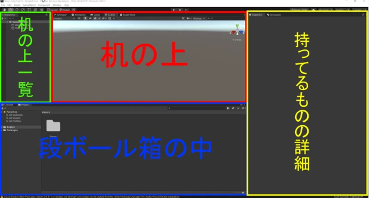
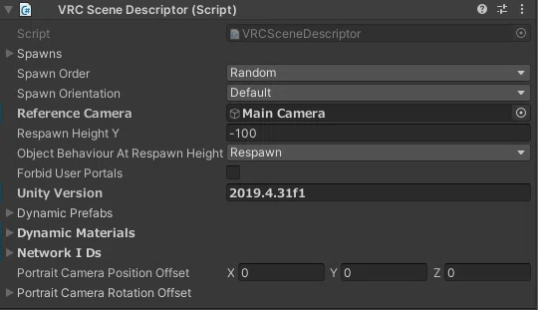
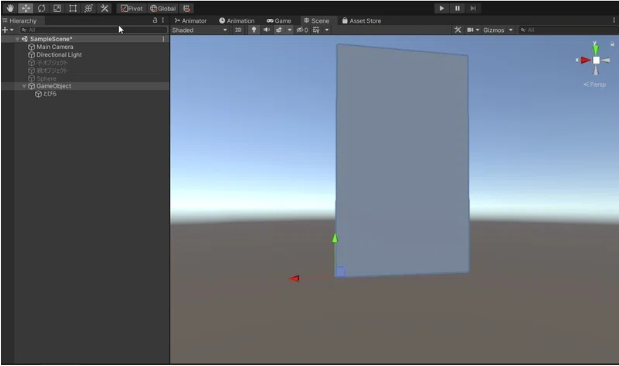
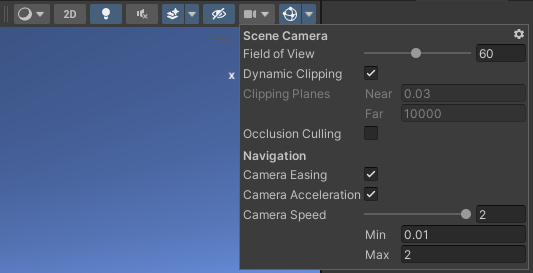

Author: くろしま  
参考: https://note.com/watahumi_mina/ by wata23

# VRChat初心者に伝えたい、情報を得るときの基本的で大事なこと
## 情報を得るときの基本的で大事なこと
  - それがいつごろ発信された情報なのか。
    - VRChatのコンテンツがUnityというゲームエンジンをもとにしており、細かくアップデートされている(バージョンごとにサポート期間が決まっている。)
    - Cannyというユーザーの要望・不具合報告サイトをもとにしてアップデートしている。 
    canny: https://vrchat.canny.io/
  - 100パーセント信じない。
    - VRChatを始める大多数は、最初はUnityを知らない素人である。
    - VRChat向けの技術的な記事を書いている人の大多数は「独学で学んでいる人」
      - 「正しいやり方ではないけど結果的にうまくいったパターン」が含まれる。
    　- 「自分の環境ではうまくいく」ものが含まれる。
## 効率のいい情報収集の方法
  - 技術的に強い人の X をフォローする。
  - VRChat公式のアップデート内容を都度確認する。
  - Twitterで検索する。
    - 些細なことは X につぶやくことが多い。
  - 詳しい人に直接聞く。
    - ものすごく近道。お礼を忘れずに。

 

# VRChat初心者のためのUnityコンポーネント入門
## コンポーネントとは?
  - Unityを開いた時のウィンドウの役割に当てはめる
    
  机の上に置いたものを「ゲームオブジェクト」といい、「ゲームオブジェクト」がどんな形をしていてどんな性質をもっているかは、どんな「コンポーネント」があるかによって決まる。 例:  
  
  「コンポーネント」を「ゲームオブジェクト」につけることで、色々な機能を付与できる。
## CRChatのコンポーネントの制限
  - 次のサイトで使用できるコンポーネントが確認できる(World)。 
    https://creators.vrchat.com/worlds/whitelisted-world-components/
## コンポーネント紹介
  - Transform
    - 全てのゲームオブジェクトについていて、削除することができない。位置、回転、大きさを調整することができる。
  - Mesh Renderer
    - 動かない3Dモデルに使うコンポーネントで、3Dモデルの外見を決めるコンポーネント。
    - 3Dモデルの見え方(どんな模様をしているかやどれくらい透明かなど)を決定する。「マテリアル」を指定する部分をはじめとして色々な項目がある。
    - オブジェクトの「見た目」を調整したいときに触るコンポーネント。
    - このコンポーネントを作ると、Mesh Filterというメッシュと呼ばれる3Dモデルの形状のデータが指定される。
  - VRC Scene Descripter 

      

    ワールドをアップロードするときに必要となる、ワールド限定のコンポーネント。
    - Reference Camera: プレイヤーの目となるカメラのリファレンス。
    - Respone Height Y: リスポーンさせられる高さ。
    - このコンポーネントがついているオブジェクトのZ方向が、ワールドに入ったときの向きになる。
  - Pipeline Manager
    - アップロードされるワールドにはBluePrintIDが付与される。IDが割り振られた後にこのコンポーネント上でDetachというボタンを押すことでBluePrintIDを空欄にすることができる。空欄のままアップロードするとIDが新しくなり、別のワールドとしてアップロードされる。
    - すでにアップロードしたデータに上書きしたい場合は、SDKコンテンツ管理画面からBluePrintIDをコピーして、Detachしたあとの空欄に貼り付けてからAttachすることで、上書きアップロードすることができる。 
  - Animator
    - 3Dオブジェクトの動きを制御できる。
    - 他のコンポーネントの値を、Animator経由で変化させられる。
    - アニメーションを切り替える条件を設定しておくことができる。
  - Tree
    - Unity標準の木を作るシステム。
  - NavMesh系
    - NPCキャラクターなどに自動追尾させることができる。
  - Projector
    - テクスチャを投影することができる。
    - 影の作成などができる

      

  - (Aim/LookAt/Parent/Position/Rotation/Scale) Constraint
    - 他のオブジェクトの変化(位置・回転・スケールの変更)に従って、ゲームオブジェクトに制約を付ける。
      - 他のゲームオブジェクトがある位置に移動するときに、同じ分だけ移動したりなど。
  - VRC_MirrorReflection
    - ミラーとして使える。
  - VRC_AvaterPedestal
    - アバターのペデスタルを置ける。
  - VRC_PortalMaker
    - ポータルを置ける。
  - uGUI系
    - Unity標準のUI
    - ボタンなどがある。 

# VRChat初心者に送る、Unityの親子関係・階層について
## 親子関係・階層
  - ヒエラルキー: Unityの左側のウィンドウ

  

  - ヒエラルキーにあるゲームオブジェクトを長押しでつかんで、ほかのゲームオブジェクト上で離す(ドラッグ＆ドロップと呼ぶ)と、次のようにオブジェクト名が一段下がる。

  

  - ２つのゲームオブジェクトは、「階層」を形作っており、上の階層にあるオブジェクトを親オブジェクト、下の階層にあるオブジェクトを子オブジェクトという。
    - 親子関係とは、ゲームオブジェクト同士の関係性を表した言葉である。
    - 子に対して親は一つだけである。
    - 一番上の親オブジェクトをルートオブジェクトという。
  - 親子関係・階層というシステムがあるのは、そのほうが便利だから。
## 親子関係・階層のメリット
  - 「親を移動させると、子も移動する」
    - 逆は違っていて、子を移動させても親は移動しない。
## 親子関係の特性
  - 各オブジェクトには、そのゲームオブジェクトの位置・角度・大きさの情報を持つ、Transformコンポーネントが必ずついてくる。
  - 子オブジェクトのTransformコンポーネントの位置の値は、親オブジェクトのTransformの位置を基準(=原点)としたものになっている。
    - 親オブジェクトはシーン画面上1個あるワールド座標を原点とする。
    - 子オブジェクトは自分の親となるオブジェクトの座標を基準としている(ローカル座標という)。
# 親の変更は子すべてに波及する
  - 例えば、親のスケールを３倍にしたとき、子も３倍になる。
# 親子関係の相対性の利用方法
  - 扉をはめようと思うと、縦に大きかった場合を考える。
  - 基準の中心位置が真ん中にあった場合、Transformコンポーネントのスケールを変えると、上下に同じ分だけ伸び縮みする。
  - 親オブジェクトが子オブジェクトの基準になることを利用する。
  - 空のゲームオブジェクトを扉の左下に配置する。

  
 
  - 左下が基準(原点)となるため、上方向にスケールすると、オブジェクトの各座標には定数が乗算され、特に下は0のため、定数を乗算しても変わらない。したがって上方向にだけのびる。
  - また、回転をすると、左下を中心に回転する。
## 相対性を利用した値の直接入力(記事内容とはあまり関係ないけど知らなかったこと)
  - オブジェクトのTransformの座標にたとえば、+5 と打ち込むと、５m先に移動する。これをコピーしたオブジェクトごとに行えば等間隔に並べることができる。 

# お勧めのUnityのショートカット【VRChat】
## Sceneの画面移動
  - 前後左右: 右クリック + WASD
  - 上下: 右クリック + EQ 
    - shift 同時押しで加速。
    - 加速量は右クリックを押したまま、マウスホイールをスクロールすると調節できる。
      - Gizumoボタン横のカメラマークでも設定可(Camera Speed)
      
## 操作ツールの切り替え
  - Q: ハンドツール
  - W: 移動
  - E: 回転
  - R: 拡大縮小
  - T: 矩形トランスフォーム
  - Y: トランスフォーム(移動・回転・拡大縮小の組み合わせ)
## Pivot/Center、Local/Global

  - Pivot/Center: 選択ツールの操作を行うときの基準点の位置を選択
    - Pivot: モデルの原点
    - Center: オブジェクトの中心
      - 親子関係にあるときに使えそう。
  - Local/Global: 選択ツールで操作する基準点のXYZ軸を切り替えられる。
    - Local: オブジェクト基準
    - Global: ワールド基準
      - Localでオブジェクトを回転させて、Glbalでワールドに対して平行に下げる、という使い方が可能
## 操作の取り消し・やり直し
  - Ctrl + Z: 取り消し
  - Ctrl + Y: やり直し
## フォーカス
  - オブジェクトを選択しているときにFキーを押すと、そのオブジェクトに注視する。(Hierarchyのオブジェクト名ダブルクリックでもできる。)
  - 「近づくと消える」場合、大きいオブジェクトを編集した後になっている。(適当に小さいオブジェクトを注視すると直る。)
## スナップ機能
  - オブジェクトを選択した状態でvキーを押しながら移動: 頂点スナップ
    - 操作するときの基準点をマウスポインタの位置に持ってこれる。
    - 移動操作で角あたりをおすとオブジェクト同士をぴったりくっつけられる。
## Sceneビューにオブジェクトの位置を合わせる
  - オブジェクトを選択した状態で、Ctrl + Shift + F を押すと、Sceneで見ている位置にオブジェクトを持ってくることができる。
  - MainCameraを選択した状態で、このショートカットキーを使うことで、GameビューとSceneビューを一致させることができる。
## Hierarchyでよく使うやつ
  - オブジェクトを選択した状態でDelete: 削除
  - オブジェクトを選択した状態でCtrl + D: 複製
  - Altキーを押しながら、ツリーの矢印を押す: ツリーをすべて展開、またはすべて閉じる
## Windouws共通
  - Ctrl + C: 値などの文字コピー
  - Ctrl + V: Ctrl + Cでコピーしたものの貼り付け
  - オブジェクトやファイルなどを選択中にF2: 名前の編集
  - ファイルなどが連続している場所で、１つクリックした後にもう一つをShift+クリック：最初にクリックした場所からShift+クリックした部分までをまとめて選択
  - Ctrl押しながらクリック：現在選択しているものに、追加して選択
  - Ctrl+A：全選択
  - Ctrl+S：編集中のファイルのセーブ

# アバターからワールドまで！VRChatユーザーのための Unity Scene入門ガイド