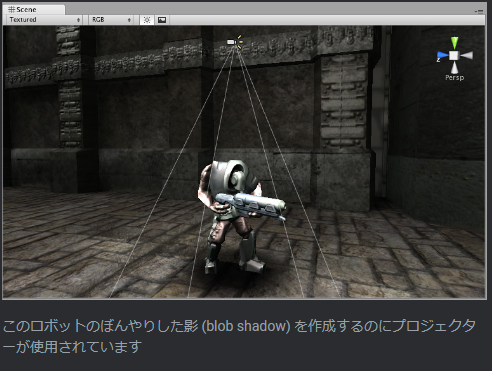
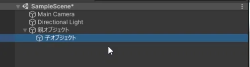
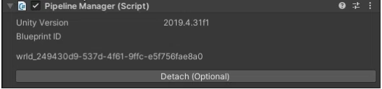
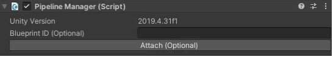

Author: くろしま  
参考: https://note.com/watahumi_mina/ by wata23

# VRChat初心者に伝えたい、情報を得るときの基本的で大事なこと
## 情報を得るときの基本的で大事なこと
  - それがいつごろ発信された情報なのか。
    - VRChatのコンテンツがUnityというゲームエンジンをもとにしており、細かくアップデートされている(バージョンごとにサポート期間が決まっている。)
    - Cannyというユーザーの要望・不具合報告サイトをもとにしてアップデートしている。 
    canny: https://vrchat.canny.io/
  - 100パーセント信じない。
    - VRChatを始める大多数は、最初はUnityを知らない素人である。
    - VRChat向けの技術的な記事を書いている人の大多数は「独学で学んでいる人」
      - 「正しいやり方ではないけど結果的にうまくいったパターン」が含まれる。
    　- 「自分の環境ではうまくいく」ものが含まれる。
## 効率のいい情報収集の方法
  - 技術的に強い人の X をフォローする。
  - VRChat公式のアップデート内容を都度確認する。
  - Twitterで検索する。
    - 些細なことは X につぶやくことが多い。
  - 詳しい人に直接聞く。
    - ものすごく近道。お礼を忘れずに。

 

# VRChat初心者のためのUnityコンポーネント入門
## コンポーネントとは?
  - Unityを開いた時のウィンドウの役割に当てはめる
    
  机の上に置いたものを「ゲームオブジェクト」といい、「ゲームオブジェクト」がどんな形をしていてどんな性質をもっているかは、どんな「コンポーネント」があるかによって決まる。 例:  
  
  「コンポーネント」を「ゲームオブジェクト」につけることで、色々な機能を付与できる。
## CRChatのコンポーネントの制限
  - 次のサイトで使用できるコンポーネントが確認できる(World)。 
    https://creators.vrchat.com/worlds/whitelisted-world-components/
## コンポーネント紹介
  - Transform
    - 全てのゲームオブジェクトについていて、削除することができない。位置、回転、大きさを調整することができる。
  - Mesh Renderer
    - 動かない3Dモデルに使うコンポーネントで、3Dモデルの外見を決めるコンポーネント。
    - 3Dモデルの見え方(どんな模様をしているかやどれくらい透明かなど)を決定する。「マテリアル」を指定する部分をはじめとして色々な項目がある。
    - オブジェクトの「見た目」を調整したいときに触るコンポーネント。
    - このコンポーネントを作ると、Mesh Filterというメッシュと呼ばれる3Dモデルの形状のデータが指定される。
  - VRC Scene Descripter 

      

    ワールドをアップロードするときに必要となる、ワールド限定のコンポーネント。
    - Reference Camera: プレイヤーの目となるカメラのリファレンス。
    - Respone Height Y: リスポーンさせられる高さ。
    - このコンポーネントがついているオブジェクトのZ方向が、ワールドに入ったときの向きになる。
  - Pipeline Manager
    - アップロードされるワールドにはBluePrintIDが付与される。IDが割り振られた後にこのコンポーネント上でDetachというボタンを押すことでBluePrintIDを空欄にすることができる。空欄のままアップロードするとIDが新しくなり、別のワールドとしてアップロードされる。
    - すでにアップロードしたデータに上書きしたい場合は、SDKコンテンツ管理画面からBluePrintIDをコピーして、Detachしたあとの空欄に貼り付けてからAttachすることで、上書きアップロードすることができる。 
  - Animator
    - 3Dオブジェクトの動きを制御できる。
    - 他のコンポーネントの値を、Animator経由で変化させられる。
    - アニメーションを切り替える条件を設定しておくことができる。
  - Tree
    - Unity標準の木を作るシステム。
  - NavMesh系
    - NPCキャラクターなどに自動追尾させることができる。
  - Projector
    - テクスチャを投影することができる。
    - 影の作成などができる

      

  - (Aim/LookAt/Parent/Position/Rotation/Scale) Constraint
    - 他のオブジェクトの変化(位置・回転・スケールの変更)に従って、ゲームオブジェクトに制約を付ける。
      - 他のゲームオブジェクトがある位置に移動するときに、同じ分だけ移動したりなど。
  - VRC_MirrorReflection
    - ミラーとして使える。
  - VRC_AvaterPedestal
    - アバターのペデスタルを置ける。
  - VRC_PortalMaker
    - ポータルを置ける。
  - uGUI系
    - Unity標準のUI
    - ボタンなどがある。 

# VRChat初心者に送る、Unityの親子関係・階層について
## 親子関係・階層
  - ヒエラルキー: Unityの左側のウィンドウ

  

  - ヒエラルキーにあるゲームオブジェクトを長押しでつかんで、ほかのゲームオブジェクト上で離す(ドラッグ＆ドロップと呼ぶ)と、次のようにオブジェクト名が一段下がる。

  

  - ２つのゲームオブジェクトは、「階層」を形作っており、上の階層にあるオブジェクトを親オブジェクト、下の階層にあるオブジェクトを子オブジェクトという。
    - 親子関係とは、ゲームオブジェクト同士の関係性を表した言葉である。
    - 子に対して親は一つだけである。
    - 一番上の親オブジェクトをルートオブジェクトという。
  - 親子関係・階層というシステムがあるのは、そのほうが便利だから。
## 親子関係・階層のメリット
  - 「親を移動させると、子も移動する」
    - 逆は違っていて、子を移動させても親は移動しない。
## 親子関係の特性
  - 各オブジェクトには、そのゲームオブジェクトの位置・角度・大きさの情報を持つ、Transformコンポーネントが必ずついてくる。
  - 子オブジェクトのTransformコンポーネントの位置の値は、親オブジェクトのTransformの位置を基準(=原点)としたものになっている。
    - 親オブジェクトはシーン画面上1個あるワールド座標を原点とする。
    - 子オブジェクトは自分の親となるオブジェクトの座標を基準としている(ローカル座標という)。
# 親の変更は子すべてに波及する
  - 例えば、親のスケールを３倍にしたとき、子も３倍になる。
# 親子関係の相対性の利用方法
  - 扉をはめようと思うと、縦に大きかった場合を考える。
  - 基準の中心位置が真ん中にあった場合、Transformコンポーネントのスケールを変えると、上下に同じ分だけ伸び縮みする。
  - 親オブジェクトが子オブジェクトの基準になることを利用する。
  - 空のゲームオブジェクトを扉の左下に配置する。

  
 
  - 左下が基準(原点)となるため、上方向にスケールすると、オブジェクトの各座標には定数が乗算され、特に下は0のため、定数を乗算しても変わらない。したがって上方向にだけのびる。
  - また、回転をすると、左下を中心に回転する。
## 相対性を利用した値の直接入力(記事内容とはあまり関係ないけど知らなかったこと)
  - オブジェクトのTransformの座標にたとえば、+5 と打ち込むと、５m先に移動する。これをコピーしたオブジェクトごとに行えば等間隔に並べることができる。 

# お勧めのUnityのショートカット【VRChat】
## Sceneの画面移動
  - 前後左右: 右クリック + WASD
  - 上下: 右クリック + EQ 
    - shift 同時押しで加速。
    - 加速量は右クリックを押したまま、マウスホイールをスクロールすると調節できる。
      - Gizumoボタン横のカメラマークでも設定可(Camera Speed)
      
## 操作ツールの切り替え
  - Q: ハンドツール
  - W: 移動
  - E: 回転
  - R: 拡大縮小
  - T: 矩形トランスフォーム
  - Y: トランスフォーム(移動・回転・拡大縮小の組み合わせ)
## Pivot/Center、Local/Global

  - Pivot/Center: 選択ツールの操作を行うときの基準点の位置を選択
    - Pivot: モデルの原点
    - Center: オブジェクトの中心
      - 親子関係にあるときに使えそう。
  - Local/Global: 選択ツールで操作する基準点のXYZ軸を切り替えられる。
    - Local: オブジェクト基準
    - Global: ワールド基準
      - Localでオブジェクトを回転させて、Glbalでワールドに対して平行に下げる、という使い方が可能
## 操作の取り消し・やり直し
  - Ctrl + Z: 取り消し
  - Ctrl + Y: やり直し
## フォーカス
  - オブジェクトを選択しているときにFキーを押すと、そのオブジェクトに注視する。(Hierarchyのオブジェクト名ダブルクリックでもできる。)
  - 「近づくと消える」場合、大きいオブジェクトを編集した後になっている。(適当に小さいオブジェクトを注視すると直る。)
## スナップ機能
  - オブジェクトを選択した状態でvキーを押しながら移動: 頂点スナップ
    - 操作するときの基準点をマウスポインタの位置に持ってこれる。
    - 移動操作で角あたりをおすとオブジェクト同士をぴったりくっつけられる。
## Sceneビューにオブジェクトの位置を合わせる
  - オブジェクトを選択した状態で、Ctrl + Shift + F を押すと、Sceneで見ている位置にオブジェクトを持ってくることができる。
  - MainCameraを選択した状態で、このショートカットキーを使うことで、GameビューとSceneビューを一致させることができる。
## Hierarchyでよく使うやつ
  - オブジェクトを選択した状態でDelete: 削除
  - オブジェクトを選択した状態でCtrl + D: 複製
  - Altキーを押しながら、ツリーの矢印を押す: ツリーをすべて展開、またはすべて閉じる
## Windouws共通
  - Ctrl + C: 値などの文字コピー
  - Ctrl + V: Ctrl + Cでコピーしたものの貼り付け
  - オブジェクトやファイルなどを選択中にF2: 名前の編集
  - ファイルなどが連続している場所で、１つクリックした後にもう一つをShift+クリック：最初にクリックした場所からShift+クリックした部分までをまとめて選択
  - Ctrl押しながらクリック：現在選択しているものに、追加して選択
  - Ctrl+A：全選択
  - Ctrl+S：編集中のファイルのセーブ

# アバターからワールドまで！VRChatユーザーのための Unity Scene入門ガイド
## UnityのSceneとその本体について
  - UnityのSceneファイルは、Unityでアバターの改変やワールド制作を行った後に保存されるセーブデータに該当する。
    - UnityのHierarchyの状態や環境設定などが保存されている。
  - 本体は、Hierarchy上ではなくプロジェクトウィンドウ内に保存されている。
## そもそものSceneの使われ方
  - VRChatでは一つのScene上でデータを編集し、それをVRCSDKを通してアップロードする形が一般的。
  - Unityでゲームを制作する場合は、「複数のSceneを切り替えて使う」方法がある。
    - 例えば、次の図のようにゲームの進行に合わせて、シーンの切り替えを行うことが可能である。
    
    - VRChatは１つのシーンしか扱えない。
## UnityのSceneに保存されている情報について
  - UnityのSceneファイルには、Hierarchy上の情報だけではなく、環境設定系のデータも紐づけて保存されている。
    - RenderSettingとLightmapSettings(どちらもLightningウィンドウにある)
    -NavMeshの設定。
      - NavMesh: シーン上をAIで自動に移動する3Dモデルを作れる機能。
    - ゲームのシーンが切り替わるときにライティングなどの設定が変わる。
    - 独自レイヤーを使用しているオブジェクトがあるシーンを、別のプロジェクトで開いてみると、レイヤーの割り当てがない状態となる(default layer)。
## Scene の複数編集について
  - Unityでは複数個のシーンを同時に開いて、編集することができる。
    - シーンファイルをヒエラルキー上にドラッグ＆ドロップする。
    - 展開されたシーンのオブジェクトは自由に操作することができ、別のシーンにドラッグ＆ドロップでオブジェクトを移動させることなども出来る。
    参考: https://summer2022.vket.com/docs/submission_tips_how_to_object_copy
    - 消すときはシーンファイル名のところで右クリックし、Remove Sceneを選択すると消すことができる。
      - ライティング・オクルージョンカリングなどの環境設定は、すでに開いているシーンのものになっている。そのため新規に開いたシーンの環境設定は無視される。
## Unityアセットのでもシーンを使った
  - Unityアセットにはでもシーンがあるため、ドラッグ＆ドロップでシーンを並べた後、ゲームオブジェクトを一つにシーンに統合する方法がある。
    - シーンが整っているため、オブジェクトの配置に手間をとられないのがメリット。
    - 高負荷のものがあるため、負荷を減らしたいと思ったときに最適化の技法と時間が求められる。
    - インポート時にエラーが起こるため、初心者には勧めづらい。
## Sceneファイルの中身について
  - プロジェクトタブ上でシーンファイルを右クリックし、「Show in Explores」エクスプローラーで開く。
  - エクスプローラー上で右クリックし、「プログラムから開く」を選択。その他のオプションからメモ帳を選ぶ。
  - シーンファイルは、YAMLと呼ばれるフォーマットに従って書かれた文字列である。
    - シーンファイルは、あくまでそのデータがおかれている場所、すなわち参照のみを保存している。
    FBXやプレハブを消すと、Hierarchy上で赤く表示される現象は、参照先のデータが失われているために起こる現象。
## シーンに関する小ネタ
### シーンファイルの複製
  - プロジェクトタブ上で ctrl + D でシーンファイルを複製することができる。Hierarchyを大幅に変更するときはこれでバックアップを取ることができる。
    - シーンは複数編集できるため、うっかり消したゲームオブジェクトを部分的に戻したいと思ったときは、バックアップしたシーンをドラッグ＆ドロップして、ゲームオブジェクトを戻す、ということも可能。
### 未セーブ状態で突然Unityが落ちた時のリカバリー
  - Unityを開く前であれば、シーンファイルのバックアップが保存される。
    - 使っていたプロジェクトのフォルダ内にバックアップ用のファイルがある。
    - Asset フォルダに中身を移したうえで、拡張子を「.unity」にすることでシーンファイルになるため、ダブルクリックすると開ける。
### シーンファイル名「Sample Scene」は危険！？
  - (VCC以前)Unityアセットストアのシーンファイル名もSample Sceneであることがあり、上書きされてこれまでのデータが消える可能性があった。

# VRChat初心者の躓きやすいUnityエラーの対処法
## VRSDKのBuildボタンが消えた！
  - 画面左側にあるConsoleというタブを開く。
  
  - 項目がたくさん出てくる(Unityのログの一覧)。
  
  - 重要度に応じて、白<黄色<赤 となっている。
    - 白い吹き出しにビックリマークのアイコンは最も影響が無いもの。 
    
    - 黄色に三角形にビックリマーク。ちょっと問題はありますが、大きい影響はありません。 
    
    - 赤い8角形にビックリマーク。明確に問題があるエラー。 
    
      - 無視してもUnityが問題なく動くものと、Unityが上手く動かなくなるものが混在している。
      - 優先的に直すべきものは、「Consoleタブの左上のClearボタンを押して、残ったエラー」。
        - ログをクリックして選択すると、下の方に文章が現れるので、それをgoogleなりtwitterに検索をかけて対処。
        - 一通り対処できると、Clearボタンを押しても何も出てこなくなる。この状態になるとUnityは正常に動くようになり、VRCSDKのBuildボタンは復活している(はず)。
## そもそもエラーを起こさないためには
  - 一番大事なのは「導入手順とその順番をきちんと守る」。
    - 規定された動作しかできない機械。
    - 導入手順とその順番をきちんと守れば、エラーが起きる可能性はぐっと減る。
## エラーの原因を少なくしよう
  - 新しい何かを追加(インポート)したら、コンソールをチェックする。
  - すでにある何かを削除したら、コンソールをチェックする。
    - 基本的に今まで大丈夫だったプロジェクトがエラーで動かなくなるタイミングは、何かをインポートしたときか何かを間違って削除したときである。
      - インポートしたときに起こるエラーは、何か前提となるものが入っていないケースや、その環境では利用できないものを入れてしまった場合が多い。
      - 間違って削除したときは、依存関係を壊してしまって、エラーになっていることが多い。
    - インポート時にエラーが起こった場合は、その時インポートされたファイルを削除するだけでエラーが解消される。
      - インポートされたファイルについては、インポート時に以下のようなリストが出てくるが、このチェックが入っているものが追加される。
      - 削除したいときは、このリストに載っているものを削除すれば良い。
      
    - 間違って削除したときは、削除してすぐなら、冷静に Ctrl+Z のショートカットを押すことで元に戻る。
      - Unityを一度閉じてしまうとダメなので、そのときは消してしまったファイルのあるUnityPackageを再インポートする。
  - Unityの動作がおかしくなっているケースもある。
    - 謎のエラーが起こったときは、何も考えずにUnityを閉じてもう一回開きなおすと直ることもある。

# 同じワールドやアバターを、別のデータとしてアップロードする方法 ～VRChatのBlueprint IDについて～
## BlueprintIDについて
  - Blueprint IDは、VRChat側がワールドやアバターを管理するためにつけているID
    - Unityを使って、VRChat上にデータをアップロードするときに自動的に割り当てられるもの。
    - このIDはユニークなものであり、ほかの人と被らないようになっている。
  - Blueprint IDの仕様をうまく使うことで、同じアバターやワールドを別データとしてあげたり、アップロード済みの既存のデータに上書きしたりすることが可能である。
## Blueprint IDの新規作成・切り替えなどについて
  - Blueprint IDを管理するためにPipeline Managerという名前のコンポーネントがある。
    - ワールドであれば、VRCWorldという名前のゲームオブジェクトについている、VRC Scene Descripterコンポーネントの下にある。
    - 一度でもアップロードしたデータであれば、以下のようにアップロード時のBlueprint IDが記載されている。
    
    - 一度もアップロードしたことがない場合は以下のように空欄になっている。
    
      - この空欄の状態でアップロードすると、自動的に新しいBlueprint IDが割り振られて、Blueprint IDが表示されるようになる。
## 別データとしてのアップロード方法
  - 別データとして、アップロードしたい場合はPipeline ManagerのDetachボタンを押す。
  - 紐づけられていたBlueprint IDが解除され、新しい状態になるので、この状態でアップロードすると新規IDが割り振られて、別データとしてアップロードすることができる。
## 既存データへの切り替え・上書き・削除など
  - VRChat SDKのタブにContent Managerというタブがある。
  - 現在紐づけられているBlueprint IDがあるときは、データの横に(Current)という表記がつく。 
  - この状態から別のデータに切り替えを行いたいときは、切り替えを行いたいデータのところにあるSet Currentボタンを押す。
  - 削除したい場合は、Deleteボタンを押すことで削除ができる。
## Blueprint ID で注意したいこと
  - ワールドやアバターの販売・配布時にBluprint IDが残ったデータを配布してしまうと、アップロードしようとしたときにエラーが発生する。
    - 他人にデータを販売、配布するときはBlueprint IDを空欄にしておく。
  - ワールドは複数Pipeline Managerがあると、一つにするようにと注意書きが出る。
## PC・Quest両対応したいときについて
  - PC版をすでにアップロード済みだとする。このときAndroid向けに切り替えたプロジェクトで、"PC版と同じBlueprint ID"に対してアップロードを行うことでQuest版を追加することができる。

# 簡単なUnityプロジェクトのバックアップ方法
## 各種バックアップ方法
  - ファイルごとコピー
    - 簡単、無料、手動、非常に時間がかかる、全部コピーする必要がある。
  - VCCのバックアップ機能
    - ファイルごとコピーを必要最低限のフォルダのみ行う。
      - **ワールドのバックアップにはおすすめできない。**(キャッシュ情報はなくなる)
  - Collaborate
    - Unity上でできる、無料、差分セーブ可能、容量が少ない
      - クラウド容量1GBのため、もはや使えない。
  - Github
    - 難しい、無料、差分セーブ可能、容量は外付けHDD等に保存することで解決する。
      - 無料で使えるクラウドの容量は5GB。
  - **Turbo Backup PRO(おすすめ)**
    - 簡単、有料(52.8ドル(約８千円...))、差分セーブ、自動セーブ、保存場所は自由

