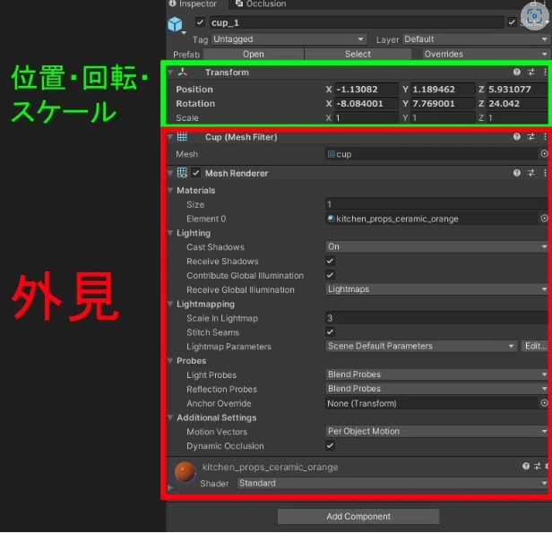

Author: くろしま  
参考: https://note.com/watahumi_mina/ by wata23

# VRChat初心者に伝えたい、情報を得るときの基本的で大事なこと
## 情報を得るときの基本的で大事なこと
  - それがいつごろ発信された情報なのか。
    - VRChatのコンテンツがUnityというゲームエンジンをもとにしており、細かくアップデートされている(バージョンごとにサポート期間が決まっている。)
    - Cannyというユーザーの要望・不具合報告サイトをもとにしてアップデートしている。 
    canny: https://vrchat.canny.io/
  - 100パーセント信じない。
    - VRChatを始める大多数は、最初はUnityを知らない素人である。
    - VRChat向けの技術的な記事を書いている人の大多数は「独学で学んでいる人」
      - 「正しいやり方ではないけど結果的にうまくいったパターン」が含まれる。
    　- 「自分の環境ではうまくいく」ものが含まれる。
## 効率のいい情報収集の方法
  - 技術的に強い人の X をフォローする。
  - VRChat公式のアップデート内容を都度確認する。
  - Twitterで検索する。
    - 些細なことは X につぶやくことが多い。
  - 詳しい人に直接聞く。
    - ものすごく近道。お礼を忘れずに。

 

# VRChat初心者のためのUnityコンポーネント入門
## コンポーネントとは?
  - Unityを開いた時のウィンドウの役割に当てはめる
    
  机の上に置いたものを「ゲームオブジェクト」といい、「ゲームオブジェクト」がどんな形をしていてどんな性質をもっているかは、どんな「コンポーネント」があるかによって決まる。 例:  
  
  「コンポーネント」を「ゲームオブジェクト」につけることで、色々な機能を付与できる。
## CRChatのコンポーネントの制限
  - 次のサイトで使用できるコンポーネントが確認できる(World)。 
    https://creators.vrchat.com/worlds/whitelisted-world-components/
## コンポーネント紹介
  - Transform
    - 全てのゲームオブジェクトについていて、削除することができない。位置、回転、大きさを調整することができる。
  - Mesh Renderer
    - 動かない3Dモデルに使うコンポーネントで、3Dモデルの外見を決めるコンポーネント。
    - 3Dモデルの見え方(どんな模様をしているかやどれくらい透明かなど)を決定する。「マテリアル」を指定する部分をはじめとして色々な項目がある。
    - オブジェクトの「見た目」を調整したいときに触るコンポーネント。
    - このコンポーネントを作ると、Mesh Filterというメッシュと呼ばれる3Dモデルの形状のデータが指定される。
  - VRC Scene Descripter 
      
    ワールドをアップロードするときに必要となる、ワールド限定のコンポーネント。
    - Reference Camera: プレイヤーの目となるカメラのリファレンス。
    - Respone Height Y: リスポーンさせられる高さ。
    - このコンポーネントがついているオブジェクトのZ方向が、ワールドに入ったときの向きになる。
  - Pipeline Manager
    - アップロードされるワールドにはBluePrintIDが付与される。IDが割り振られた後にこのコンポーネント上でDetachというボタンを押すことでBluePrintIDを空欄にすることができる。空欄のままアップロードするとIDが新しくなり、別のワールドとしてアップロードされる。
    - すでにアップロードしたデータに上書きしたい場合は、SDKコンテンツ管理画面からBluePrintIDをコピーして、Detachしたあとの空欄に貼り付けてからAttachすることで、上書きアップロードすることができる。 
  - Animator
    - 3Dオブジェクトの動きを制御できる。
    - 他のコンポーネントの値を、Animator経由で変化させられる。
    - アニメーションを切り替える条件を設定しておくことができる。
  - Tree
    - Unity標準の木を作るシステム。
  - NavMesh系
    - NPCキャラクターなどに自動追尾させることができる。
  - Projector
    - テクスチャを投影することができる。
    - 影の作成などができる
      
  - (Aim/LookAt/Parent/Position/Rotation/Scale) Constraint
    - 他のオブジェクトの変化(位置・回転・スケールの変更)に従って、ゲームオブジェクトに制約を付ける。
      - 他のゲームオブジェクトがある位置に移動するときに、同じ分だけ移動したりなど。
  - VRC_MirrorReflection
    - ミラーとして使える。
  - VRC_AvaterPedestal
    - アバターのペデスタルを置ける。
  - VRC_PortalMaker
    - ポータルを置ける。
  - uGUI系
    - Unity標準のUI
    - ボタンなどがある。 

